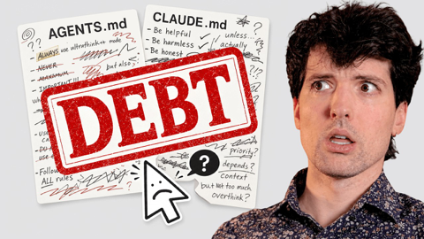
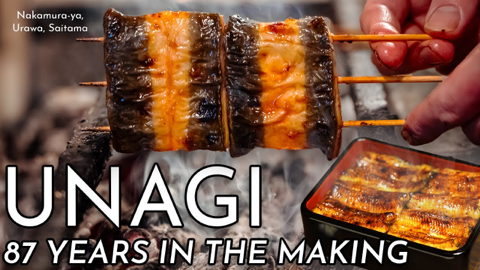

## Current Personal Status
>
> I'm starting to understand why apps like Bartender, Thaw, and other apps designed to handle the notch/menubar problem are so shitty. It's a HARD problem to solve!

## Current Projects

- Work. Focusing on work. Focusing on financial goals for the sole purpose of creating some life flexibility for our family.

## Stuff I've recently enjoyed

### Podcasts

*Podcast episodes without links are members-only but I think are interesting enough to post in case you want to investigate them.*

 [Judge John Hodgman – Lawn and Hors D’oeuvres Live in Los Angeles](https://overcast.fm/+YJM369H_w)
 The Race F1 Podcast (Members) – Why F1 teams are so convinced of an upset in Monaco (ad free)
 The Race F1 Podcast (Members) – Jon’s take on Leclerc’s surprising new Ferrari deal
 [Accidental Tech Podcast – 693: Negative Bonus Points](https://atp.fm/693)
 The 404 Media Podcast (Premium Feed) – Hackers Asked Meta AI To Let Them In. It Worked
 The Vergecast: Ad-Free Edition – Nvidia just started a new chip war
 [Sales Logic - Selling Strategies That Work – Selling Through the Summer Slow Down](https://overcast.fm/+X6nPPK2II)
 The Vergecast: Ad-Free Edition – Jony Ive’s funky Ferrari
 [Security You Should Know – Automating Offensive Security with XBOW](https://overcast.fm/+BN0ZfsSCF8)
 [The Talk Show With John Gruber – 448: ‘Twins Named John’, With Stephen Hackett](https://overcast.fm/+B7NCbPjHs)

### TV Shows

[Legends • 2026 • The actors make this one. I loved them all. Well, most of them. This is when I was able to just sit back and enjoy and really relish the people. *****
](/images/posts/png-image4dbb97ecf20-review-015b4382-d62f-46d3-b37c-e6252cd0c5e5.jpg)

### Books

[Steve Jobs in Exile • 2026 • Geoffrey Cain • Steve Jobs in Exile is one of the better books about Steve Jobs I've read, because it's not trying to mythologize him or do anything other than document an under-represented part of his development story. Without failure, he never could have become the CEO who saved Apple. *****
](/images/posts/png-image43a9b3f12c0-review-d0962a09-70d1-4fb1-af49-a79ae8d2fc5f.jpg)

### YouTube

Channel – [Erin Talks Money](https://www.youtube.com/@ErinTalksMoney)

[The Retirement Math Is Getting Worse… Most People Haven’t Realized It Yet](https://www.youtube.com/watch?v=7XShCjpe-vw&t=1060s)

Channel – [GeoBeats Animals](https://www.youtube.com/@GeoBeatsAnimals)

[Rescue cat does the sweetest thing for dad every night](https://www.youtube.com/watch?v=jDRpj9DhPrk)

Channel – [Jet Li](https://www.youtube.com/@Jet_Li)

[A message from Jet Li](https://www.youtube.com/watch?v=MmSbHQ5hURs)

Channel – [NBC News](https://www.youtube.com/@NBCNews)

[Sonic booms heard around the U.S.](https://www.youtube.com/watch?v=677kTin0ojI)

Channel – [Nick Saraev](https://www.youtube.com/@nicksaraev)

[$2.4M of Prompt Engineering Hacks in 53 Mins (GPT, Claude)](https://www.youtube.com/watch?v=CxbHw93oWP0&t=2811s)

Channel – [Theo - t3․gg](https://www.youtube.com/@t3dotgg)

[Your prompts are tech debt.](https://www.youtube.com/watch?v=WnBx1Vi7M6w&t=47s)

Channel – [IGN](https://www.youtube.com/@IGN)

[Stuntman: Hollywood - Official Reveal Trailer | State of Play 2026](https://www.youtube.com/watch?v=3xa_pQuhHzU)

Channel – [Sunny in Japan](https://www.youtube.com/@Sunny_in_Japan)

[36 hours in Fukuoka | Japan Travel Vlog | 🍜 Ramen, Cafe Hopping, Dazaifu Shrine](https://www.youtube.com/watch?v=R6Jrt1ECJ98&t=774s)

Channel – [Torry Travel](https://www.youtube.com/@torrytravel)

[First Time in Fukuoka 🍜🍓 Must-Try Food, Cafés & Shrines 🇯🇵 Japan Travel VLOG 📸](https://www.youtube.com/watch?v=CPOjTvK_Bmw)

Channel – [A Ryu Life Story](https://www.youtube.com/@aryulifestory)

[10 Days in Fukuoka & other Kyushu cities | JAPAN Travel Vlog 🇯🇵](https://www.youtube.com/watch?v=x1XEaSQfezg&t=14s&pp=0gcJCSgLAYcqIYzv)

Channel – [Shu Matsuo Post](https://www.youtube.com/@shumatsuopost)

[These Fukuoka Homes Are Shockingly Cheap Compared to Tokyo](https://www.youtube.com/watch?v=gFFfmtG75_Q&t=965s)

Channel – [JAPAN LOVEWalker](https://www.youtube.com/@JAPANLOVEWalker)

[Generations of Timeless Unagi: Family Owned Restaurant Aims for 100 Years of Operation](https://www.youtube.com/watch?v=j2vs1xFpG90&t=11s)

