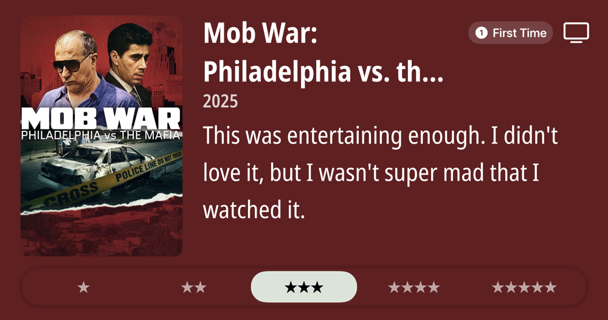
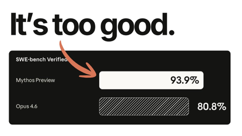
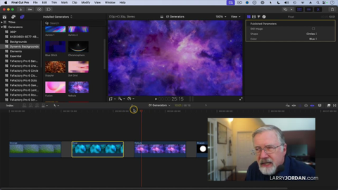

## Current Personal Status
>
> Right this second I'm drinking green tea, and it's all that really matters.

## Current Projects

- Japanese and Korean study (somewhat proficient in J, complete newb to K). Using [Talk To Me In Korean Courses](https://courses.talktomeinkorean.com/). Currently taking Beginner Bootcamp course.

- [Friends with Brews](https://friendswithbrews.com) [YouTube channel](https://www.youtube.com/@FriendswithBrewsPodcast)

## Stuff I've recently enjoyed

### Podcasts

*Podcast episodes without links are members-only but I think are interesting enough to post in case you want to investigate them.*

 Decoder: Ad-Free Edition – The AI industry’s existential race for profits
 [Comfort Zone – It’s Five O’Clock Somewhere](https://overcast.fm/+BI6NQ5DDPE)
 [The Weekly Planet – The War of the Worlds (1953) - Caravan Of Garbage](https://overcast.fm/+1HFJAPE5I)
 The Race F1 Podcast (Members) – Driving Style Secrets is returning! Find out the drivers we’re analysing in Season 3…
 The Race F1 Podcast (Members) – What the latest high-profile exit means for Red Bull - and Verstappen (ad-free)
 [Accidental Tech Podcast: Unedited Live Stream – 686: Write Two Letters](https://atp.fm/686)
 [Risky Business – Risky Business #832 — Anthropic unveils magical 0day computer God](https://overcast.fm/+It0gUrobI)
 [EFFector – How License Plate Readers Are Normalizing Mass Surveillance](https://overcast.fm/+BWSiqcsw8Q)
 [Patrick Boyle On Finance – Canada is a Warning to the Rest of the World!](https://overcast.fm/+oGB41ejDg)
 [Judge John Hodgman – Requesting an Immediate Hinge Junction](https://overcast.fm/+YJM3j2r10)

### TV Shows

[Mob War: First Time Philadelphia vs. the Mafia • 2025 • This was entertaining enough. I didn't love it, but I wasn't super mad that I watched it. ***
](/images/posts/png-image4654a011540-review-701b50ac-9de7-42db-8d22-27f950cb4b04.jpg)

### YouTube

Channel – [Theo - t3․gg](https://www.youtube.com/@t3dotgg)

[Claude Mythos and the end of software](https://www.youtube.com/watch?v=aFcVKzfkJPk&t=119s)

Channel – [THE RACE](https://www.youtube.com/@WeAreTheRace)

[Why McLaren's taking Max Verstappen's F1 race engineer](https://www.youtube.com/watch?v=5k1DHYHmI24)

Channel – [Nick Saraev](https://www.youtube.com/@nicksaraev)

[Claude Managed Agents Just Dropped, And It Kills No-Code](https://www.youtube.com/watch?v=Ob5Vu-gD3mo)

Channel – [fern](https://www.youtube.com/@fern-tv)

[Disneyland’s Most Preventable Tragedy](https://www.youtube.com/watch?v=Q7pgDmR-pWg)

Channel – [Cybernews](https://www.youtube.com/@cybernews)

[The Biggest Hack in US History: SolarWinds Hack](https://www.youtube.com/watch?v=Eq6ATHhBezw)

Channel – [THE RACE](https://www.youtube.com/@WeAreTheRace)

[Why Newey’s Aston Martin is as flawed as Honda’s F1 engine](https://www.youtube.com/watch?v=IkD1Qd_iP3k)

Channel – [Nick Saraev](https://www.youtube.com/@nicksaraev)

[Claude Mythos Preview Just Dropped, And Wow...](https://www.youtube.com/watch?v=oCuttuCQmZg)

Channel – [Aaron Datu Films](https://www.youtube.com/@AaronDatuFilms)

[2x Playback Speed for Editing!](https://www.youtube.com/watch?v=4r3gVYsLwfc)

Channel – [Serge Morgotch](https://www.youtube.com/@serge.morgotch)

[How Loud Should Your YouTube Videos Be? | Loudness Normalizing for YouTube](https://www.youtube.com/watch?v=0GxYpxtyuoY)

Channel – [Larry Jordan](https://www.youtube.com/@LarryJordanFCP)

[How to Use Generators as Visual Backgrounds in Final Cut Pro 11](https://www.youtube.com/watch?v=P5uCLAL5T-M&t=62s)

Channel – [The Final Ideas](https://www.youtube.com/@thefinalideas)

[Creating Dynamic Animated Backgrounds in Apple Motion for Final Cut Pro | The Final Ideas](https://www.youtube.com/watch?v=keGP2efgz0E)

Channel – [Lenny's Podcast](https://www.youtube.com/@LennysPodcast)

[An AI state of the union: We’ve passed the inflection point & dark factories are coming](https://www.youtube.com/watch?v=wc8FBhQtdsA&t=4512s)

