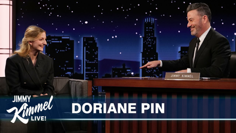
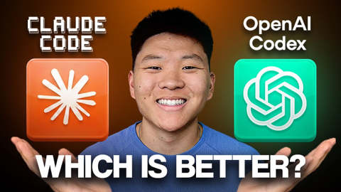
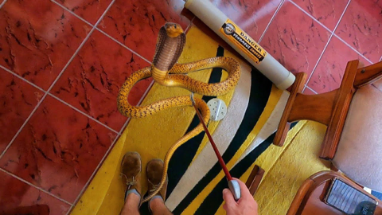
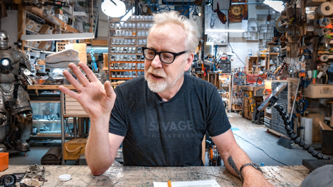
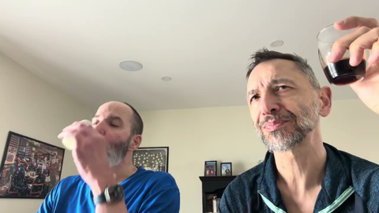
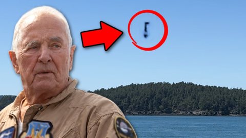
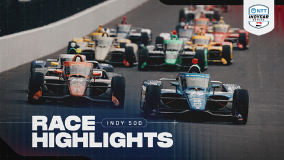
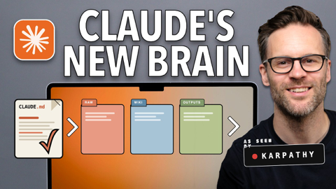
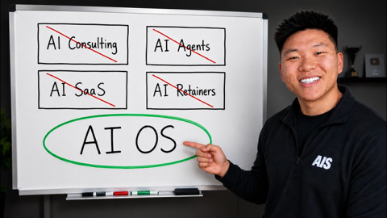
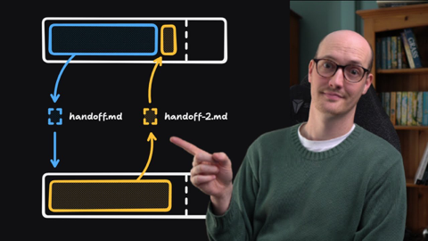

## Current Personal Status
>
> I added some [fun utilities](/mikanremote-utilities) to [MikanRemote](/mikanremote-an-iphone-remote-control-for-my-mac), so [check 'em out](https://github.com/scottaw66/mikan-remote). Other than that, lots of work. LOTS. Of. Work.

## Current Projects

- I've started vibecoding a time zone app for Mac and iOS, name TBD. Stay tuned. Or stay zoned, maybe?

- I need to get back to studying Korean. I got derailed by my trip east and work since.

- [Friends with Brews](https://friendswithbrews.com) [YouTube channel](https://www.youtube.com/@FriendswithBrewsPodcast)

## Stuff I've recently enjoyed

### TV Shows

[Legends • 2026 • The actors make this one. I loved them all. Well, most of them. This is when I was able to just sit back and enjoy and really relish the people. *****
](/images/posts/png-image4dbb97ecf20-review-015b4382-d62f-46d3-b37c-e6252cd0c5e5.jpg)

### Podcasts

*Podcast episodes without links are members-only but I think are interesting enough to post in case you want to investigate them.*

 The Race F1 Podcast (Members) – Edd answers your questions about his Canadian GP driver rankings in our new-look podcast!
 [ながらAIラジオ – 2026年5月24日: Codex進化で遠隔操作！AIトークン使用量に戦慄？流行りプロンプト雑談](https://overcast.fm/+BNeIVBE4XU)
 Decoder: Ad-Free Edition – How Sundar Pichai is rethinking Google for the AI era
 [Sales Logic - Selling Strategies That Work – How to Stay Motivated When the Pipeline Thins](https://overcast.fm/+X6nORiHFE)
 The Vergecast: Ad-Free Edition – How clips ate the internet
 [Talk Python To Me – #549: Great Docs](https://overcast.fm/+F4RDey75A)
 [NosillaCast Apple Podcast – NC #1098 Wireless Power Consortium Qi2 25W and Ki, MindSpace, Security Bits](https://overcast.fm/+BJFaJ0a5Cc)
 [Firewalls Don't Stop Dragons Podcast – Bossware & Boundaries](https://overcast.fm/+PvDaw1x9M)
 [The Weekly Planet – 624 The Mandalorian vs Groglet & The Boys Series Finale](https://overcast.fm/+1HFIYeYds)
 The Race F1 Podcast (Members) – Canadian Grand Prix review (ad free)

### Books

[Exhalation • 2019 • Ted Chiang • A fun and thought-provoking collection of short sci-fi stories. Some of these are centered around completely novel concepts, others less so, but they're all explorations in their own way of what it means to be human. *****
](/images/posts/png-image46f28d750e0-review-a0f8e609-880b-4163-bda8-037d74d23c80.jpg)
[The Mastermind • Evan Ratliff • 2019 • Crime is fun, at least for the reader of good journalistic documentations of it, and Evan Ratliff is nothing if not a dogged and interested journalist. I read most of this online at some point, but the book is still incredibly fascinating. Paul Le Roux is quite a character. You won't be able to put this down. *****
](/images/posts/png-image44fcb606ac0-review-a25b8a5c-1425-41be-9d10-77e987cd396a.jpg)

### YouTube

Channel – [Jimmy Kimmel Live](https://www.youtube.com/@JimmyKimmelLive)

[Doriane Pin on the F1 Academy, Americans Eating Burgers for Breakfast & Racing at 9 Years Old](https://www.youtube.com/watch?v=cEHK3kDMSX0&pp=0gcJCQkLAYcqIYzv)

Channel – [Nate Herk | AI Automation](https://www.youtube.com/@nateherk)

[100 Hours Testing Claude Code vs ChatGPT Codex (honest results)](https://www.youtube.com/watch?v=RLjaUES9P8A)

Channel – [Kevin Ulett - Snake Handler](https://www.youtube.com/@KevinUlett)

[Deadly Golden Cobra in Their Home!](https://www.youtube.com/watch?v=j60Y3AD3BRI)

Channel – [Adam Savage’s Tested](https://www.youtube.com/@tested)

[The Thought That Shifted Adam Savage's Relationship With Jamie Forever](https://www.youtube.com/watch?v=OSpd5rV4evo)

Channel – [Peter Nikolaidis](https://www.youtube.com/@PeterNikolaidis)

[Peter (and Scott - the Friends with Brews) drink Illy Classico Cold Brew and Laurel's Matcha Latte](https://www.youtube.com/watch?v=YwREnYhlSxE)

Channel – [Pilot Debrief](https://www.youtube.com/@pilot-debrief)

[90-Year-Old Legendary Astronaut Makes Fatal Mistake!](https://www.youtube.com/watch?v=Oq0W9IjfKrY)

Channel – [NTT INDYCAR SERIES](https://www.youtube.com/@indycar)

[Race Highlights | 2026 Indianapolis 500](https://www.youtube.com/watch?v=6RzRMLUB_DI)

Channel – [Lon.TV](https://www.youtube.com/@LonSeidman)

[Taildrop: Simple Worldwide File Transfers via Tailscale - No Cloud Required!](https://www.youtube.com/watch?v=eZVN0HT8WbI&t=117s)

Channel – Systems Made Better and Better Creating

[Build A Claude Knowledge Base That Self-Improves!](https://www.youtube.com/watch?v=ib74sLgjIBM&t=368s&pp=0gcJCQkLAYcqIYzv)

Channel – [Nate Herk | AI Automation](https://www.youtube.com/@nateherk)

[The AI Offer You Can Sell Tomorrow Morning](https://www.youtube.com/watch?v=Pi-m8R068r4)

Channel – [Mini Air Crash Investigation](https://www.youtube.com/@MiniAirCrashInvestigation)

[Good Intentions, Deadly Consequences | Royal Australian Airforce 707 Crash](https://www.youtube.com/watch?v=H4xvz4ueqKU)

Channel – [Matt Pocock](https://www.youtube.com/@mattpocockuk)

[/handoff is my new favourite skill](https://www.youtube.com/watch?v=dtAJ2dOd3ko&t=53s)

