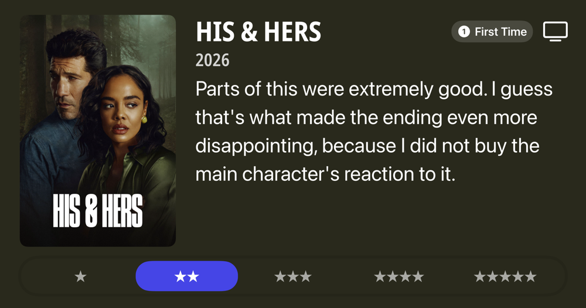
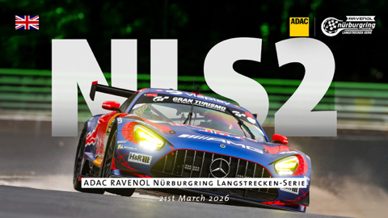
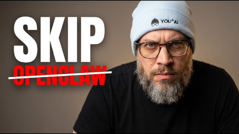
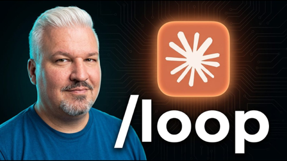
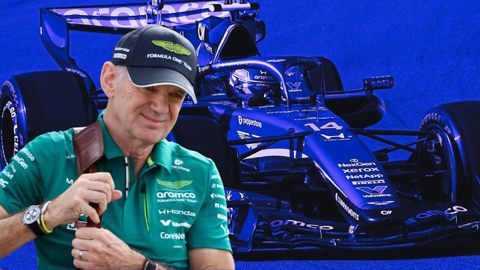
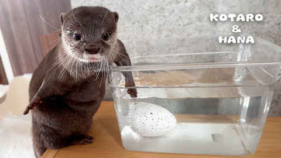
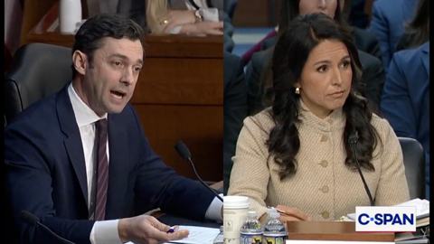
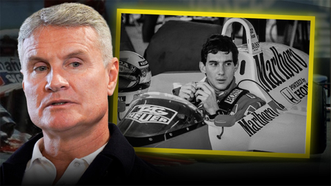
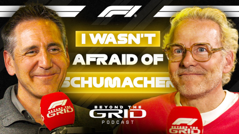

## Current Personal Status
>
> Hangeul turns out to be a little weirder than I thought - there are a couple weird rules. However, compared to learning kanji... haha! Not even in the same universe of complexity.

## Current Projects

- Japanese and Korean study (somewhat proficient in J, complete newb to K). Using [Talk To Me In Korean Courses](https://courses.talktomeinkorean.com/). Finished the Hangeul 7 day challenge.

- Finger therapy (post-surgery)

## Stuff I've recently enjoyed

### Podcasts

*Podcast episodes without links are members-only but I think are interesting enough to post in case you want to investigate them.*

 The Vergecast: Ad-Free Edition – Why people really hate AI
 Six Colors+ — Private – Jeopardy, AirPods Max, and MacBook Neo’s market
 The Race F1 Podcast (Members) – Audi’s loss, Aston’s gain? How a Wheatley move would help Newey (ad-free)
 MacStories Unwind+ – Xcode for Mobile: It’s Time
 [The Incomparable Mothership – 809: Triple J on ‘Jeopardy!’ with Jennings](https://overcast.fm/+kMbrvwqI)
 The Race F1 Podcast (Members) – Jon explains the Leclerc anomaly that exposes a massive F1 2026 complexity
 Decoder: Ad-Free Edition – Paramount’s $110 billion Warner Bros. gamble
 [Talk Python To Me – #541: Monty - Python in Rust for AI](https://overcast.fm/+F4RAaQ9Xc)
 [Accidental Tech Podcast – 683: I Didn’t Want to Melt My Rug](https://atp.fm/683)
 [The Weekly Planet – Gamer - Caravan Of Garbage](https://overcast.fm/+1HFLpzNoU)

### Books

[Falling Free (Vorkosigan Saga) • 2015 • Lois McMaster Bujold I'm giving this a 3 star here because I can't give it a 2.5, but please understand this book has an average 4.0 rating. It definitely didn't quite sell me. I didn't really like Leo, and his romance with Silver at the end seemed forced. ****
](/images/posts/png-image489eb5250e0-review-132bc5fe-2a88-4ba0-9153-481fbd57bf93.jpg)

### Movies

[Fountain of Youth • 2025 • Guy Ritchie • This movie is silly and unbelievable in a lot of the same ways that Indiana Jones-style action movies often are, but it likes its characters very much and as a result, you like them as well. It's a really fun watch because of the characters and their interactions. I did not expect to like this as much as I did. *****
](/images/posts/png-image47ac813f860-review-ea8e1091-be2e-4d42-ba2c-758f69f839da.jpg)

### TV Shows

[HIS & HERS • 2026 • Parts of this were extremely good. I guess that's what made the ending even more disappointing, because I did not buy the main character's reaction to it. **
](/images/posts/png-image46188fe7dc0-review-aaab3e16-7f1e-4aa0-8d70-8161bf0b4445.jpg)
[Formula 1: Drive to Survive • Season 8 review. Once again Drive to Survive is very painful for long- time and knowledgeable Formula One fans. They continue to manufacture story lines that don't quite exist and they continue to give Christian Horner more attention than that guy deserves. And now they've added Flavio Briatore to the attention they don't deserve category. The last couple of episodes were pretty good though. **
](/images/posts/png-image40aeb107b10-review-d8edf9cb-be78-4ff9-bd06-6638478149b9.jpg)

### YouTube

Channel – [Nürburgring Langstrecken-Serie](https://www.youtube.com/@VLNOFFICIAL)

[Race 2 ADAC RAVENOL Nürburgring Langstrecken-Serie (NLS), 2026 season](https://www.youtube.com/watch?v=8rwzlrV_Mx4&t=36s)

Channel – [AI News & Strategy Daily | Nate B Jones](https://www.youtube.com/@NateBJones)

[Anthropic Just Gave Your AI Agent the One Thing OpenClaw Has. Without the Risk.](https://www.youtube.com/watch?v=vqnAOV8NMZ4&t=1458s)

Channel – [Nick Saraev](https://www.youtube.com/@nicksaraev)

[Claude Channels Just Dropped, And It Kills OpenClaw (Again)](https://www.youtube.com/watch?v=ot3NM5OVFmc)

Channel – [Leon van Zyl](https://www.youtube.com/@leonvanzyl)

[Claude Code /loop Does the Work Nobody Wants to Do](https://www.youtube.com/watch?v=7JKTLLW856I&t=79s)

Channel – [Rebecca Watson (Skepchick)](https://www.youtube.com/@RebeccaWatson)

[Inside Hugh Jackman's Weird Cult](https://www.youtube.com/watch?v=Corqql0QGHE&t=619s)

Channel – [Peter Windsor](https://www.youtube.com/@peterwindsor)

[Newey/Aston/Honda: what went wrong? By Peter Windsor with Cameron](https://www.youtube.com/watch?v=1KLkS-qofdM&t=1093s)

Channel – [Senator Bernie Sanders](https://www.youtube.com/@SenatorSanders)

[Bernie vs. Claude](https://www.youtube.com/watch?v=h3AtWdeu_G0)

Channel – [KOTSUMET](https://www.youtube.com/@KOTARO_OTTER)

[Curious Otters Witness Hatching of Mystery Egg](https://www.youtube.com/watch?v=fFV9LNN3Aks)

Channel – [Brian Tyler Cohen](https://www.youtube.com/@briantylercohen)

[MUST-SEE: Tulsi Gabbard makes BOMBSHELL CONFESSION at Senate hearing](https://www.youtube.com/watch?v=R4Guh6cLftI&pp=0gcJCcUKAYcqIYzv)

Channel – Cars & Money Breakdowns and Cars & Money

[David Coulthard Opens Up About Senna's Fatal Crash](https://www.youtube.com/watch?v=le1CSHfS4jA&t=335s)

Channel – [Jasmine DiLucci, JD, CPA, EA](https://www.youtube.com/@taxleverage)

[IRS Cracking Down on Self-Employment Income (Avoid These Mistakes!)](https://www.youtube.com/watch?v=C5VyeOO3LYQ&t=31s)

Channel – [FORMULA 1](https://www.youtube.com/@Formula1)

[How Jacques Villeneuve Shook Up F1 | F1 Beyond The Grid Podcast](https://www.youtube.com/watch?v=S0UGxZm6PF8)

### Food

 [Spielman Bagels and Coffee Roasters | Best Bagels in Beaverton, OR | Bagels near me](https://spielmanbagels.co/spielmanbeaverton)

