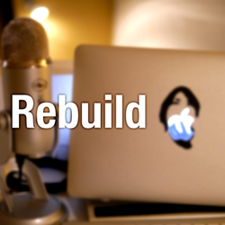
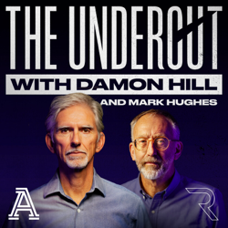
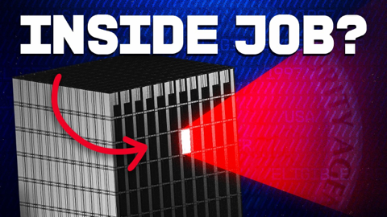
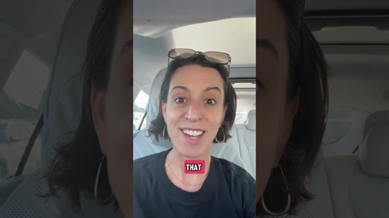
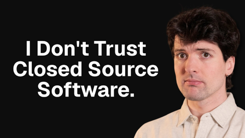
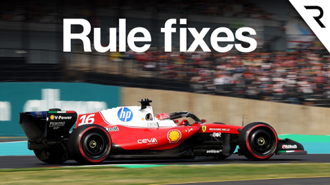
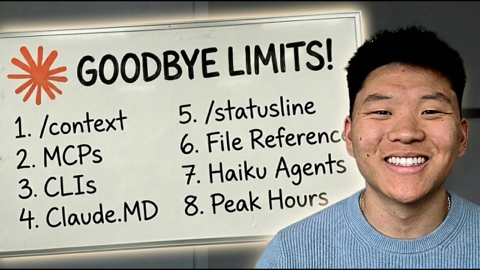
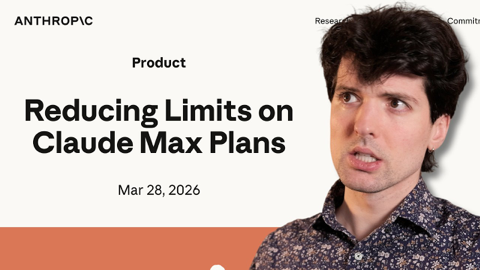

## Current Personal Status
>
> Working on transitioning [Friends with Brews](https://friendswithbrews.com) from an audio podcast to a [YouTube channel](https://www.youtube.com/@FriendswithBrewsPodcast).

## Current Projects

- Japanese and Korean study (somewhat proficient in J, complete newb to K). Using [Talk To Me In Korean Courses](https://courses.talktomeinkorean.com/). Currently taking Beginner Bootcamp course.

- Finger therapy (post-surgery)

## Stuff I've recently enjoyed

### Podcasts

*Podcast episodes without links are members-only but I think are interesting enough to post in case you want to investigate them.*

 Tech Won't Save Us (Premium) – Why Iran is Attacking Data Centers w/ Sam Biddle
 Decoder: Ad-Free Edition – A jury says Meta and Google hurt a kid. What now?
 [Risky Business – How the World Got Owned Episode 2: The 1990s, Part One](https://overcast.fm/+It0gOeooU)
 [The Incomparable Mothership – 811: Have You Considered More Voiceovers?](https://overcast.fm/+kMZ5DSSI)
 [Rebuild – 423: Stylish Magazine Like Brutus (kyuukanba)](https://overcast.fm/+mfER0iE)
 The Vergecast: Ad-Free Edition – Apple’s best product ever
 [The Undercut with Damon Hill and Mark Hughes – Why Adrian Newey’s F1 projects end in triumph or disaster | The Undercut episode 4](https://overcast.fm/+BT6gjo6GFM)
 The Race F1 Podcast (Members) – The fun way we uncovered F1’s new engine trick
 [Podcast by Yuka Studio // ユカスタポッドキャスト – Ep.138 Mac ProとAI動画アプリ「Sora」の終了、その背景👀 今週のテックニュース](https://overcast.fm/+-w715oqSM)
 MacStories Unwind+ – Moonshots, Time Machines, and Workflows

### Books

[AMETORA HOW JAPAN SAVED AMERICAN STYLE • W. David Marx • 2023 • Basic Books • It may sound odd that a history of American fashion as repurposed by the Japanese into something uniquely their own could be as fascinating as this book is, but it is indeed an enjoyable and informative read. *****
](/images/posts/png-image4844b187210-review-a8aefcaf-a9c1-4ad4-9dcd-a1c1776c0aee.jpg)

### Movies

[Fountain of Youth • 2025 • Guy Ritchie • This movie is silly and unbelievable in a lot of the same ways that Indiana Jones-style action movies often are, but it likes its characters very much and as a result, you like them as well. It's a really fun watch because of the characters and their interactions. I did not expect to like this as much as I did. *****
](/images/posts/png-image47ac813f860-review-ea8e1091-be2e-4d42-ba2c-758f69f839da.jpg)

### YouTube

Channel – [Cybernews](https://www.youtube.com/@cybernews)

[The Most Secret US Hacking Operation: Eligible Receiver 97](https://www.youtube.com/watch?v=9XdBltWIe-4&t=37s)

Channel – [Lawyer Oyer](https://www.youtube.com/@Lawyer_Oyer)

[Blanche’s first interview as Acting AG—tldr: shameless lies](https://www.youtube.com/watch?v=1dKXUTA1xzk)

Channel – [Tailscale](https://www.youtube.com/@Tailscale)

[We got self-hosted apps for days with ScaleTail](https://www.youtube.com/watch?v=ZoEZ7oHA7Gg&t=152s&pp=0gcJCdkKAYcqIYzv)

Channel – [Lenny's Podcast](https://www.youtube.com/@LennysPodcast)

[An AI state of the union: We’ve passed the inflection point & dark factories are coming](https://www.youtube.com/watch?v=wc8FBhQtdsA&t=2638s)

Channel – [Theo - t3․gg](https://www.youtube.com/@t3dotgg)

[I’m serious.](https://www.youtube.com/watch?v=08NqrRQArNw&pp=0gcJCdkKAYcqIYzv)

Channel – THE RACE and The Race Podcasts

[Why Adrian Newey's F1 projects only end in triumph or disaster](https://www.youtube.com/watch?v=UNGgOgWi6E8&t=2215s)

Channel – [Jim Farley](https://www.youtube.com/@Jim.Farley)

[Daniel Ricciardo on Winning in F1, Knowing When to Retire, and Why “Fun” Matters](https://www.youtube.com/watch?v=GCl5wUtwEYw)

Channel – [Cybernews](https://www.youtube.com/@cybernews)

[The Day China Hacked Google: Operation Aurora](https://www.youtube.com/watch?v=MlD2h0BP0Jc)

Channel – [THE RACE](https://www.youtube.com/@WeAreTheRace)

[F1's plan for six 2026 rules fixes revealed](https://www.youtube.com/watch?v=a1FGZRtNndE)

Channel – [Nate Herk | AI Automation](https://www.youtube.com/@nateherk)

[18 Claude Code Token Hacks in 18 Minutes](https://www.youtube.com/watch?v=49V-5Ock8LU&t=314s)

Channel – [Theo - t3․gg](https://www.youtube.com/@t3dotgg)

[We need to talk about the Claude Code rate limits](https://www.youtube.com/watch?v=j_kJNYLI6Tw)

Channel – [Brian Tyler Cohen](https://www.youtube.com/@briantylercohen)

[BREAKING: Bondi gets MORE BAD NEWS after firing](https://www.youtube.com/watch?v=9hgvOy9GaOE&t=70s)

### Food

 [Toshi Restaurant](https://toshirestaurant.wixsite.com/beaverton)

