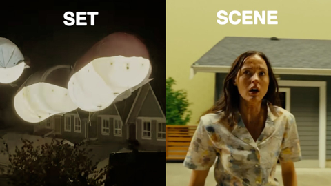
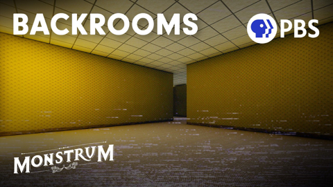
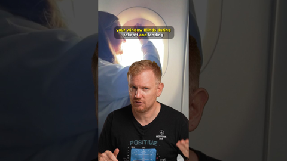

## Current Personal Status
>
> I'm here to say that depression is real and that it can be crippling. I found myself fighting this for the past week. Now it's time to take steps to get back on track and get to work again.

## Current Projects

- Work. Focusing on work. Focusing on financial goals for the sole purpose of creating some life flexibility for our family.

## Stuff I've recently enjoyed

### Podcasts

*Podcast episodes without links are members-only but I think are interesting enough to post in case you want to investigate them.*

 The 404 Media Podcast (Premium Feed) – A Repairable, No-Tech Tractor
 The Race F1 Podcast (Members) – ‘In Pizzeria Insights’: Monaco Grand Prix qualifying day
 [Comfort Zone – They’re Putting AI in the Mice](https://overcast.fm/+BI6NQbCXUc)
 [Risky Business – Soap Box: Detection and response in the AI age](https://overcast.fm/+It0ih4rRo)
 The Vergecast: Ad-Free Edition – Microsoft’s plan to catch up in AI
 [Podcast by Yuka Studio // ユカスタポッドキャスト – Ep.146 WWDC 2026 直前大予測！👀 今週のテックニュース](https://overcast.fm/+-w72CWaKM)
 The Race F1 Podcast (Members) – Kebab Shop Insights: Scott and Jon’s Monaco Friday night debrief
![McLaren’s weird rules breach and Monaco GP form so far [ad-free video]](../../assets/images/oc_artwork/5523677104465174-2591eefe-555d-4771-8545-8bd09d7b3cee.png) The Race F1 Podcast (Members) – McLaren’s weird rules breach and Monaco GP form so far [ad-free video]
 The Vergecast: Ad-Free Edition – This is your laptop… on AI
 Six Colors+ — Private – Feature thoughts on WWDC eve

### TV Shows

[Legends • 2026 • The actors make this one. I loved them all. Well, most of them. This is when I was able to just sit back and enjoy and really relish the people. *****
](/images/posts/png-image4dbb97ecf20-review-015b4382-d62f-46d3-b37c-e6252cd0c5e5.jpg)

### Books

[Steve Jobs in Exile • 2026 • Geoffrey Cain • Steve Jobs in Exile is one of the better books about Steve Jobs I've read, because it's not trying to mythologize him or do anything other than document an under-represented part of his development story. Without failure, he never could have become the CEO who saved Apple. *****
](/images/posts/png-image43a9b3f12c0-review-d0962a09-70d1-4fb1-af49-a79ae8d2fc5f.jpg)

### YouTube

Channel – [patrick 2masso](https://www.youtube.com/@sloppysteaks)

[How they filmed BACKROOMS for real](https://www.youtube.com/watch?v=2HqW0jvzrUY&t=155s)

Channel – [Ice711](https://www.youtube.com/@ice711real)

[The Mysterious YouTube Channel of the MH370 Captain](https://www.youtube.com/watch?v=h-5NNATBOgA)

Channel – [Storied](https://www.youtube.com/@pbsstoried)

[The Mythology of the Backrooms Explained](https://www.youtube.com/watch?v=Ir9do-YQoC8)

Channel – [Chase AI](https://www.youtube.com/@Chase-H-AI)

[This Open Source Repo Just Solved Claude Code's #1 Problem](https://www.youtube.com/watch?v=ChskqGovoHg&t=93s)

Channel – [Mentour Pilot](https://www.youtube.com/@MentourPilot)

[There's a REASON They Make You Open Your Window Blinds!](https://www.youtube.com/watch?v=jCA1AvhIxZE)

Channel – [Nate Herk | AI Automation](https://www.youtube.com/@nateherk)

[Is Claude Mythos Coming?](https://www.youtube.com/watch?v=lkR6mvqQQlk)

Channel – [Tech Enthusiast](https://www.youtube.com/@TechEnthusiastOfficial)

[Mac's Best Window Manager](https://www.youtube.com/watch?v=gkSe7UF1Xf0&t=8s)

Channel – [Mac Square](https://www.youtube.com/@MacSquareVideos)

[The BEST Window Snapping Tool for Mac!](https://www.youtube.com/watch?v=uakHtSxl6cA)

Channel – [Dailytekk](https://www.youtube.com/@Dailytekk)

[Unbelievably Useful Mac Productivity Apps](https://www.youtube.com/watch?v=Qhk-vj-850I&t=199s)

Channel – [Captain Steeeve](https://www.youtube.com/@CaptainSteeeve)

[Lufthansa 787 COLLAPSES at the Gate! - Pilot Reacts](https://www.youtube.com/watch?v=656xoyj4kIw&t=724s)

Channel – [FORMULA 1](https://www.youtube.com/@Formula1)

[Drivers React To Qualifying | 2026 Monaco Grand Prix](https://www.youtube.com/watch?v=RTZQ55o7TZY)

Channel – [Charlie Hills](https://www.youtube.com/@CharlieHillsAI)

[Did Claude Code Just Replace Video Editors?](https://www.youtube.com/watch?v=xByc_UCEr-8&t=56s)

