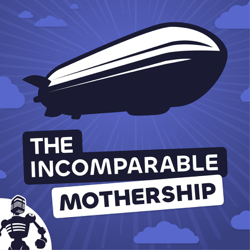
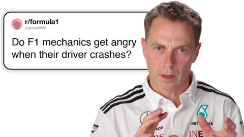
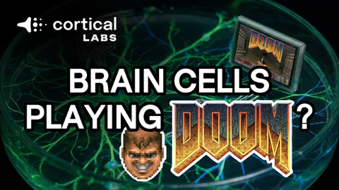
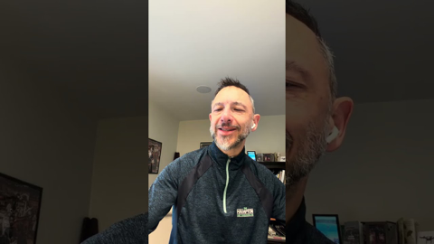
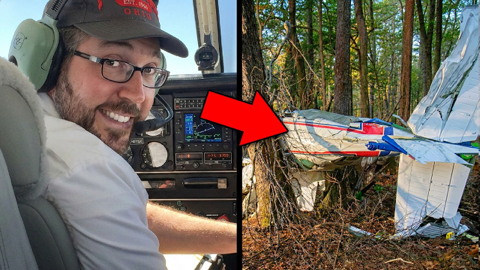
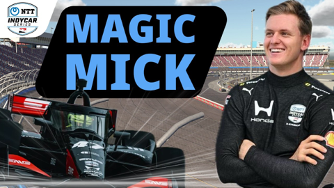
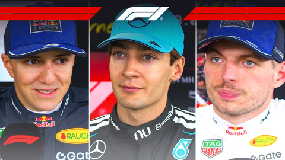
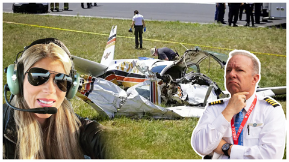
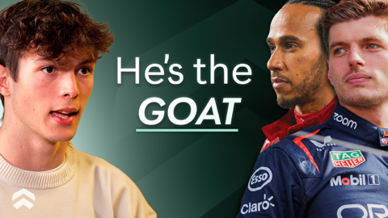
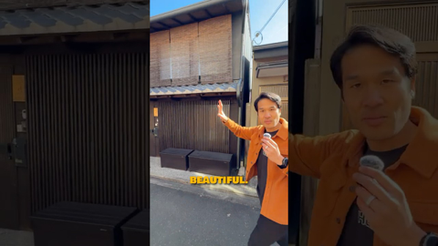

## Current Personal Status
>
> Thinking about making [Friends with Brews](https://friendswithbrews.com/) either wholly or primarily a YouTube channel. It fits the video medium better.

## Current Projects

- Japanese and Korean study (somewhat proficient in J, complete newb to K). Using [Talk To Me In Korean Courses](https://courses.talktomeinkorean.com/). Currently doing the Hangeul 7 day challenge just to make myself get to work.

## Stuff I've recently enjoyed

### Podcasts

*Podcast episodes without links are members-only but I think are interesting enough to post in case you want to investigate them.*

 [Cybersecurity Headlines – FBI network breach, GitHub distributes stealer, Hackers abuse .arpa](https://overcast.fm/+BTPniuutNQ)
 AppStories+ – Apple’s Big Neo Week
 [Patrick Boyle On Finance – The Winners & Losers from Trumps New Tariffs](https://overcast.fm/+oGB6HZDBI)
 The Race F1 Podcast (Members) – Australian Grand Prix review (ad-free)
 [Unclear and Present Danger – U.S. Marshals](https://overcast.fm/+00hlrxR3s)
 [Accidental Tech Podcast – 681: The Price of Your Nightmares](https://atp.fm/681)
 [The Incomparable Mothership – 807: Assassin As a Service](https://overcast.fm/+kMZRNolM)
 The Race F1 Podcast (Members) – Jon’s take on a rollercoaster first F1 qualifying day of 2026
 Six Colors+ — Private – Studio Displays and, oh yeah, the MacBook Neo
 MacStories Unwind+ – From Press Releases to Pokopia

### Books

[Falling Free (Vorkosigan Saga) • 2015 • Lois McMaster Bujold I'm giving this a 3 star here because I can't give it a 2.5, but please understand this book has an average 4.0 rating. It definitely didn't quite sell me. I didn't really like Leo, and his romance with Silver at the end seemed forced. ****
](/images/posts/png-image489eb5250e0-review-132bc5fe-2a88-4ba0-9153-481fbd57bf93.jpg)

### Movies

[THE RIP • First Time Viewing • 2026 • Joe Carnahan • The implausibilities and obvious impossibilities are largely overcome by the plot premise and the likability of some of the characters. Have a Kirin and watch and you'll enjoy it. ***
](/images/posts/png-image47ce83965e0-review-0f62fa43-92c4-4650-8ff9-7a7bc650d6d0.jpg)

### TV Shows

[HIS & HERS • 2026 • Parts of this were extremely good. I guess that's what made the ending even more disappointing, because I did not buy the main character's reaction to it. **
](/images/posts/png-image46188fe7dc0-review-aaab3e16-7f1e-4aa0-8d70-8161bf0b4445.jpg)
[Formula 1: Drive to Survive • Season 8 review. Once again Drive to Survive is very painful for long- time and knowledgeable Formula One fans. They continue to manufacture story lines that don't quite exist and they continue to give Christian Horner more attention than that guy deserves. And now they've added Flavio Briatore to the attention they don't deserve category. The last couple of episodes were pretty good though. **
](/images/posts/png-image40aeb107b10-review-d8edf9cb-be78-4ff9-bd06-6638478149b9.jpg)
[The Night Manager • 2016 • Season 2 review • Tom Hiddleston continues to be super compelling in this role. The supporting cast here is very good - Diego Calva as Teddy Dos Santos and Camila Morrone as Roxana Bolaños are expecially good. Paul Chahidi (Basil) and Hayley Squires (Sally) are also great. *****
](/images/posts/png-image461184dd2c0-review-d49dd5f8-0c11-429a-9832-4d8c4f8173cf.jpg)

### YouTube

Channel – [WIRED](https://www.youtube.com/@WIRED)

[F1 Chief Mechanic Answers F1 Car Questions | Tech Support | WIRED](https://www.youtube.com/watch?v=Ie-KCHHSUo4&t=586s)

Channel – [AI LABS](https://www.youtube.com/@AILABS-393)

[Claude Just Solved Their Biggest Problem](https://www.youtube.com/watch?v=opZpIN8g_6M&t=14s)

Channel – [Cortical Labs](https://www.youtube.com/@corticallabs-yt)

[Living Human Brain Cells Play DOOM on a CL1](https://www.youtube.com/watch?v=yRV8fSw6HaE&t=161s&pp=0gcJCa4KAYcqIYzv)

Channel – [Hysteria](https://www.youtube.com/@hysteriapodcast)

[Sam Altman: Everything You Didn't Know About His Sh*tty Past](https://www.youtube.com/watch?v=_XRjoR5VLos&t=25s)

Channel – [Peter Nikolaidis](https://www.youtube.com/@PeterNikolaidis)

[Peter Drinks High Brew Nitro Cold Brew Coffee](https://www.youtube.com/watch?v=cvR8Q4LN2yU)

Channel – [Pilot Debrief](https://www.youtube.com/@pilot-debrief)

[Chilling Audio Reveals Pilot's Fatal Mistake!](https://www.youtube.com/watch?v=iGhefWbVSOk)

Channel – [The Hot Lap](https://www.youtube.com/@thehotlapshow)

[MICK Schumachers INSANE Qualifying](https://www.youtube.com/watch?v=Dhch92iPJ4s&t=258s)

Channel – [FORMULA 1](https://www.youtube.com/@Formula1)

[Drivers React To Qualifying | 2026 Australian Grand Prix](https://www.youtube.com/watch?v=FCZsrwmqQDM&pp=0gcJCa4KAYcqIYzv)

Channel – [Captain Steeeve](https://www.youtube.com/@CaptainSteeeve)

[Final NTSB Report: TNFlygirl Crash Breakdown](https://www.youtube.com/watch?v=sr3AbxESSro)

Channel – [High Performance](https://www.youtube.com/@HighPerformancePodcast)

[Ollie Bearman on Max vs Lewis, Mental Struggles & Ferrari Return?](https://www.youtube.com/watch?v=4dz2Tk8nScs)

Channel – [High Performance](https://www.youtube.com/@HighPerformancePodcast)

[Ollie Bearman on Max vs Lewis, Mental Struggles & Ferrari Return?](https://www.youtube.com/watch?v=4dz2Tk8nScs&pp=0gcJCa4KAYcqIYzv)

Channel – [Shu Matsuo Post](https://www.youtube.com/@shumatsuopost)

[Prime Kyoto Living by the River #AkiyaHub #JapaneseHouse #VacationHome #Japan #Kyoto](https://www.youtube.com/watch?v=ssKnAUOsLzE)

### Food

 [Hapa Pizza Home](https://www.hapapizza.com)

