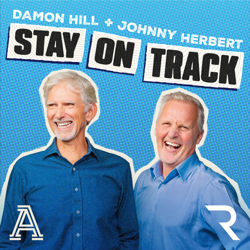
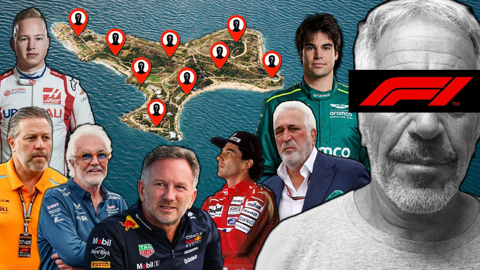
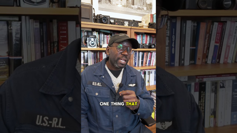
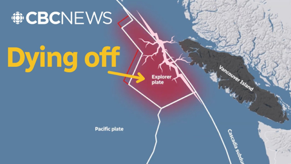
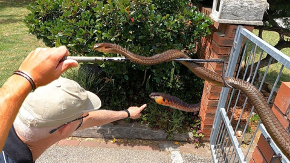
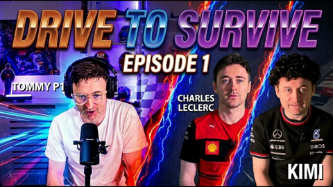

## Current Personal Status
>
> I have had a cold for about a week and a half, and... no, I'm sorry, it's almost two weeks, and I am just wiped out.

## Current Projects

- Japanese and Korean study (somewhat proficient in J, complete newb to K). Using [Talk To Me In Korean Courses](https://courses.talktomeinkorean.com/).

## Stuff I've recently enjoyed

### Podcasts

*Podcast episodes without links are members-only but I think are interesting enough to post in case you want to investigate them.*

 [NosillaCast Apple Podcast – NC #1086 Broken Femur, Rescue Retriever, Audiobook Recording V3 Part 1 Eddie Tonki, Security Bits](https://overcast.fm/+BJFaJrH-04)
 The Race F1 Podcast (Members) – Greetings from Melbourne! Jon’s welcome message after making it to Australia
 [Friends with Brews – Greg Is a Reindeer](https://overcast.fm/+9SHi-GZ7Y)
 AppStories+ – Our Apple Hardware Wish List for 2026
 [The Talk Show With John Gruber – 442: ‘Bad Dates’, With Jason Snell](https://overcast.fm/+B7NAt5xls)
 [Stay On Track with Damon Hill and Johnny Herbert – Early Access: Is Verstappen right about F1 2026? Hill and Herbert’s verdict | Stay On Track Ep.5](https://overcast.fm/+BTLppqbfUw)
 [Accidental Tech Podcast – 680: A Lot of Holes in That Cheese](https://atp.fm/680)
 Six Colors+ — Private – Report cards, Formula One, and Netflix
 MacStories Unwind+ – Cartridges, Vinyl, and Italian Rocky
 The 404 Media Podcast (Premium Feed) – How to Detect Phone Spying Tech (with Cooper Quintin)

### Books

[Falling Free (Vorkosigan Saga) • 2015 • Lois McMaster Bujold I'm giving this a 3 star here because I can't give it a 2.5, but please understand this book has an average 4.0 rating. It definitely didn't quite sell me. I didn't really like Leo, and his romance with Silver at the end seemed forced. ****
](/images/posts/png-image489eb5250e0-review-132bc5fe-2a88-4ba0-9153-481fbd57bf93.jpg)

### Movies

[THE RIP • First Time Viewing • 2026 • Joe Carnahan • The implausibilities and obvious impossibilities are largely overcome by the plot premise and the likability of some of the characters. Have a Kirin and watch and you'll enjoy it. ***
](/images/posts/png-image47ce83965e0-review-0f62fa43-92c4-4650-8ff9-7a7bc650d6d0.jpg)

### TV Shows

[Formula 1: Drive to Survive • Season 8 review. Once again Drive to Survive is very painful for long- time and knowledgeable Formula One fans. They continue to manufacture story lines that don't quite exist and they continue to give Christian Horner more attention than that guy deserves. And now they've added Flavio Briatore to the attention they don't deserve category. The last couple of episodes were pretty good though. **
](/images/posts/png-image40aeb107b10-review-d8edf9cb-be78-4ff9-bd06-6638478149b9.jpg)
[The Night Manager • 2016 • Season 2 review • Tom Hiddleston continues to be super compelling in this role. The supporting cast here is very good - Diego Calva as Teddy Dos Santos and Camila Morrone as Roxana Bolaños are expecially good. Paul Chahidi (Basil) and Hayley Squires (Sally) are also great. *****
](/images/posts/png-image461184dd2c0-review-d49dd5f8-0c11-429a-9832-4d8c4f8173cf.jpg)

### YouTube

Channel – [Rick'sF1Addiction](https://www.youtube.com/@RicksF1Addiction)

[F1 and the Epstein List](https://www.youtube.com/watch?v=J8WVXqi-W28)

Channel – [THE RACE](https://www.youtube.com/@WeAreTheRace)

[What we’ve learned about Honda’s disastrous F1 engine problems](https://www.youtube.com/watch?v=22N1KYcybX0)

Channel – [Takes™ by Jamelle Bouie](https://www.youtube.com/@jamelle-bouie)

[next time don't invite him](https://www.youtube.com/watch?v=JjEXlAZ-1bQ)

Channel – [Patrick Boyle](https://www.youtube.com/@PBoyle)

[How a Small Wine Importer Smashed Trump’s Tariffs](https://www.youtube.com/watch?v=ChdQciz1gns)

Channel – [CBC News](https://www.youtube.com/@CBCNews)

[The ‘Big One’ just got more complicated](https://www.youtube.com/watch?v=fzo2WiWeVV4)

Channel – [Vincent Langevin](https://www.youtube.com/channel/UCSOJL9INAMkkp8EE6xQXoaA)

[Jim Carrey Stuns France While Speaking French At The Ceasar Awards](https://www.youtube.com/watch?v=OIDTI6VL9wE)

Channel – [Kevin Ulett - Snake Handler](https://www.youtube.com/@KevinUlett)

[Catching a Huge, Venomous Boomslang! It was hiding under the Postbox!](https://www.youtube.com/watch?v=_pd9OlmDmiU)

Channel – [Keith Edwards](https://www.youtube.com/@keithedwards)

[Trump thought no one was recording..](https://www.youtube.com/watch?v=bfqtPe1A7EA)

Channel – [Conor Moore Racing](https://www.youtube.com/@conormooref1)

[F1 Drive to Survive Episode 1 Parody!](https://www.youtube.com/watch?v=OvBXGDf1ZcI)

Channel – [Horizon3 AI](https://www.youtube.com/@horizon3ai)

[Fireside Chat: Horizon3.ai and Quantum Marine Engineering](https://www.youtube.com/watch?v=2zFPDh4IjVk&t=231s)

Channel – [Loving The 80s](https://www.youtube.com/@Lovingthe80s)

[Is To Live and Die in L.A. REALLY the Most Dangerous 80s Crime Film?](https://www.youtube.com/watch?v=Vm0UFC2S39k&t=110s)

Channel – [David Pakman Show](https://www.youtube.com/@thedavidpakmanshow)

[Epstein file BOMB explodes](https://www.youtube.com/watch?v=y4DiIoq4Gg0)

