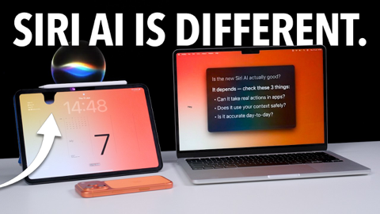
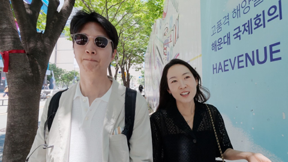
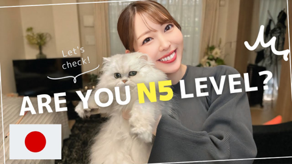
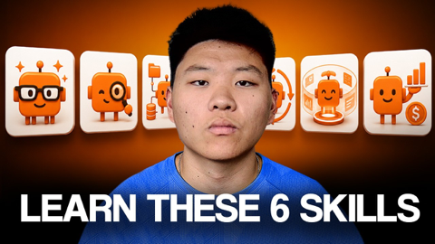
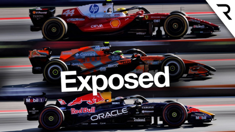
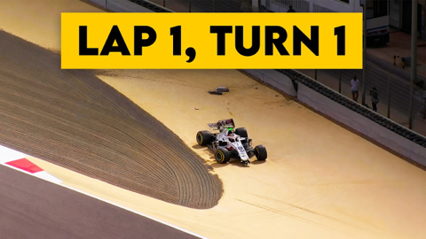
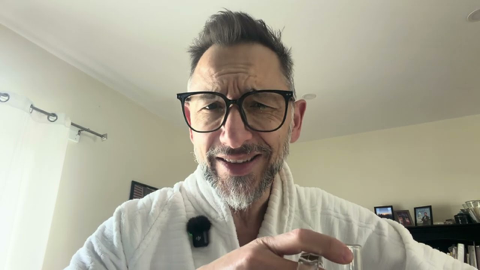
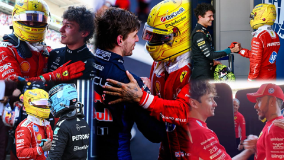
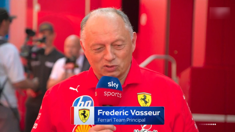

## Current Personal Status
>
> This week I discovered the world of getting Claude Code to edit video, and I'm never going back! I've built up a pretty good system. It'll be interesting once I get to episodes with separate recordings per host for it to compile.

## Current Projects

- [Friends with Brews Podcast YouTube Channel](https://www.youtube.com/@FriendswithBrewsPodcast)

- Work. Focusing on work. Focusing on financial goals for the sole purpose of creating some life flexibility for our family.

## Stuff I've recently enjoyed

### Podcasts

*Podcast episodes without links are members-only but I think are interesting enough to post in case you want to investigate them.*

 The Vergecast: Ad-Free Edition – The epic story of Markdown
 The Race F1 Podcast (Members) – Barcelona Grand Prix review (ad free)
 [Patrick Boyle On Finance – What SpaceX, Anthropic and OpenAI’s IPOs mean for investors](https://overcast.fm/+oGB4Rro9I)
 Decoder: Ad-Free Edition – Microsoft AI chief thinks superintelligence is near, but won’t take your job
 The Race F1 Podcast (Members) – In-Car Insights: Edd and Jon on Barcelona qualifying day’s big talking points
 [Accidental Tech Podcast – 695: The Crystal Pepsi of Aqua](https://atp.fm/695)
 The Vergecast: Ad-Free Edition – Siri AI, Screen Time, and the rest of WWDC 2026: The Vergecast Livestream
 [Sales Logic - Selling Strategies That Work – What’s Wrong with My Pipeline?](https://overcast.fm/+X6nOEGunE)
 The Vergecast: Ad-Free Edition – How Steve Jobs became Steve Jobs
 [Business History – Ida Tarbell: The “Muckraker” Who Beat John D Rockefeller and Big Oil](https://overcast.fm/+BSZV2ZkND4)

### Books

[Steve Jobs in Exile • 2026 • Geoffrey Cain • Steve Jobs in Exile is one of the better books about Steve Jobs I've read, because it's not trying to mythologize him or do anything other than document an under-represented part of his development story. Without failure, he never could have become the CEO who saved Apple. *****
](/images/posts/png-image43a9b3f12c0-review-d0962a09-70d1-4fb1-af49-a79ae8d2fc5f.jpg)

### YouTube

Channel – [Better Creating](https://www.youtube.com/@BetterCreating)

[Siri AI Is Late… but Great. Apple’s New AI Disruptor](https://www.youtube.com/watch?v=pK_670-OtC0&t=50s&pp=0gcJCT4LAYcqIYzv)

Channel – [Chris and Yeji](https://www.youtube.com/@chrisandyeji)

[Back to Busan life](https://www.youtube.com/watch?v=8sOXYTaFXQ8)

Channel – [Mochi Real Japanese](https://www.youtube.com/@mochirealjapanese3430)

[34. If you understand this, you are JLPT N5 level!](https://www.youtube.com/watch?v=ZBrHRwCDTy0&t=133s)

Channel – [Nischa](https://www.youtube.com/@nischa)

[Accountant explains: You might be richer than you think](https://www.youtube.com/watch?v=859_TTVdfn4)

Channel – [Nate Herk | AI Automation](https://www.youtube.com/@nateherk)

[Learn These 6 AI Skills Now (Before AI Replaces You)](https://www.youtube.com/watch?v=3XIGcM7VICc&t=800s)

Channel – [Low Level](https://www.youtube.com/@LowLevelTV)

[The First Domino Has Fallen...](https://www.youtube.com/watch?v=gDpuFDCLvBc)

Channel – [THE RACE](https://www.youtube.com/@WeAreTheRace)

[What brutal Barcelona exposed about every F1 team](https://www.youtube.com/watch?v=fkw7CgjKSRM)

Channel – [Throttle Talk](https://www.youtube.com/@ThrottleTalkTV)

[The Worst F1 Debuts of All Time...](https://www.youtube.com/watch?v=DBn36F117pE)

Channel – [Peter Nikolaidis](https://www.youtube.com/@PeterNikolaidis)

[Peter Drinks a *Third* Cup Downeast Dark Roast #coffee](https://www.youtube.com/watch?v=IkrlJ3iFQjs)

Channel – [F1 Chequered Flag](https://www.youtube.com/@F1ChequeredFlag)

[Max Verstappen & every F1 Driver congratulating Lewis Hamilton after Win in Spain | Wholesome scenes](https://www.youtube.com/watch?v=242jVjH7Uk4&t=91s)

Channel – [The Debrief Zone](https://www.youtube.com/@TheDebriefZone3)

[Fred Vasseur Praises Hamilton’s Race Management | Barcelona-Catalunya GP Race 2026](https://www.youtube.com/watch?v=IDPdPXzUgOE)

Channel – [Nischa](https://www.youtube.com/@nischa)

[Accountant Explains: I'm Changing How I Invest (Before It's Too Late)](https://www.youtube.com/watch?v=HNVg81nA2J8)

