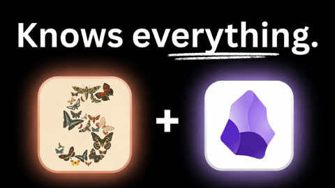
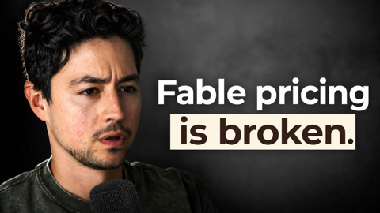
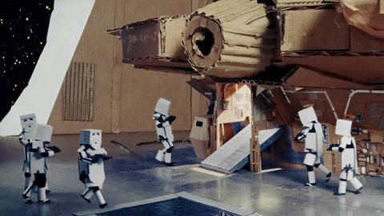

## Current Personal Status
>
> My Claude Code video editing workflow is getting more and more robust. I haven't tried it on a separate file, two host episode yet, but that should happen soon. Also having fun using tokens on Fable while I'm ... able. Sorry. I genuinely didn't mean to do that.

## Current Projects

- Work. Lots of fun stuff.

- Also a couple Mac utilities, some of them with corresponding iOS apps. This really is the golden age of generating software for yourself for your own use.

## Stuff I've recently enjoyed

### Podcasts

*Podcast episodes without links are members-only but I think are interesting enough to post in case you want to investigate them.*

 [Risky Business Features – Mythos on your desk? Using local LLMs for code reviews](https://overcast.fm/+BVj7mJeq9U)
 The Race F1 Podcast (Members) – British Grand Prix review (ad free)
 [Comfort Zone – The Year of Our Lord, Zork](https://overcast.fm/+BI6NTg1BxA)
 [The Weekly Planet – Jason and the Argonauts - Caravan Of Garbage](https://overcast.fm/+1HFI04ZQU)
 AppStories+ (private members feed) – Email Survival Guide
 [Patrick Boyle On Finance – The Real Reason European Cars Can’t Compete](https://overcast.fm/+oGB6yxmUs)
 [Podcast by Yuka Studio // ユカスタポッドキャスト – Ep.149 AI生成画像を見抜く6つのポイント🧐 今週のテックニュース](https://overcast.fm/+-w72pF6_k)
 Decoder: Ad-Free Edition – The CMO is a dying role, says Digitas’ Amy Lanzi
 The Vergecast: Ad-Free Edition – The video game disc is dead
 [Unclear and Present Danger – Godzilla (1998)](https://overcast.fm/+00hm4Rhi0)

### Movies

[Nobody 2 • 2025 • Timo Tjahjanto • I wanted to at least enjoy this as a piece of mindless entertainment. The problem is it's too dumb to be mindless. This is probably the stupidest movie I've ever seen, and I've seen some stupid movies. *
](/images/posts/png-image4725917c6f0-review-84793152-5b89-41bf-bf96-14141079d676.jpg)

### TV Shows

[Your Friends & Neighbors S2 • 2025 • S2 review. Yes, this show is absolutely about the rich and privileged, but it does actually make you care about some of the people. It's overwhelmingly hilarious. And tense. And fun. The whole cast is stellar, but Jon Hamm is just magnificent. *****
](/images/posts/png-image4bbc8ac8530-review-ebe7158f-8a58-43e6-80c7-100526973512.jpg)

### YouTube

Channel – [MacStories](https://www.youtube.com/@MacStories09)

[Comfort Zone, Episode 107: The Year of Our Lord, Zork](https://www.youtube.com/watch?v=ok_LPAP6J94&t=3231s)

Channel – [Pilot Debrief](https://www.youtube.com/@pilot-debrief)

[5 Times Pilot Mistakes Got Celebrities Killed!](https://www.youtube.com/watch?v=hpKXcDc6ftY&t=2416s)

Channel – [fern](https://www.youtube.com/@fern-tv)

[ANØM: The Most Genius FBI Operation](https://www.youtube.com/watch?v=f6FRIDG8TPY)

Channel – [CBC News: The National](https://www.youtube.com/@CBCTheNational)

[War arrives on Putin’s doorstep](https://www.youtube.com/watch?v=siIij7W8bAY)

Channel – [Mentour Pilot](https://www.youtube.com/@MentourPilot)

[Desperate: The Crash that Changed Aviation Forever](https://www.youtube.com/watch?v=mJ5zuuDN7A4)

Channel – [Mentour Pilot](https://www.youtube.com/@MentourPilot)

[Were They CONSCIOUS.. After it Hit?!](https://www.youtube.com/watch?v=hVl4paLvLzw&pp=0gcJCUwLAYcqIYzv)

Channel – [Shane Hummus](https://www.youtube.com/@ShaneHummus)

[The Fastest Claude AI Side Hustle to Your First $1,000](https://www.youtube.com/watch?v=THz33AhikiI)

Channel – [Nate Herk | AI Automation](https://www.youtube.com/@nateherk)

[How to Give Fable 5 Infinite Memory (Karpathy Wiki)](https://www.youtube.com/watch?v=hQvwMj7IJe4)

Channel – [Theo - t3․gg](https://www.youtube.com/@t3dotgg)

[You were lied to about Fable](https://www.youtube.com/watch?v=5LqC6qdVAwU&t=1209s)

Channel – [Nick Saraev](https://www.youtube.com/@nicksaraev)

[I spent $1,486 on Fable tokens so you don't have to](https://www.youtube.com/watch?v=aif87UYCxOo)

Channel – [Road Racing Empire](https://www.youtube.com/@RoadRacingEmpire)

[Isle of Man TT | Every Clip is Absolute Madness](https://www.youtube.com/watch?v=RZiE9Nd4GAs)

Channel – [Secondhand Movie Co](https://www.youtube.com/@SecondhandMovieCo)

[Star Wars But We Only Had $12](https://www.youtube.com/watch?v=ptPzMAf3U-s)

