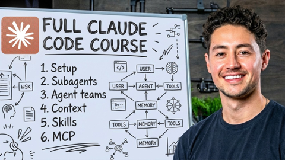
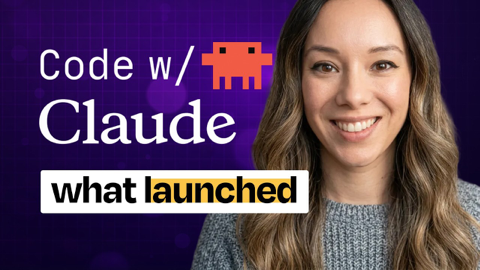
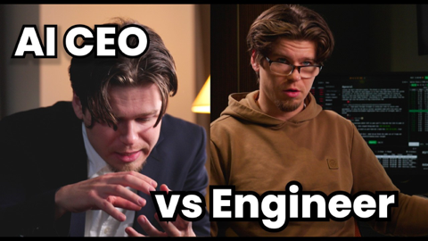
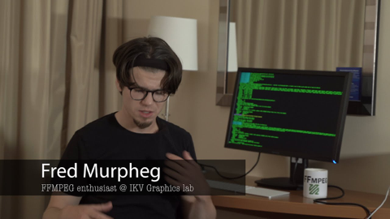
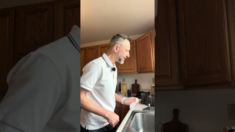
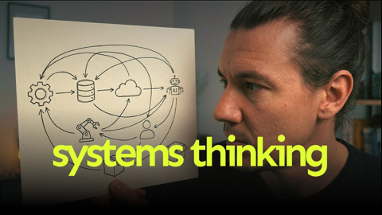

## Current Personal Status
>
> I have not forgotten about this site. I've just been extremely busy trying to pay bills and also trying to make better things happen in terms of some work-related projects. I honestly need more hours in the day and more energy in the body.

## Current Projects

- Working hard on stuff for Paradigm Consulting and trying to get some new related ventures going.

- Japanese and Korean study (somewhat proficient in J, complete newb to K). Using [Talk To Me In Korean Courses](https://courses.talktomeinkorean.com/). Currently taking Beginner Bootcamp course.

- [Friends with Brews](https://friendswithbrews.com) [YouTube channel](https://www.youtube.com/@FriendswithBrewsPodcast)

## Stuff I've recently enjoyed

### Podcasts

*Podcast episodes without links are members-only but I think are interesting enough to post in case you want to investigate them.*

 Tech Won't Save Us (Premium) – Muskism is the New Fordism w/ Ben Tarnoff & Quinn Slobodian (audio only)
 [Talk Python To Me – #547: Parallel Python at Anyscale with Ray](https://overcast.fm/+F4RBzOwpE)
 [Comfort Zone – Better Than Getting Into Crypto](https://overcast.fm/+BI6NS7GWa8)
 [First, Last, Everything – Niléane Dorffer - Activist, Podcaster](https://overcast.fm/+BWGclcrzK4)
 [Judge John Hodgman – Asparagus Plea Live in Portland](https://overcast.fm/+YJM1FH-gQ)
 The Race F1 Podcast (Members) – Has Russell’s title bid gone off-track already? Your questions answered (ad free)
 The Race F1 Podcast (Members) – Edd answers your questions about his Miami GP F1 driver rankings
 The Vergecast: Ad-Free Edition – What an AI-designed car looks like
 [Sales Logic - Selling Strategies That Work – Redefining Sales Success in the Age of Customer Experience](https://overcast.fm/+X6nPWdqCA)
 [ながらAIラジオ – 2026年05月04日: AI初心者向け徹底解説！LLM・AIエージェント、学習法、副業、起業のQ&A、Claude×Adobe連携も](https://overcast.fm/+BNeIVPkqWI)

### Books

[The Mastermind • Evan Ratliff • 2019 • Crime is fun, at least for the reader of good journalistic documentations of it, and Evan Ratliff is nothing if not a dogged and interested journalist. I read most of this online at some point, but the book is still incredibly fascinating. Paul Le Roux is quite a character. You won't be able to put this down. *****
](/images/posts/png-image44fcb606ac0-review-a25b8a5c-1425-41be-9d10-77e987cd396a.jpg)

### YouTube

Channel – [Nick Saraev](https://www.youtube.com/@nicksaraev)

[CLAUDE CODE FULL COURSE 4 HOURS: Build & Sell (2026)](https://www.youtube.com/watch?v=QoQBzR1NIqI&t=9185s)

Channel – [Nick Saraev](https://www.youtube.com/@nicksaraev)

[VIBE CODING FULL COURSE: Gemini 3.1 + Antigravity (6 Hrs)](https://www.youtube.com/watch?v=gcuR_-rzlDw&t=2s)

Channel – [Papermancy](https://www.youtube.com/@papermancy)

[Come on a Tour of Hiromi Paper in L.A.!](https://www.youtube.com/watch?v=1BTo0vTlDNk&pp=0gcJCQMLAYcqIYzv)

Channel – [Punchline Vault](https://www.youtube.com/@PunchlineVault24)

[Josh Johnson Says the Shooter Ran Past Secret Service Like an Anime Character 💀](https://www.youtube.com/watch?v=ceb7qEM592A&t=70s)

Channel – [How I AI](https://www.youtube.com/@howiaipodcast)

[Claude Code Just Got WAY More Powerful](https://www.youtube.com/watch?v=efVfydaUIrM)

Channel – [Lauren the Mortician](https://www.youtube.com/@Laurenthemortician)

[The Night I Picked Up My Own Uncle (True Mortician Story)](https://www.youtube.com/watch?v=3g9QTl1nnfE)

Channel – [Kai Lentit](https://www.youtube.com/@programmersarealsohuman5909)

[AI CEO vs Engineer (2026).](https://www.youtube.com/watch?v=WAUnmQt2Z7Y)

Channel – [Low Level](https://www.youtube.com/@LowLevelTV)

[The GitHub situation just got worse...](https://www.youtube.com/watch?v=m5t08CREHcE)

Channel – [Kai Lentit](https://www.youtube.com/@programmersarealsohuman5909)

[Interview with FFMPEG enthusiast](https://www.youtube.com/watch?v=9kaIXkImCAM)

Channel – [Peter Nikolaidis](https://www.youtube.com/@PeterNikolaidis)

[Peter Drinks Vermont #coffee  Company Dark Roast](https://www.youtube.com/watch?v=FxNU9mnur-o)

Channel – [Hak](https://www.youtube.com/@mostlyhak)

[Is this the only skill left?](https://www.youtube.com/watch?v=7zCsfe57tpU&t=517s)

Channel – [Japan by Food](https://www.youtube.com/@JapanbyFood)

[We Ate Japan’s #1 Spiciest Curry 🥵 (Instant REGRET!) | Japan byFood](https://www.youtube.com/watch?v=CBKvkgeZwiE)

