## Current Personal Status
>
> Lots of fun with hand therapy exercises after my finger surgery.

## Current Projects

- Japanese and Korean study (somewhat proficient in J, complete newb to K). Using [Talk To Me In Korean Courses](https://courses.talktomeinkorean.com/). Currently doing the Hangeul 7 day challenge just to make myself get to work.

- Finger therapy (post-surgery)

## Stuff I've recently enjoyed

### Podcasts

*Podcast episodes without links are members-only but I think are interesting enough to post in case you want to investigate them.*

 [Sales Logic - Selling Strategies That Work – How to Know if You Have What it Takes to Make It in Sales](https://overcast.fm/+X6nPVqhAk)
 [The Weekly Planet – 614 How to Make a Killing & Supergirl First Reactions](https://overcast.fm/+1HFJdz73A)
 [Security You Should Know – Transitioning to Quantum-Safe Encryption with enQase](https://overcast.fm/+BN0Zej7QRQ)
 [Firewalls Don't Stop Dragons Podcast – Surveillance Pricing](https://overcast.fm/+PvDaEQGUo)
 Decoder: Ad-Free Edition – Yahoo CEO Jim Lanzone on reviving the web’s homepage
[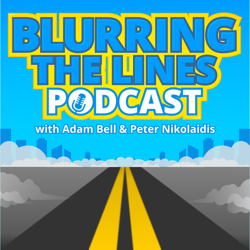](https://overcast.fm/+GsOnuLzJs) [Blurring The Lines Podcast – Episode 248 - From Polynesian Voyages to French Press](https://overcast.fm/+GsOnuLzJs)
 [Programming By Stealth – PBS Tidbit 18 — A Real-World Jekyll Example](https://overcast.fm/+JGaAry1FY)
 [Patrick Boyle On Finance – SpaceX IPO Scandal](https://overcast.fm/+oGB5e3KAQ)
 AppStories+ – The Fractal Fragmentation of AI Tools
 The Race F1 Podcast (Members) – Chinese Grand Prix review (ad-free)

### Books

[Falling Free (Vorkosigan Saga) • 2015 • Lois McMaster Bujold I'm giving this a 3 star here because I can't give it a 2.5, but please understand this book has an average 4.0 rating. It definitely didn't quite sell me. I didn't really like Leo, and his romance with Silver at the end seemed forced. ****
](/images/posts/png-image489eb5250e0-review-132bc5fe-2a88-4ba0-9153-481fbd57bf93.jpg)

### Movies

[THE RIP • First Time Viewing • 2026 • Joe Carnahan • The implausibilities and obvious impossibilities are largely overcome by the plot premise and the likability of some of the characters. Have a Kirin and watch and you'll enjoy it. ***
](/images/posts/png-image47ce83965e0-review-0f62fa43-92c4-4650-8ff9-7a7bc650d6d0.jpg)

### TV Shows

[HIS & HERS • 2026 • Parts of this were extremely good. I guess that's what made the ending even more disappointing, because I did not buy the main character's reaction to it. **
](/images/posts/png-image46188fe7dc0-review-aaab3e16-7f1e-4aa0-8d70-8161bf0b4445.jpg)
[Formula 1: Drive to Survive • Season 8 review. Once again Drive to Survive is very painful for long- time and knowledgeable Formula One fans. They continue to manufacture story lines that don't quite exist and they continue to give Christian Horner more attention than that guy deserves. And now they've added Flavio Briatore to the attention they don't deserve category. The last couple of episodes were pretty good though. **
](/images/posts/png-image40aeb107b10-review-d8edf9cb-be78-4ff9-bd06-6638478149b9.jpg)
[The Night Manager • 2016 • Season 2 review • Tom Hiddleston continues to be super compelling in this role. The supporting cast here is very good - Diego Calva as Teddy Dos Santos and Camila Morrone as Roxana Bolaños are expecially good. Paul Chahidi (Basil) and Hayley Squires (Sally) are also great. *****
](/images/posts/png-image461184dd2c0-review-d49dd5f8-0c11-429a-9832-4d8c4f8173cf.jpg)

### YouTube

[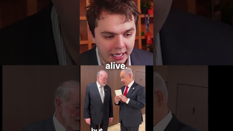 ](https://www.youtube.com/watch?v=_wrzIikMR5A)

Channel – [Adam Mockler](https://www.youtube.com/@adammockler)

[Netanyahu Misses 7 Straight Meetings #politics #fyp #new](https://www.youtube.com/watch?v=_wrzIikMR5A)

[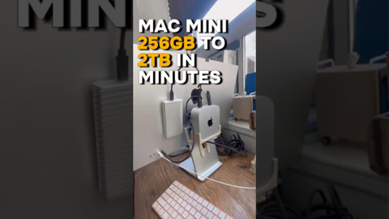 ](https://www.youtube.com/watch?v=q8K5O7m0KgU)

Channel – [Dan Ackerman](https://www.youtube.com/@DanAckerman)

[M4 Mac Mini: 256GB to 2TB in Minutes](https://www.youtube.com/watch?v=q8K5O7m0KgU)

[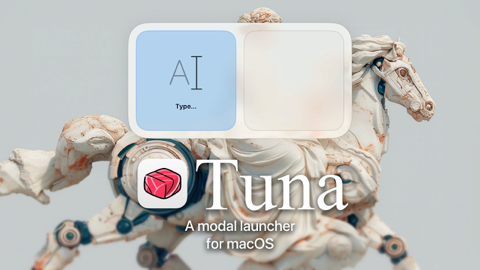 ](https://www.youtube.com/watch?v=vkm-ZFlivyI)

Channel – [Mikkel Malmberg](https://www.youtube.com/@MikkelMalmberg)

[Meet Tuna: a brand new, modern, modal launcher for macOS](https://www.youtube.com/watch?v=vkm-ZFlivyI)

[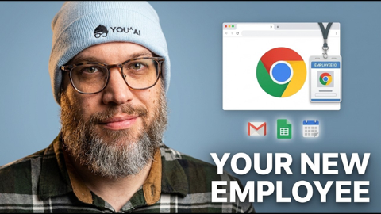 ](https://www.youtube.com/watch?v=QT7W_uHjqWE&t=314s)

Channel – [AI News & Strategy Daily | Nate B Jones](https://www.youtube.com/@NateBJones)

[Anthropic Didn't Build a New Browser. They Did Something Smarter.](https://www.youtube.com/watch?v=QT7W_uHjqWE&t=314s)

[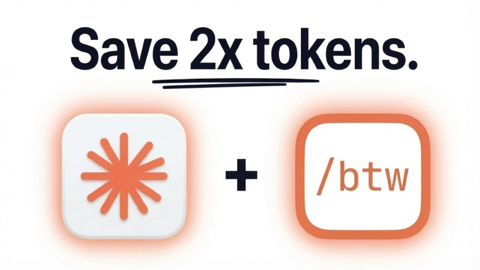 ](https://www.youtube.com/watch?v=ZbKNpn0woDY)

Channel – [Nick Saraev](https://www.youtube.com/@nicksaraev)

[Claude Code's New Upgrade: /btw](https://www.youtube.com/watch?v=ZbKNpn0woDY)

Channel – [Nick Saraev](https://www.youtube.com/@nicksaraev)

[Claude Code + Karpathy's Autoresearch = The New Meta](https://www.youtube.com/watch?v=4Cb_l2LJAW8&pp=0gcJCcUKAYcqIYzv)

Channel – [Conor Moore Racing](https://www.youtube.com/@conormooref1)

[Kimi Antonelli WINS the China Grand Prix F1](https://www.youtube.com/watch?v=feI5TAdwemc)

[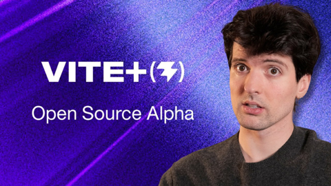 ](https://www.youtube.com/watch?v=JKbVk6bIXvA&t=72s)

Channel – [Theo - t3․gg](https://www.youtube.com/@t3dotgg)

[I did not expect this...](https://www.youtube.com/watch?v=JKbVk6bIXvA&t=72s)

[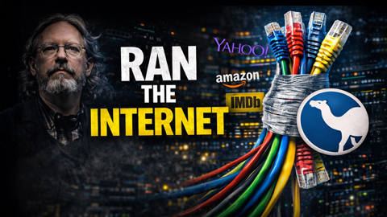 ](https://www.youtube.com/watch?v=RCHhAEjEjKw)

Channel – [CodeSource](https://www.youtube.com/@CodeSource)

[Why Perl Quietly Disappeared](https://www.youtube.com/watch?v=RCHhAEjEjKw)

[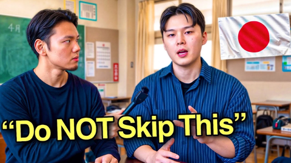 ](https://www.youtube.com/watch?v=S68BvDAtIL8&pp=0gcJCcUKAYcqIYzv)

Channel – [TAKASHii](https://www.youtube.com/@takashiifromjapan)

[Japanese teacher explains how to learn Japanese faster 🇯🇵](https://www.youtube.com/watch?v=S68BvDAtIL8&pp=0gcJCcUKAYcqIYzv)

[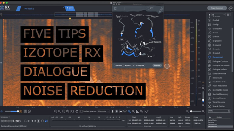 ](https://www.youtube.com/watch?v=ZxYSWEsv9tc&t=5s)

Channel – [Thomas Boykin](https://www.youtube.com/@ThomasBoykin)

[iZotope RX Advanced: Five Tips for Dialogue Noise Reduction](https://www.youtube.com/watch?v=ZxYSWEsv9tc&t=5s)

[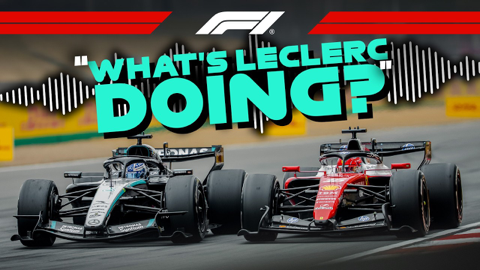 ](https://www.youtube.com/watch?v=FPPeChcgytU)

Channel – [FORMULA 1](https://www.youtube.com/@Formula1)

[Radio Rewind | 2026 Chinese Grand Prix](https://www.youtube.com/watch?v=FPPeChcgytU)

### Food

 [Spielman Bagels and Coffee Roasters | Best Bagels in Beaverton, OR | Bagels near me](https://spielmanbagels.co/spielmanbeaverton)

