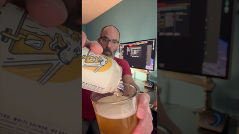
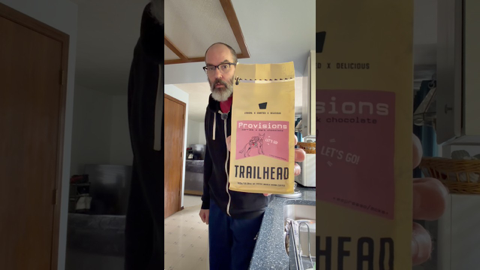
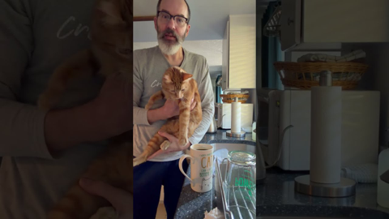
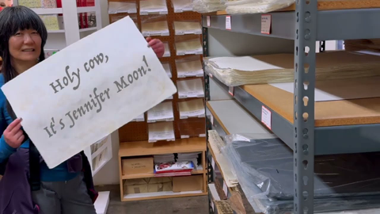
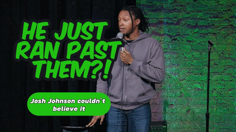
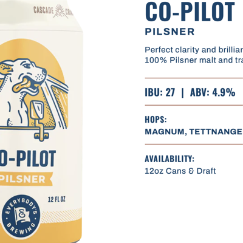

## Current Personal Status
>
> It's the weekend! And life is good! I ran today in my new Altra Torin 8's, I had a nap, I drank coffee and a very nice pilsner, and today was a good day!

## Current Projects

- Working hard on stuff for Paradigm Consulting and trying to get some new related ventures going.

- Japanese and Korean study (somewhat proficient in J, complete newb to K). Using [Talk To Me In Korean Courses](https://courses.talktomeinkorean.com/). Currently taking Beginner Bootcamp course.

- [Friends with Brews](https://friendswithbrews.com) [YouTube channel](https://www.youtube.com/@FriendswithBrewsPodcast)

## Stuff I've recently enjoyed

### Podcasts

*Podcast episodes without links are members-only but I think are interesting enough to post in case you want to investigate them.*

 The Vergecast: Ad-Free Edition – Everybody wants to rule the AI world
 MacStories Unwind+ – Screaming Peacocks and Roving Coyotes
 Six Colors+ — Private – An image-conscious duck
 The Race F1 Podcast (Members) – F1’s sudden engine change for 2027 explained (ad free)
 [Accidental Tech Podcast: Unedited Live Stream – 690: Turn Left at the Next Tree](https://atp.fm/690)
 Tech Won't Save Us (Premium) – Muskism is the New Fordism w/ Ben Tarnoff & Quinn Slobodian (audio only)
 [Talk Python To Me – #547: Parallel Python at Anyscale with Ray](https://overcast.fm/+F4RBzOwpE)
 [Comfort Zone – Better Than Getting Into Crypto](https://overcast.fm/+BI6NS7GWa8)
 [First, Last, Everything – Niléane Dorffer - Activist, Podcaster](https://overcast.fm/+BWGclcrzK4)
 [Judge John Hodgman – Asparagus Plea Live in Portland](https://overcast.fm/+YJM1FH-gQ)

### Books

[Exhalation • 2019 • Ted Chiang • A fun and thought-provoking collection of short sci-fi stories. Some of these are centered around completely novel concepts, others less so, but they're all explorations in their own way of what it means to be human. *****
](/images/posts/png-image46f28d750e0-review-a0f8e609-880b-4163-bda8-037d74d23c80.jpg)
[The Mastermind • Evan Ratliff • 2019 • Crime is fun, at least for the reader of good journalistic documentations of it, and Evan Ratliff is nothing if not a dogged and interested journalist. I read most of this online at some point, but the book is still incredibly fascinating. Paul Le Roux is quite a character. You won't be able to put this down. *****
](/images/posts/png-image44fcb606ac0-review-a25b8a5c-1425-41be-9d10-77e987cd396a.jpg)

### YouTube

Channel – [Core Memory ](https://www.youtube.com/@CoreMemoryVideos)

[They Built An Actual Brain In A Vat, And It Changed Our Definition Of Death](https://www.youtube.com/watch?v=IzUuvlCjHC4&t=12s)

Channel – [Theo - t3․gg](https://www.youtube.com/@t3dotgg)

[Anthropic just…wait what](https://www.youtube.com/watch?v=3pkz-Ie_k_c)

Channel – [Friends with Brews](https://www.youtube.com/@FriendswithBrewsPodcast)

[Everybody's Brewing Co Pilot Pilsner #beer #review](https://www.youtube.com/watch?v=n_HZNMbPx8c)

Channel – [Friends with Brews](https://www.youtube.com/@FriendswithBrewsPodcast)

[Trailhead Provisions](https://www.youtube.com/watch?v=w3QZwX4qNoc)

Channel – [Friends with Brews](https://www.youtube.com/@FriendswithBrewsPodcast)

[The Mix - Trailhead Snowdrop and Water Avenue Velvet Falls Decaf](https://www.youtube.com/watch?v=e1p15oU03Fs&t=46s)

Channel – [Nick Saraev](https://www.youtube.com/@nicksaraev)

[CLAUDE CODE FULL COURSE 4 HOURS: Build & Sell (2026)](https://www.youtube.com/watch?v=QoQBzR1NIqI&t=9185s)

Channel – [Nick Saraev](https://www.youtube.com/@nicksaraev)

[VIBE CODING FULL COURSE: Gemini 3.1 + Antigravity (6 Hrs)](https://www.youtube.com/watch?v=gcuR_-rzlDw&t=2s)

Channel – [Papermancy](https://www.youtube.com/@papermancy)

[Come on a Tour of Hiromi Paper in L.A.!](https://www.youtube.com/watch?v=1BTo0vTlDNk&pp=0gcJCQMLAYcqIYzv)

Channel – [Punchline Vault](https://www.youtube.com/@PunchlineVault24)

[Josh Johnson Says the Shooter Ran Past Secret Service Like an Anime Character 💀](https://www.youtube.com/watch?v=ceb7qEM592A&t=70s)

Channel – [How I AI](https://www.youtube.com/@howiaipodcast)

[Claude Code Just Got WAY More Powerful](https://www.youtube.com/watch?v=efVfydaUIrM)

Channel – [Lauren the Mortician](https://www.youtube.com/@Laurenthemortician)

[The Night I Picked Up My Own Uncle (True Mortician Story)](https://www.youtube.com/watch?v=3g9QTl1nnfE)

Channel – [Kai Lentit](https://www.youtube.com/@programmersarealsohuman5909)

[AI CEO vs Engineer (2026).](https://www.youtube.com/watch?v=WAUnmQt2Z7Y)

### Food

 [Everybody's Brewing Co-Pilot Pilsner](https://everybodysbrewing.com/pages/beer-list)

