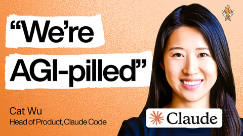
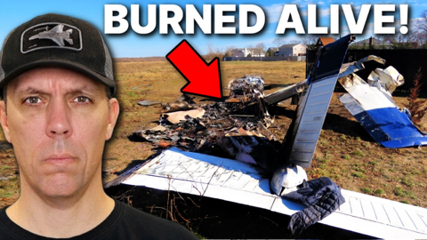

## Current Personal Status
>
> Got back on Sunday night from a business trip to Boston, NH, and VT, and now I'm trying to catch up on personal things while still working through a backlog of work related tasks.

## Current Projects

- Japanese and Korean study (somewhat proficient in J, complete newb to K). Using [Talk To Me In Korean Courses](https://courses.talktomeinkorean.com/). Currently taking Beginner Bootcamp course.

- [Friends with Brews](https://friendswithbrews.com) [YouTube channel](https://www.youtube.com/@FriendswithBrewsPodcast)

## Stuff I've recently enjoyed

### Podcasts

*Podcast episodes without links are members-only but I think are interesting enough to post in case you want to investigate them.*

 [Comfort Zone – Dinosaurs Are From Space](https://overcast.fm/+BI6NR1wChU)
 [Accidental Tech Podcast: Unedited Live Stream – 689: The Positive Effect of Enthusiasm](https://atp.fm/689)
 [First, Last, Everything – Craig Hockenberry - Principal, The Iconfactory](https://overcast.fm/+BWGcnDjZ6s)
 [Risky Business – Risky Business #835 — Why the Fast16 malware is badass](https://overcast.fm/+It0gkgWJQ)
 The Race F1 Podcast (Members) – What we made of our Domenicali interview - and how you felt about it
 The Race F1 Podcast (Members) – How different will F1 look in Miami after rules tweaks and upgrades? (ad-free)
 The 404 Media Podcast (Premium Feed) – How This Trippy Image Started A Massive Conspiracy Theory
 Decoder: Ad-Free Edition – That UL safety logo is a lot more complicated than it looks
 [Talk Python To Me – #546: Self hosting apps for Python people](https://overcast.fm/+F4RDBH0kQ)
 [Sales Logic - Selling Strategies That Work – Slow Market, High Quota: New Rules of Selling](https://overcast.fm/+X6nMsSp-4)

### Books

[The Mastermind • Evan Ratliff • 2019 • Crime is fun, at least for the reader of good journalistic documentations of it, and Evan Ratliff is nothing if not a dogged and interested journalist. I read most of this online at some point, but the book is still incredibly fascinating. Paul Le Roux is quite a character. You won't be able to put this down. *****
](/images/posts/png-image44fcb606ac0-review-a25b8a5c-1425-41be-9d10-77e987cd396a.jpg)

### YouTube

Channel – [Friends with Brews](https://www.youtube.com/@FriendswithBrewsPodcast)

[The Mix - Trailhead Snowdrop and Water Avenue Velvet Falls Decaf](https://www.youtube.com/watch?v=e1p15oU03Fs&pp=0gcJCd4KAYcqIYzv)

Channel – [Mobiles Tech Land](https://www.youtube.com/@Mobilestechland)

[Final Cut Pro: Turn Any Video into a Vertical Reel or YouTube Short](https://www.youtube.com/watch?v=k03VboO8qHk&t=67s)

Channel – [Lenny's Podcast](https://www.youtube.com/@LennysPodcast)

[How Anthropic’s product team moves faster than anyone else | Cat Wu (Head of Product, Claude Code)](https://www.youtube.com/watch?v=PplmzlgE0kg&t=1381s)

Channel – [Marcus Hutchins](https://www.youtube.com/@MalwareTechBlog)

[Where Is All The AI-Powered Self-Rewriting Malware We Were Warned About?](https://www.youtube.com/watch?v=OF3H_1teGUM)

Channel – [Pilot Debrief](https://www.youtube.com/@pilot-debrief)

[The Most Horrifying Flight I've Ever Talked About!](https://www.youtube.com/watch?v=rxZaaO0qvVs)

Channel – [Low Level](https://www.youtube.com/@LowLevelTV)

[HUGE password manager got compromised](https://www.youtube.com/watch?v=-_TWFbw8XjU)

Channel – [David Pakman Show](https://www.youtube.com/@thedavidpakmanshow)

[I WAS THERE: They’re saying it was staged!](https://www.youtube.com/watch?v=SrxPWsViQgw)

Channel – [A Better Computer](https://www.youtube.com/@ABetterComputer)

[I built the read later app I'd always wanted](https://www.youtube.com/watch?v=Y6112-XClHg&pp=0gcJCd4KAYcqIYzv)

Channel – [THE RACE](https://www.youtube.com/@WeAreTheRace)

[Revealed: First look at how F1’s new rules will work](https://www.youtube.com/watch?v=tGg171cK5dI)

Channel – [Alex Volkov from ThursdAI](https://www.youtube.com/@altryne)

[ThursdAI: GPT 5.5 Launches Mid-Show + Claude Design, GPT Image 2, Cursor x XAI $60B](https://www.youtube.com/watch?v=Ff6znij6Evg&t=13s&pp=0gcJCd4KAYcqIYzv)

Channel – [Hoshi Japan](https://www.youtube.com/@HoshiJapanVids)

[How to Retire in Japan 6 Months a Year (The $18,000 Half-Life) (Audio Fixed)](https://www.youtube.com/watch?v=cL_sML-4XdM&t=26s)

Channel – [The Rich Eisen Show](https://www.youtube.com/@RichEisenShow)

[Why Bob Odenkirk Got Called Out by ‘Breaking Bad’ Co-star Bryan Cranston | The Rich Eisen Show](https://www.youtube.com/watch?v=01UiocqJOWA&t=21s)

