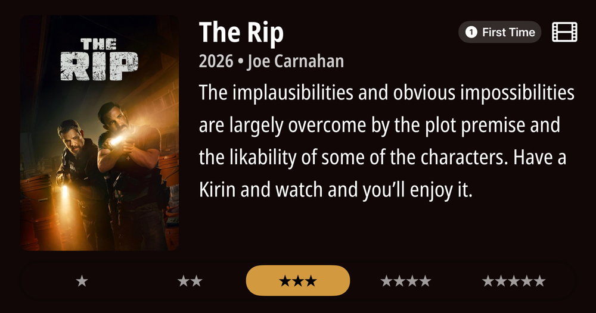
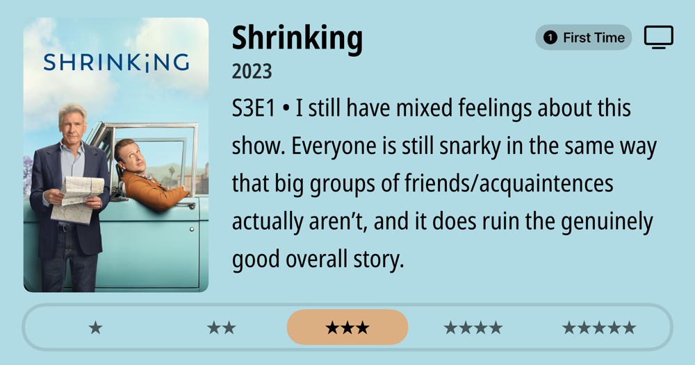
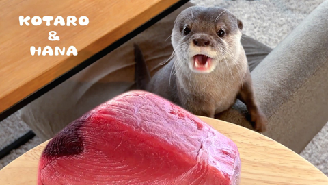
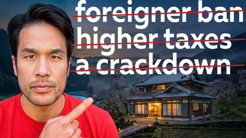
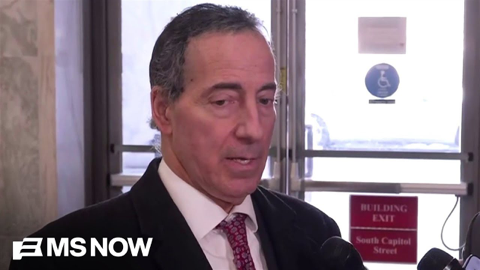

## Current Personal Status
>
> You may notice new colors and section breaks in both dark and light modes. These started out as Atari colored themes and then changed slightly, but either way, I think the site is more visually interesting now. Dark mode definitely looks better... suggestions for light mode happily accepted.

## Current Projects

- Japanese and Korean study (somewhat proficient in J, complete newb to K). Using [Talk To Me In Korean Courses](https://courses.talktomeinkorean.com/).

## Stuff I've recently enjoyed

### Podcasts

*Podcast episodes without links are members-only but I think are interesting enough to post in case you want to investigate them.*

 [Killer In The Code – Chapter 8: The Round Table Part 2](https://overcast.fm/+BUVQnxLfbg)
 [Killer In The Code – Chapter 7: The Round Table Part 1](https://overcast.fm/+BUVQlMCRUE)
 The Race F1 Podcast (Members) – From Bahrain to Saudi and back: Jon’s day at Aston Martin’s 2026 launch
 Decoder: Ad-Free Edition – Siemens CEO’s mission to automate everything
 The Race F1 Podcast (Members) – Why Aston Martin hinted it’ll start 2026 behind rivals (ad-free)
 [Security You Should Know – Operationalizing Threat Intelligence with Recorded Future](https://overcast.fm/+BN0ZdX0mxo)
 [The Weekly Planet – 609 Super Bowl Trailers & Most Anticipated Movies 2026](https://overcast.fm/+1HFIku9FA)
 [Firewalls Don't Stop Dragons Podcast – Agents of Misfortune](https://overcast.fm/+PvDawMXm8)
 AppStories+ – One Notion: Two Approaches
 Decoder: Ad-Free Edition – Reality is losing the deepfake war

### Books

[Falling Free (Vorkosigan Saga) • 2015 • Lois McMaster Bujold I'm giving this a 3 star here because I can't give it a 2.5, but please understand this book has an average 4.0 rating. It definitely didn't quite sell me. I didn't really like Leo, and his romance with Silver at the end seemed forced. ****
](/images/posts/png-image489eb5250e0-review-132bc5fe-2a88-4ba0-9153-481fbd57bf93.jpg)
[The Best Science Fiction and Fantasy of the Year Volume 2 • Jonathan Strahan • Mar 1, 2008 • This is a really good and varied compilation of stories. The thing these books do well is introduce you to stories and authors you wouldn't have found yourself, and that are certainly interesting and thought-proving. *****
](/images/posts/png-image477b8a8df50-review-085d7f25-50b9-400e-a578-287471d5d87e.jpg)
[The Convenience Store by the Sea • First Time Read • 2020 • Sonoko Machida • I didn't know what to think of this book initially. It felt slightly stilted, whether due to translation or not, I'm not sure. But I kept reading. And it started drawing me in by brilliantly building intertwined moments of social interactions and vignettes of character development. • Loved It!
](/images/posts/png-image458cbadfd70-review-68981979-9b1f-4d9e-9ae9-1c29c838e7c5.jpg)

### Movies

[THE RIP • First Time Viewing • 2026 • Joe Carnahan • The implausibilities and obvious impossibilities are largely overcome by the plot premise and the likability of some of the characters. Have a Kirin and watch and you'll enjoy it. ***
](/images/posts/png-image47ce83965e0-review-0f62fa43-92c4-4650-8ff9-7a7bc650d6d0.jpg)

### TV Shows

[Shrinking • S3E1 • I still have mixed feelings about this show. Everyone is still snarky in the same way that big groups of friends/acquaintences actually aren't, and it does ruin the genuinely good overall story. ***
](/images/posts/png-image4272a21ca80-review-c8b45daa-b69f-4487-8382-ad44e00b4b16.jpg)

### YouTube

Channel – [Jenny Tian](https://www.youtube.com/@nomnomjenny)

[Jenny Tian: Chinese Australian | FULL SPECIAL](https://www.youtube.com/watch?v=baAW62HvbJA&pp=0gcJCZQKAYcqIYzv)

Channel – [KOTSUMET](https://www.youtube.com/@KOTARO_OTTER)

[Otters Super Excited for Giant Tuna!](https://www.youtube.com/watch?v=33gJqcKTx-Y)

Channel – [Kevin Ulett - Snake Handler](https://www.youtube.com/@KevinUlett)

[Cape Cobra tries to EAT a Deadly Boomslang!](https://www.youtube.com/watch?v=tb-VKsZXI7k)

Channel – [Shu Matsuo Post](https://www.youtube.com/@shumatsuopost)

[Japan Is Revising Its Property Rules — Here’s What’s Changing](https://www.youtube.com/watch?v=7-oUwgNuv4E&t=762s)

Channel – [More Perfect Union](https://www.youtube.com/@moreperfectunion)

[OpenAl Showed Up At My Door. Here’s Why They’re Targeting People Like Me](https://www.youtube.com/watch?v=qnOmUWd-OII)

Channel – [Novara Media](https://www.youtube.com/@NovaraMedia)

[The Epstein Mossad Connections Have Gone Mainstream](https://www.youtube.com/watch?v=RJhqGDZbqBI&t=7s)

Channel – [毎日甘いもの食べたい](https://www.youtube.com/@yuuuuto38)

[Fruits Souffle pancakes / Japanese Street Food](https://www.youtube.com/watch?v=5rMfYlthm4U&pp=0gcJCZQKAYcqIYzv)

Channel – [Japanese Food Noodles](https://www.youtube.com/@Japanese_Food_Noodles)

[How This Old Man Runs the Last Soba Shop in a Ghost Town.](https://www.youtube.com/watch?v=oe_6iB-2H1M&t=939s)

Channel – [MS NOW](https://www.youtube.com/@msnow)

[LIVE: Reps. Khanna and Massie speak after reviewing unredacted Epstein files](https://www.youtube.com/watch?v=Deh5tR1fTk8&t=797s)

Channel – [MS NOW](https://www.youtube.com/@msnow)

[Rep. Raskin: ‘Puzzling, mysterious redactions’ in Epstein files](https://www.youtube.com/watch?v=9NKNX7TSv64)

Channel – [Ron](https://www.youtube.com/@Ron-RisingSunProperties)

[26K Condo For Sale - Nagoya, Japan](https://www.youtube.com/watch?v=2d1jRdRpf8I&pp=0gcJCZQKAYcqIYzv)

Channel – [Katie Phang](https://www.youtube.com/@katiephangnews)

[Maxwell TAKES THE FIFTH as Epstein COVER-UP IMPLODES](https://www.youtube.com/watch?v=fLVDj7C7ZtM)

