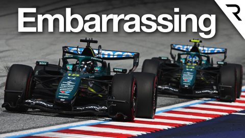
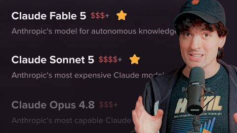

## Current Personal Status
>
> My Claude Code video editing workflow is getting more and more robust. I haven't tried it on a separate file, two host episode yet, but that should happen soon. Also having fun using tokens on Fable while I'm ... able. Sorry. I genuinely didn't mean to do that.

## Current Projects

- Work. Lots of fun stuff.

- Also a couple Mac utilities, some of them with corresponding iOS apps. This really is the golden age of generating software for yourself for your own use.

## Stuff I've recently enjoyed

### Podcasts

*Podcast episodes without links are members-only but I think are interesting enough to post in case you want to investigate them.*

 The Race F1 Podcast (Members) – Edd answers your questions about his Austrian GP driver rankings (ad free)
 The Vergecast: Ad-Free Edition – Rivian’s last chance to take on Tesla
 The Race F1 Podcast (Members) – Verstappen + Antonelli? Our take on F1’s next big driver moves (ad free)
 The Race F1 Podcast (Members) – Edd reacts to your Austria driver rankings!
 [Judge John Hodgman – Crime and Bunishment and Mailbags](https://overcast.fm/+YJM1u9YPU)
 [The Talk Show With John Gruber – 451: ‘Taking Drugs to Get Fat’, With John Moltz](https://overcast.fm/+B7NCCqyP4)
 [Accidental Tech Podcast – 698: And Do What?](https://atp.fm/698)
 [Accidental Tech Podcast: Unedited Live Stream – 698: And Do What?](https://atp.fm/698)
 [The Weekly Planet – 629 Supergirl!](https://overcast.fm/+1HFKZdYAI)
 The Vergecast: Ad-Free Edition – Our vibe coded projects that actually work

### Books

[Steve Jobs in Exile • 2026 • Geoffrey Cain • Steve Jobs in Exile is one of the better books about Steve Jobs I've read, because it's not trying to mythologize him or do anything other than document an under-represented part of his development story. Without failure, he never could have become the CEO who saved Apple. *****
](/images/posts/png-image43a9b3f12c0-review-d0962a09-70d1-4fb1-af49-a79ae8d2fc5f.jpg)

### TV Shows

[Your Friends & Neighbors S2 • 2025 • S2 review. Yes, this show is absolutely about the rich and privileged, but it does actually make you care about some of the people. It's overwhelmingly hilarious. And tense. And fun. The whole cast is stellar, but Jon Hamm is just magnificent. *****
](/images/posts/png-image4bbc8ac8530-review-ebe7158f-8a58-43e6-80c7-100526973512.jpg)

### YouTube

Channel – [David Pakman Show](https://www.youtube.com/@thedavidpakmanshow)

[UPDATE: Is Mitch McConnell DEAD?](https://www.youtube.com/watch?v=3X76Z02a1rk)

Channel – [Nate Herk | AI Automation](https://www.youtube.com/@nateherk)

[6 Simple Rules That Change How Fable 5 Works](https://www.youtube.com/watch?v=vcU85OrwuV0&pp=0gcJCUwLAYcqIYzv)

Channel – [THE RACE](https://www.youtube.com/@WeAreTheRace)

[Why Silverstone will bring out the worst of F1 2026](https://www.youtube.com/watch?v=IHjQlGJqoSI)

Channel – [Mini Air Crash Investigation](https://www.youtube.com/@MiniAirCrashInvestigation)

[The Bet That Killed 70 People | Aeroflot Flight 6502](https://www.youtube.com/watch?v=bAJi5EQunQs)

Channel – [CCN Ballet de Lorraine](https://www.youtube.com/@ccnballetdelorraine7924)

[Discofoot - Centre Pompidou](https://www.youtube.com/watch?v=cYkUME8YtD4)

Channel – [Jannis Moore](https://www.youtube.com/@jannismoore)

[How to Get Started with Trigger.dev](https://www.youtube.com/watch?v=BY9Ud_W7en0)

Channel – [Lauren the Mortician](https://www.youtube.com/@Laurenthemortician)

[Mortician Explains: Oliver Tree Crash & What "Carbonized" Really Means](https://www.youtube.com/watch?v=5Zfye7KDj7o)

Channel – [Tommo](https://www.youtube.com/@TommoMcCluskey)

[What Really Happened Between Lawson & Lindblad?](https://www.youtube.com/watch?v=z7Hwxl6YUTc)

Channel – [THE RACE](https://www.youtube.com/@WeAreTheRace)

[What Newey has revealed about the extent of Aston Martin's 2026 F1 disaster](https://www.youtube.com/watch?v=aELkysa7i9Q)

Channel – [Theo - t3․gg](https://www.youtube.com/@t3dotgg)

[FABLE IS BACK! (And Sonnet 5 is here too)](https://www.youtube.com/watch?v=KSV-7ywHxeU)

Channel – [Nate Herk | AI Automation](https://www.youtube.com/@nateherk)

[The EASIEST Way to Host Your Claude Code Agents](https://www.youtube.com/watch?v=UGIZnh6HNLc)

Channel – [Mentour Pilot](https://www.youtube.com/@MentourPilot)

[Aeroflot Jet crash update! Why did the FO jump out the window??](https://www.youtube.com/watch?v=-y0dhayVtWY)

