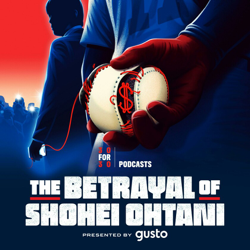
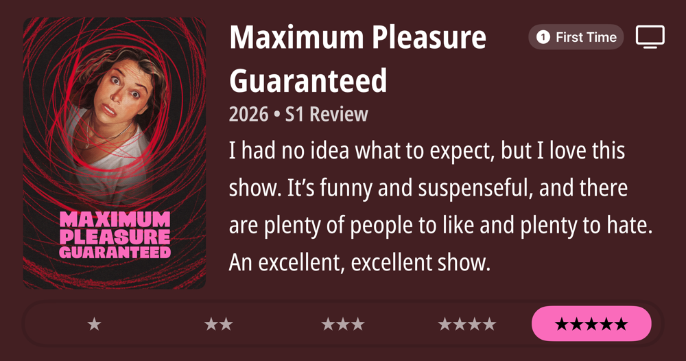
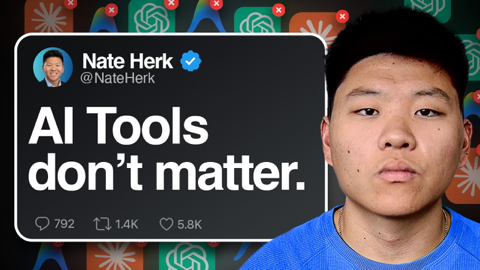
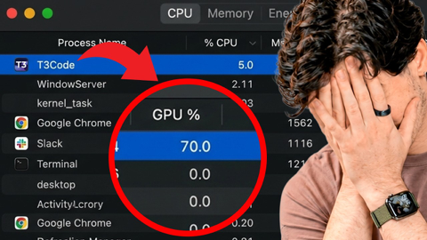
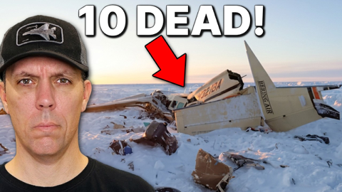

## Current Personal Status
>
> I started getting tired of watching NPM get owned every week, and I decided I don't want websites that rely on NPM and JavaScript as the framework. And since Astro does, I decided to convert everything to Zola, which is a Rust framework, and I could also do the build with very little third-party software involved.

## Current Projects

- Migrating all my sites from Astro (npm/javascript supply chain that's currently just a massive security risk, begging to be p0wned) to Zola. Fable 5 did this site in about an hour... not a bad bit of work considering how much custom stuff I had going on with this site.

## Stuff I've recently enjoyed

### Podcasts

*Podcast episodes without links are members-only but I think are interesting enough to post in case you want to investigate them.*

 [Risky Business Features – How private LLM inference actually works](https://overcast.fm/+BVj7mi-1YE)
 The 404 Media Podcast (Premium Feed) – How to Surveil the Police
 [Accidental Tech Podcast – 703: Part of a Healthy Breakfast](https://atp.fm/703)
 [Comfort Zone – Dollar Dollar Bills Y’all](https://overcast.fm/+BI6NRtzS38)
 [Accidental Tech Podcast: Unedited Live Stream – 703: Part of a Healthy Breakfast](https://atp.fm/703)
 Decoder: Ad-Free Edition – The left and right agree on one thing: no data centers
 [The Betrayal of Shohei Ohtani – The Feds](https://overcast.fm/+BYuY9Cw3qw)
 [Business History – Billy Beer: When American Beer Hit Bottom, Then Bounced Back](https://overcast.fm/+BSZV3IS76A)
 [Judge John Hodgman – Sheets and Desist](https://overcast.fm/+YJM1MhW4I)
 [Risky Business – Risky Business #847 — Oops! Claude’s accidental hacking spree](https://overcast.fm/+It0hVViWk)

### Movies

[The Odyssey • 2026 • Christopher Nolan • A story of loyalty, courage, cowardice, greed, selflessness, and ultimately the ending you all know and love. This was so well done. Throw your Matt Damon preconceptions out the window. Tom Holland and Anne Hathaway were also brilliant. *****
](/images/posts/png-image4d96b34db30-review-ff2c3832-0348-44a3-894e-87ba21e2a550.jpg)

### TV Shows

[The Idaho Murders: College Nightmare • 2026 • It's a little weird to give a documentary about kids getting murdered five stars, but I thought that it did a really good job of showing the grief of the families and how they handled it, as well as just the incredible insensitivity of people on the internet judging it from afar. *****
](/images/posts/png-image4eab849c610-review-df8a4735-a32f-449e-824d-efe47722493b.jpg)
[Maximum Pleasure Guaranteed • 2026 • S1 Review • I had no idea what to expect, but I love this show. It's funny and suspenseful, and there are plenty of people to like and plenty to hate. An excellent, excellent show. *****
](/images/posts/png-image4866af42760-review-eef99e4b-26e1-460d-9c87-0f8183fc137a.jpg)

### YouTube

Channel – [Eric Tech](https://www.youtube.com/@EricWTech)

[Matt Pocock's Claude Code Skills Beat Superpowers Now](https://www.youtube.com/watch?v=8D8ewFBJfFM)

Channel – [Biz Buzz](https://www.youtube.com/@bizbuzz3)

[Steve Jobs: Bumpers For All!](https://www.youtube.com/watch?v=FjGT-8Rp6fI)

Channel – [Eric Tech](https://www.youtube.com/@EricWTech)

[Anthropic's New Rules Break Most Claude Code Setups](https://www.youtube.com/watch?v=rYb_xSjx-Fw&pp=0gcJCcQLAYcqIYzv)

Channel – [Traveling with Kristin](https://www.youtube.com/@TravelingwithKristin)

[NEW citizenship rules for Americans moving to Europe](https://www.youtube.com/watch?v=tpv4jzYerF0&t=10s)

Channel – [Pilot Debrief](https://www.youtube.com/@pilot-debrief)

[The Most Frustrating Pilot Mistake I've Ever Talked About!](https://www.youtube.com/watch?v=mvqFN7Rp-O8&t=547s&pp=0gcJCcQLAYcqIYzv)

Channel – [Nate Herk | AI Automation](https://www.youtube.com/@nateherk)

[5000 Hours of Building AI in Just 17 Minutes](https://www.youtube.com/watch?v=7WZ6XldxX0U)

Channel – [Theo - t3․gg](https://www.youtube.com/@t3dotgg)

[Fable Broke My App and Couldn't Fix It](https://www.youtube.com/watch?v=TKlOCjLMNtw)

Channel – [Takes™ by Jamelle Bouie](https://www.youtube.com/@jamelle-bouie)

[Can Democrats actually win the Senate?](https://www.youtube.com/watch?v=oUCMlHd4w4E&pp=0gcJCcQLAYcqIYzv)

Channel – [Patrick Boyle](https://www.youtube.com/@PBoyle)

[Why Wall Street is Ignoring Big Tech's Debt](https://www.youtube.com/watch?v=NufJ7g63KSY&t=1282s)

Channel – [Bibi Doggo](https://www.youtube.com/@BibiDoggo)

[Mom Cat Shows Her Kittens The Giant Golden Retriever Is Safe](https://www.youtube.com/watch?v=Bd1ZqSqMcJA)

Channel – [Baseball & Scars](https://www.youtube.com/@baseball_scars)

[The MLB Outfielder Killed by His Own Brother](https://www.youtube.com/watch?v=E4NCjxibjfM)

Channel – [Pilot Debrief](https://www.youtube.com/@pilot-debrief)

[The Disturbing Mistakes That Doomed Bering Air 445!!](https://www.youtube.com/watch?v=KD38dSEw0Bs)

