## Current Personal Status
>
> Donnie Adams was on [Friends with Brews](https://www.youtube.com/@FriendswithBrewsPodcast) with me, talking about Obot.AI. [Check it out!](https://www.youtube.com/watch?v=N6iHhMfncu8)!

## Current Projects

- Finished a major client firewall migration, super glad that's mostly done.
- Working on creating and DOING some additional consulting and contracting offerings.

## Stuff I've recently enjoyed

### Podcasts

*Podcast episodes without links are members-only but I think are interesting enough to post in case you want to investigate them.*

 The Race F1 Podcast (Members) – Azerbaijan Grand Prix review (ad free)
 The Race F1 Podcast (Members) – In-Restaurant Insights: Qualifying results, upgrade verdicts and angry/sad drivers
 [Risky Bulletin – Srsly Risky Biz: Bring on the AI lawsuits](https://overcast.fm/+5Sl9UdRt8)
[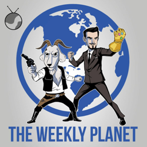](https://overcast.fm/+1HFKwYga4) [The Weekly Planet – Blade Runner - Caravan Of Garbage](https://overcast.fm/+1HFKwYga4)
 The 404 Media Podcast (Premium Feed) – The End of Privacy Is Here (with Kashmir Hill)
 [Accidental Tech Podcast – 710: That New Mouse Pad Feeling](https://atp.fm/710)
 The Race F1 Podcast (Members) – On-Street Insights: Scott and Josh on Ocon’s seat + other big day-one talking points in Baku
 The Race F1 Podcast (Members) – On-Bench Insights: Baku F1 practice and the Hamilton/Lawson near-miss
[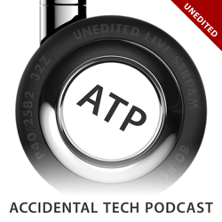](https://atp.fm/710) [Accidental Tech Podcast: Unedited Live Stream – 710: That New Mouse Pad Feeling](https://atp.fm/710)
 [Risky Bulletin – Between Two Nerds: Real-time cyber defence](https://overcast.fm/+5Sl8Oy9q8)

### TV Shows

[Star City • 2026 • A much different show than its sibling For All Mankind, and in a good way. More subtle, deeper, and more trusting of the viewer in a way that British tv still appears to *****
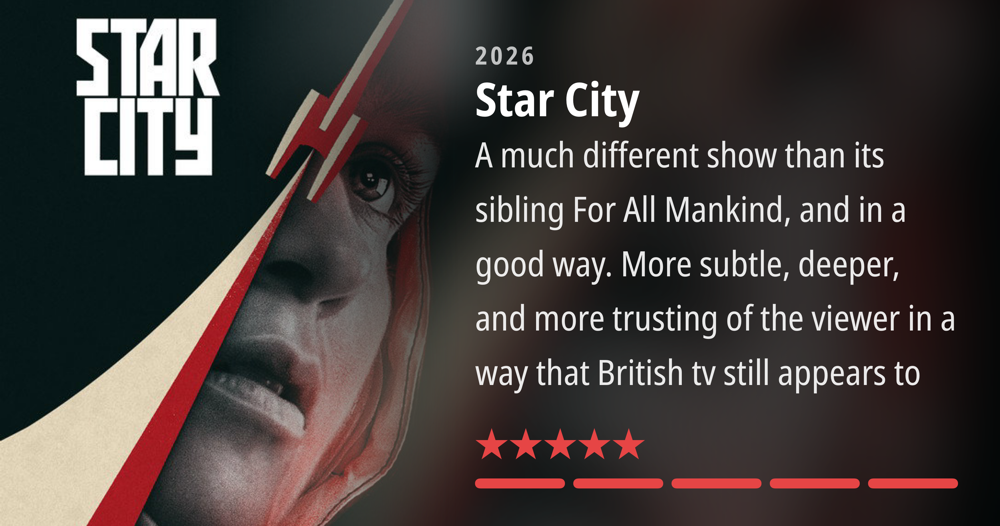](/images/posts/png-image462db9b6f20-review-7b80f404-0591-45d7-b551-b43a6f1a89ef.jpg)
[Silo • 2023 • Silo is a great interpretation of the books, and is full of great world-building, character development, acting, and everything else that goes into a great tv series. So many great characters. I think this is my favorite current series. *****
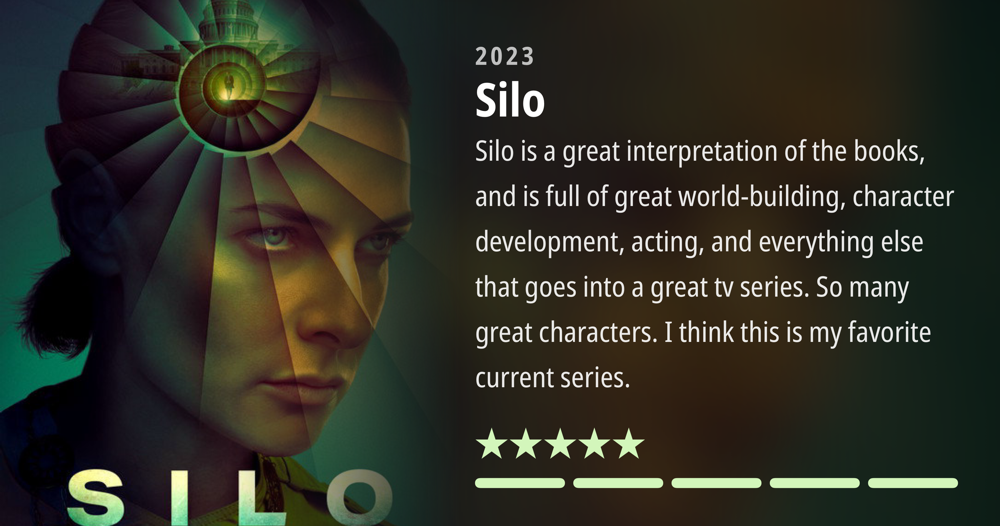](/images/posts/png-image418eb9ba070-review-4d59fda5-b9d9-4204-9792-4d5493d84c97.jpg)

### YouTube

[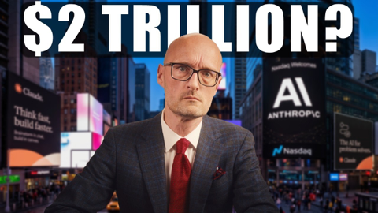](https://www.youtube.com/watch?v=T-oXyXwD6sE&t=523s)

Channel – [Patrick Boyle](https://www.youtube.com/@PBoyle)

[Is the AI Bubble About to Be Tested?](https://www.youtube.com/watch?v=T-oXyXwD6sE&t=523s)

[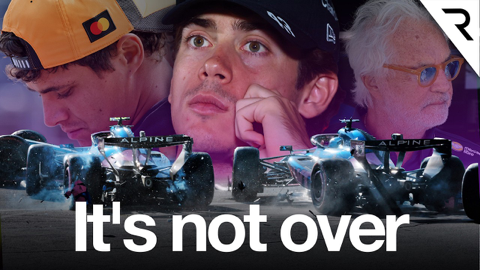](https://www.youtube.com/watch?v=f4NM8c7zLhw)

Channel – [THE RACE](https://www.youtube.com/@WeAreTheRace)

[What next for the F1 driver Lando Norris wants banned](https://www.youtube.com/watch?v=f4NM8c7zLhw)

Channel – [平手 晃平 | 車の楽しさを伝える](https://www.youtube.com/@youtuberising-kproject2905)

[My R32 GT-R… The Car That Means Everything to Me](https://www.youtube.com/watch?v=VV-QGVNBP5E)

[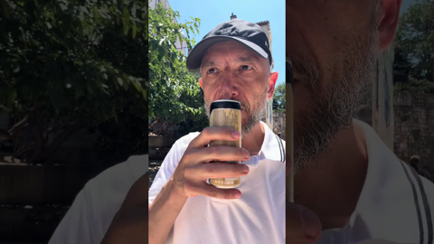](https://www.youtube.com/watch?v=aqAvF4-lCvk)

Channel – [Peter Nikolaidis](https://www.youtube.com/@PeterNikolaidis)

[Peter drinks coffee from Bela Gelato in Trogir, Croatia](https://www.youtube.com/watch?v=aqAvF4-lCvk)

[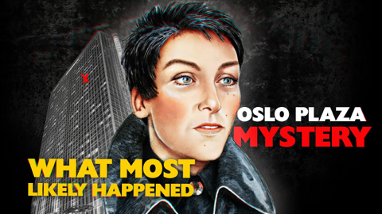](https://www.youtube.com/watch?v=WEsZ5UdKn1k&pp=0gcJCS8MAYcqIYzv)

Channel – [Bad Things: True Crime](https://www.youtube.com/@BadThingsTrueCrime)

[Who the Oslo Plaza Woman most likely was](https://www.youtube.com/watch?v=WEsZ5UdKn1k&pp=0gcJCS8MAYcqIYzv)

[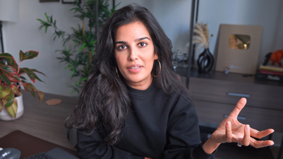](https://www.youtube.com/watch?v=2JJQbAmqOqE&pp=0gcJCS8MAYcqIYzv)

Channel – [Nischa](https://www.youtube.com/@nischa)

[This will be deleted in 21 hours...](https://www.youtube.com/watch?v=2JJQbAmqOqE&pp=0gcJCS8MAYcqIYzv)

[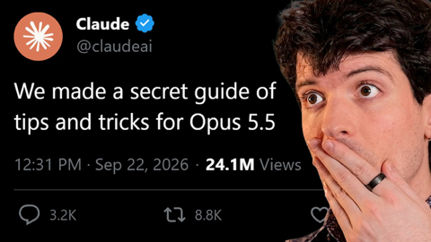](https://www.youtube.com/watch?v=ejjBbaq9RmY)

Channel – [Theo - t3․gg](https://www.youtube.com/@t3dotgg)

[Getting the most out of Opus 5.5](https://www.youtube.com/watch?v=ejjBbaq9RmY)

[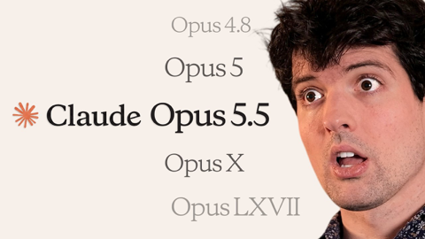](https://www.youtube.com/watch?v=jgGyX7MPPVg)

Channel – [Theo - t3․gg](https://www.youtube.com/@t3dotgg)

[Wow.](https://www.youtube.com/watch?v=jgGyX7MPPVg)

[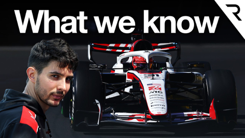](https://www.youtube.com/watch?v=FIgzqE-_7iQ)

Channel – [THE RACE](https://www.youtube.com/@WeAreTheRace)

[What's really behind Haas F1 driver change](https://www.youtube.com/watch?v=FIgzqE-_7iQ)

[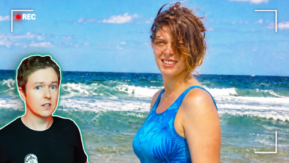](https://www.youtube.com/watch?v=g0ItCMHlcvA)

Channel – [That Chapter](https://www.youtube.com/@ThatChapter)

[The Strange Affair of Laura Grillo](https://www.youtube.com/watch?v=g0ItCMHlcvA)

[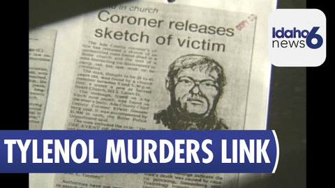](https://www.youtube.com/watch?v=QlBQ_5lsCiY)

Channel – [Idaho News 6](https://www.youtube.com/@KiviTVNews)

[Cold case solved: Boise man identified, connected to Tylenol capsule deaths](https://www.youtube.com/watch?v=QlBQ_5lsCiY)

[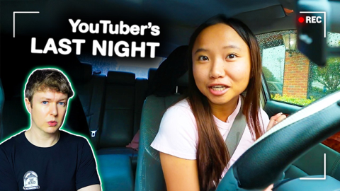](https://www.youtube.com/watch?v=wk-K8ZtEgA8)

Channel – [That Chapter](https://www.youtube.com/@ThatChapter)

[The Disturbing Case of Mitchel Dang](https://www.youtube.com/watch?v=wk-K8ZtEgA8)

