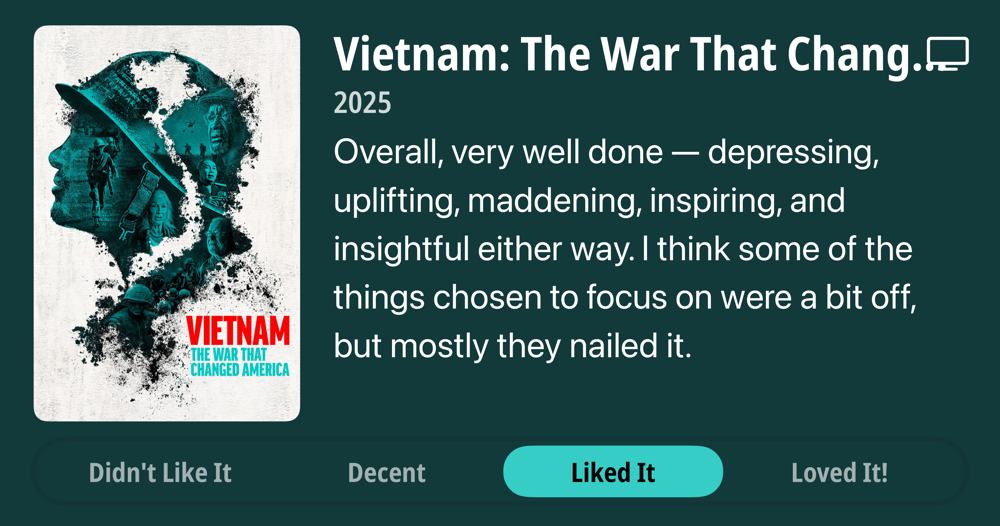

### Podcasts

*Podcast episodes without links are members-only but I think are interesting enough to post in case you want to investigate them.*

- [P1 with Matt and Tommy – Australian GP Race Review](https://overcast.fm/+_U3p9Bh8c)
- [Click Here – Mic Drop: Frank McCourt wants TikTok to help him reinvent the internet](https://overcast.fm/+BL5Zg_1rJc)
- [The Vergecast – The fake promise of better Siri](https://overcast.fm/+QN1ptrIUA)
- [Accidental Tech Podcast – 630: Time to Spiral](https://atp.fm/630)
- Trashfuture Bonus Content Feed (Extremely Good) – Pump It! ft. Ed Ongweso Jr
- [Whisky Whiskey – 42: Tamdhu 15 Year Single Malt Scotch Whisky](https://overcast.fm/+BLIhc7vslU)
- [Career Tools – Working In A Remote Team - Dealing With Timezones](https://overcast.fm/+JHHXVvRw)
- [P1 with Matt and Tommy – Reaction to Australian GP qualifying](https://overcast.fm/+_U3omA3ZY)
- [System Crash – Elon in Power: The PayPal Mafia and Building the Myth of Musk ft. Max Chafkin](https://overcast.fm/+BL8c3_pVMc)
- [P1 with Matt and Tommy – Reaction to Australian GP practice](https://overcast.fm/+_U3rrgcVQ)

### Books

*Don't be surprised when the book list stays constant for awhile. Reading time is harder to come by these days. 😞*  

### Movies

### TV Shows

### Food and Drink

- [Syun Izakaya](https://www.syunhillsboro.com/#21)
- [Sisters Coffee Company](https://sisterscoffee.com/)
- [Fair Trade Organic Bolivian Blend | Trader Joe's](https://www.traderjoes.com/home/products/pdp/fair-trade-organic-bolivian-blend-074367)
- [Wayfinder Beer](https://www.wayfinder.beer/) LA MAGIE - FRENCH PILSNER
