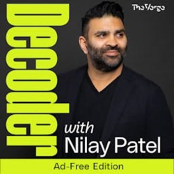
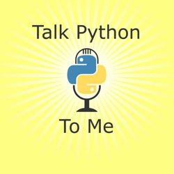
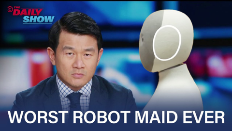
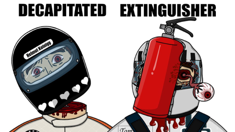
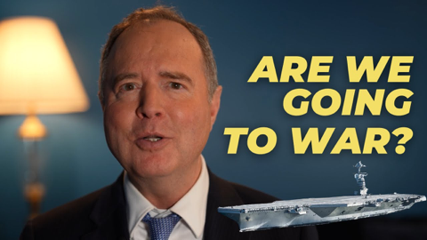
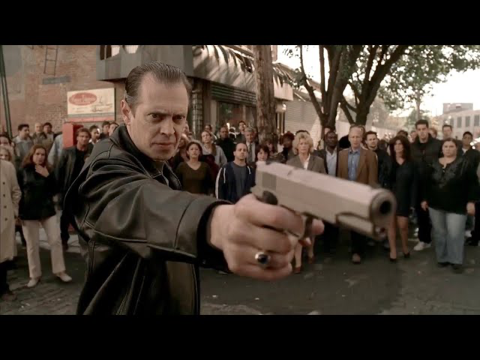
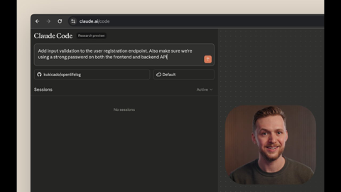

## Current Personal Status

All work and no play still makes not enough money. But hey, I *AM* working on a blog post in the Spotlight series!

## Stuff I've recently enjoyed

### Podcasts

*Podcast episodes without links are members-only but I think are interesting enough to post in case you want to investigate them.*

 [Decoder: Ad-Free Edition – LexisNexis CEO says the AI law era is already here](https://overcast.fm/+BSp8fcfrCs)
 [Talk Python To Me – #525: NiceGUI Goes 3.0](https://overcast.fm/+F4RDfu7Uk)
 [Risky Bulletin – Srsly Risky Biz: Peter Williams, Ex-ASD, Pleads Guilty to Selling Eight Exploits to Russia](https://overcast.fm/+5Sl8eMwQs)
 [Risky Business – Risky Business #812 — Alleged Trenchant exploit mole is ex-ASD](https://overcast.fm/+It0gJvYW0)
 David Pakman Member Feed – 10/29/25: Layoffs explode as Trump turns on farmers, half the country sues him
 David Pakman Member Feed – 10/29/25: TDPS Bonus Show
 [Blurring The Lines Podcast – Episode 238 – Time Zones, Tech Glitches, and Travel Tales](https://overcast.fm/+GsOk2UHEo)
 [kill switch – workslop: how AI is making you hate your coworkers](https://overcast.fm/+4qHr-Bda0)
 [Judge John Hodgman – Sole Benefishiary](https://overcast.fm/+YJM2MB7eI)
 The Race F1 Podcast (Members) – F1 Extra: Is Leclerc the modern day Arnoux?

### TV Shows

[Slow Horses • 2022 • Season 5 review: The last episode stumbled for me a bit. A few highly unlikely moments, those always take me out of a show. Not, I'm not changing, so forget it. But overall, it's still Slow Horses. • Liked It
](/images/posts/png-image4038ad32750-review-caf828be-d53f-475c-aa8b-64bdd3138075.jpg)
[The Last Frontier • 2025 • Another Apple TV+ series. Two episodes in, not sure how I'm going to feel about it. Started off well in some ways, hand-wavy in others. Seems like it's worth giving a chance though. • Liked It
](/images/posts/png-image41b9a9fec20-review-7a31e41f-7f85-4844-9544-87b1d32b09d7.jpg)

### YouTube

Channel – [Theo - t3․gg](https://www.youtube.com/@t3dotgg)

[AI is ruining the job market](https://www.youtube.com/watch?v=EiPYgiu8-Hc&t=976s)

Channel – The Daily Show and Ronny Chieng

[Ronny Chieng Meets Neo, the World’s Stupidest Robot Maid | The Daily Show](https://www.youtube.com/watch?v=b_SNExtznd4&t=75s)

Channel – [Walter Masterson](https://www.youtube.com/@waltermasterson)

[Trolling ICE Agents in Portland](https://www.youtube.com/watch?v=RkihlUfLG_0)

Channel – [Mort](https://www.youtube.com/@mort.animation)

[The Most Painful Formula 1 Deaths Ever | Part 2](https://www.youtube.com/watch?v=QNouXP0cQjM)

Channel – [Sen. Adam Schiff](https://www.youtube.com/@senadamschiff)

[Are We Going to War?](https://www.youtube.com/watch?v=BUKleG0N180&t=86s)

Channel – [FORMULA 1](https://www.youtube.com/@Formula1)

[25 Years Of Legendary F1 Team Radio](https://www.youtube.com/watch?v=Z4OpDCF8qME&pp=0gcJCQMKAYcqIYzv)

Channel – [Borko](https://www.youtube.com/@borko2.0)

[The Sopranos - Animal Blundetto strikes again and kills Billy "The kid" Leotardo](https://www.youtube.com/watch?v=ou9M6rEZZMk)

Channel – [FORMULA 1](https://www.youtube.com/@Formula1)

[Charles Leclerc: The Ultimate Onboard Collection | Best Onboards | Qatar Airways](https://www.youtube.com/watch?v=ygxT9Vs8Vr0)

Channel – [Affinity](https://www.youtube.com/@Affinity)

[Your first look at the all-new Affinity](https://www.youtube.com/watch?v=UP_TBaKODlw&t=3s)

Channel – [Anthropic](https://www.youtube.com/@anthropic-ai)

[Claude Code updates: When to use Haiku 4.5, Claude Code on web, and more.](https://www.youtube.com/watch?v=CBneTpXF1CQ)

