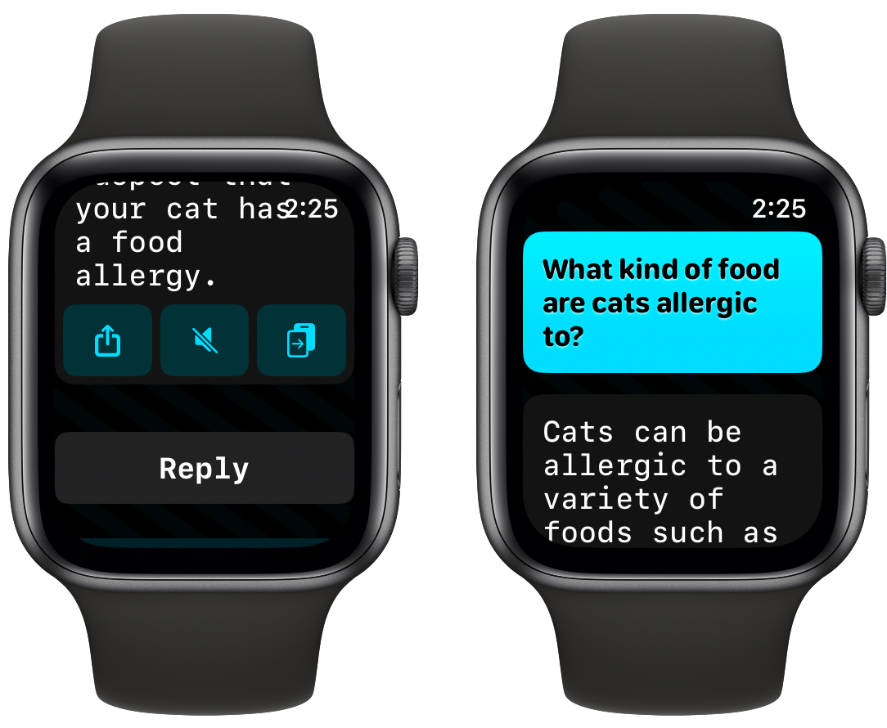

## GPT - What is it good for?

Human communication is weird. It's so nebulous and imprecise and dependent on visual cues like eye-to-eye contact and physical observation of the party we're communicating with. I often used to imagine how much life would be easier if we could do direct data dumps into each other's brains, like computers sending information to each other.

How funny it is to me then that machine learning is making advances by using large language models to let computers parse incoming information through the context of human language in order to let systems with different APIs and data formats communicate with each other. It turns out that the future of computer communication may well be based on the less precise and more misunderstanding-prone human forms of verbal communication.

All philosophical musing aside, the point is that I've been using ChatGPT to do computer related tasks for me like write AppleScripts, bash scripts, and detail nuances of Swift code. These are the types of things I believe the GPT LLMs are best at. I don't like arguing with it to make it do things it's not good at or isn't supposed to do, and I understand and share the social and ethical concerns voiced by people like [Timnit Gebru](https://dair-community.social/@timnitGebru) and [Emily M. Bender](https://dair-community.social/@emilymbender). In addition, there's the question of resource usage, and LLM training requires tons of it.

That's a lot of off-topic information to prepend onto what is basically a post about what ChatGPT tools and applications I use, but I think it's important to think about these things and not just blindly fall into the AI craze and believe everything people like Sam Altman want us to believe.

## GPT apps

"Blah, blah, blah," you say, "what about the apps?" Fine. Let's talk about some ChatGPT apps I like.

### MacGPT

By far the GPT app I use the most is [MacGPT](https://www.macgpt.com) by [Jordi Bruin](https://mastodon.online/@jordibruin). MacGPT primarily runs as a menubar app, but it also features global mode (a pop up query field that looks like Spotlight) and inline mode (letting you get responses from ChatGPT right inside your text documents and text fields).

As an example of inline mode, I'm going to trigger MacGPT to have ChatGPT tell me if Python 3 supports async/await right here inside this post.

> **Does Python 3 have async/await functionality?+gpt**
>
> Yes, starting from Python 3.5, async/await functionality is available in Python. It allows for asynchronous programming, which can greatly improve the performance of certain types of applications. The async/await keywords are used to define asynchronous functions and to wait for the results of asynchronous operations.

Here's what that looks like in action:

<iframe width="710" height="400" src="https://www.youtube.com/embed/GEZOyZ6BD5Q" title="YouTube video player" frameborder="0" allow="accelerometer; autoplay; clipboard-write; encrypted-media; gyroscope; picture-in-picture; web-share" allowfullscreen></iframe>

MacGPT allows you to use either a native Mac UI for interacting with ChatGPT or the OpenAI web view for ChatGPT. Both have pros and cons - the OpenAI web view allows you to keep your history available there for access across all platforms, while the native UI looks nicer and (hopefully) in the future will have greater customization. I'd like to see an even wider menubar view, and complete font customization including font, font size, and bubble colors.

Both views allow for copying of conversations, but the native UI copy function copies the entire conversation in the window including both your prompts and ChatGPT's replies, while the web view only allows you to copy a ChatGPT response and doesn't include the preceding prompt that you entered.

MacGPT isn't perfect, but given the low cost of entry (it's basically donation-ware) and the pace at which Jordi has added updates, I have high hopes for its future.

### Machato

I recently stumbled across another Mac ChatGPT app called [Machato](https://untimelyunicorn.gumroad.com/l/machato). Machato takes a different approach than MacGPT in that it just runs as a normal Mac app and doesn't have menubar, inline, or global (floating textbox) functionality. I miss MacGPT's menubar aspect when using Machato, but it has some compelling features of its own.

Machato lets you create multiple conversations so you can categorize by topic, and it also allows you to create folders to further organize them. It also has a very handy ability to branch a conversation so that you can pick a point to split off into a new conversation. All you have to do is hover over a prompt or response and click the "Branch from here" icon. It's super handy.

Machato also lets you pick the output type for copied conversations – Markdown, LaTeX, or plain text.

And finally, Machato keeps track of your usage costs per day, week, month, or all time. I would love to see MacGPT steal this feature.

I'm kind of torn between MacGPT and Machato, because Machato has the superior UI and functionality for serious "help me with my programming" use, for example, but MacGPT has the nice always-there presence with its menubar component and the ability to pop that open and closed with a keyboard shortcut.

### Petey

Another interesting entry into the ChatGPT space is [Petey](https://petey-assistant.com). Petey is for iOS and (get this) Apple Watch. Yep, you can ask ChatGPT things from your watch. You can share the results to messages or mail on the watch, or copy and paste them by sending the answer to your iPhone with one tap, and copying the answer from there.

On iOS, it's not quite as interesting to me as the next app in my list, because it doesn't let you do multiple conversations or look at the history as easily. You can ask questions, get answers (and have them read back to you), and copy and paste them, but that's about it.

Petey is well-designed, playful, and fun. For more background and information about Petey, you can hear it directly from app developer Hidde van der Ploeg[^1] on [episode 60](https://launchedfm.com/episodes/60-Petey-HiddevanderPloeg) of the [Launched](https://launchedfm.com) podcast.

Petey is $4.99 and has an in-app subscription, but if you have your own OpenAI API key, you don't need to pay for the subscription.

### GeePeeTee

[GeePeeTee](https://apps.apple.com/us/app/geepeetee/id6446040815) is Jordi Bruin's iOS companion app to MacGPT, but it has some interesting features that MacGPT doesn't. The most interesting feature to me is Conversations, similar to the same feature in Machato. My assumption is he plans to bring that to MacGPT at some point, but I haven't bothered him to ask yet.

GeePeeTee doesn't have a watchOS app, but it is better for iPhone use than Petey. Either way, you can't go wrong. GeePeeTee is free on the App Store, but you need an API key.

## Summarium

ChatGPT can be an effective tool to learn things and shorten writing or programming time if used wisely. It's also wildly overhyped and has replaced crypto as the buzzword de jour, but the result is that lots of developers are writing apps against its API. You can probably guess by the fact I own and am talking about them that I like all the above apps (I do). I recommend you give them a try if you're a Mac and iOS user who has room for ChatGPT in your workflow.

[^1]: No, I have no clue how to say that, but [Clay Daly](https://mastodon.art/@cwdaly) certainly must.
