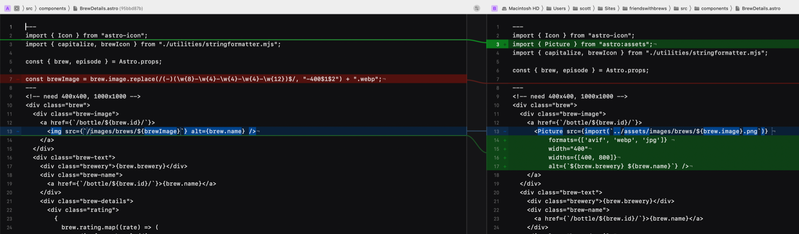

The [last time I wrote about image optimization and responsive images in Astro](https://scottwillsey.com/astro-3-responsive-images/), there were some compromises to be made in order to use [astro:assets image optimization](https://docs.astro.build/en/guides/images/#images-in-astro-files).

First, it did not resize images or create responsive source sets, it only optimized the format and file byte size with the same width and height. Second, it did and still does require importing images in a way that at the very least requires you to know the file extension of the original, and in a way that I thought made dynamically creating image source file names impossible. And finally, there was no control at all over how images referenced in markdown are optimized.

The good news is that as of [Astro 3.3](https://astro.build/blog/astro-330/), there is an improved astro:assets Image component as well as a new astro:assets Picture component that solve a lot of my problems. The issue of leaving it up to Astro to do what it wants with markdown images still exists, but I have a compromise for that issue.[^1] In the meantime, Astro 3.3+ can now create multiple image formats, multiple image pixel sizes, and can create both img and picture tags with source sets for great image responsiveness.

## A Problem Requiring Responsive Images and Dynamic Image Names

Let's look at a real world use case to show you a typical scenario where you need to create your image source file names dynamically as well as create multiple sizes.

[Friends with Brews](https://friendswithbrews.com/) is a podcast about conversations and different kinds of brewed drinks – beer, coffee, or tea. Because part of the show's premise is trying new drinks and giving them a thumbs-up or thumbs-down, I also want to keep a list of these drinks and showcase them both on the individual episodes they're consumed on as well as on an aggregate brews page.

[](/images/posts/TheBrews-DEEBDE29-AA09-4BE1-89C7-2F3A37F9952A.png)

Each of these little detail blocks links to a details page for the specific drink.

[](/images/posts/BottlePage-5B3808E1-4745-4345-8A39-4A5C9CCA40E0.png)

Because several of these images are typically displayed on any given page, or because the image on the individual drink detail pages are dimensionally larger, I want them optimized as much as possible. In addition, I want them to be as responsive as possible for different size screens and different [pixel densities](https://scottwillsey.com/image-rabbit-hole-3/).

One thing to note is that all of the drink details for every drink are kept in a JSON file called brews.json. This JSON file includes the name of the image associated with the drink. The JSON entry for a specific brew looks like this:

```json


{
    "id": "YodfV6yTeB75PJpmQDPgU",
    "name": "Oktoberfest Märzen",
    "brewery": "Hacker-Pschorr",
    "image": "HackerPschorrOktoberfestMarzen-8E6221D0-7EB7-46B3-8AFA-5CA4A1E6AC1B",
    "description": "As it was forbidden to brew in summer, a stronger beer -- the Märzen -- was brewed earlier in March. It would finally be served at the Oktoberfest, under the \"Heaven of Bavaria.\" We have returned once again to the age-old recipe and recreated that gloriously smooth, honey-coloured piece of history from times gone by. Perfect with: Bavarian sausage salad and all the titbits a true Bavarian would also enjoy: roast chicken, sausages or suckling pig cooked in Wiesn beer.",
    "type": "beer",
    "sortOrder": "0",
    "episodes": ["54"],
    "url": "https://www.hacker-pschorr.com/our-beers/usa/oktoberfest-maerzen",
    "rating": [
      {
        "host": "Peter",
        "vote": "thumbs-up",
        "description": "It is malty, it is toasty, and it is crisp. Very happy, this is good."
      }
    ]
  },


```

Note the image entry: the image name doesn't have a file extension for technical reasons, namely that when you're importing images in an Astro file, you can't create a dynamic file name including the file extension. Vite has to know the file extension ahead of time, even if you do cobble together the rest of the file name at compile time.

Because of this, I just made all my images PNG, regardless of what they would later be optimized to by the various image optimization components I've used over the life of the Friends with Brews website, and therefore I also didn't include the file extension because I would be hard-coding it into the image name string to keep Vite happy.

It sounds more confusing than it is. Here's my code pre-Astro 3.0, back when Astro had an image optimization tool called @astrojs/image which had both Image and Picture components. Note the src property of the Picture component and the above paragraph will make more sense.

```astro

---
import { Icon } from "astro-icon";
import { Picture } from "@astrojs/image/components";

const { brew, episode } = Astro.props;
---

<div class="brew">
  <div class="brew-image">
    <a href={`/bottle/${brew.id}/`}>
      <Picture
        src={`/images/brews/${brew.image}.png`}
        widths={[400, 800, 1200]}
        aspectRatio="1:1"
        sizes="200px"
        formats={["avif", "webp", "png"]}
        alt={`${brew.brewery} ${brew.name}`}
      />
    </a>
  </div>


```

## Astro 3.0 - 3.2.x Solution

After migrating to Astro 3 and before Astro 3.3 gave the ability to generate multiple widths for each desired image format, I was generating those myself. For my brew images, I was creating 400 pixel wide and 1000 pixel wide images for each drink in addition to the original size. This was all automated with [Retrobatch](https://flyingmeat.com/retrobatch/), but it was still a little more work and management on my part.

[](/images/posts/FwBRetrobatchOriginal-86FC47FD-4C37-4DD3-A324-7B701A6BAF26.png)

In my case, I would generate the 400 and 1000 pixel wide images in webp, and also keep the full-sized png on hand to link to for people who like staring at large images with equally impressive download times.

Here's what my BrewsDetails.astro file looked like with this solution:

```astro

---
import { Icon } from "astro-icon";
import { capitalize, brewIcon } from "./utilities/stringformatter.mjs";

const { brew, episode } = Astro.props;

const brewImage = brew.image.replace(/(-)(\w{8}-\w{4}-\w{4}-\w{4}-\w{12})$/, "-400$1$2") + ".webp";
---

<div class="brew">
  <div class="brew-image">
    <a href={`/bottle/${brew.id}/`}>
      
    </a>
  </div>

<!-- Etc, etc, etc -->

```

The first thing eagle-eyed readers will notice is that I'm not using any kind of image component at all here – just a plain old html img tag. This is because I was already generating the optimized images and because I was using a wider image size than needed to help with the high pixel-density display cases.

This string is just making sure we're grabbing the 400 pixel wide version of the image for this view:

`const brewImage = brew.image.replace(/(-)(\w{8}-\w{4}-\w{4}-\w{4}-\w{12})$/, "-400$1$2") + ".webp";`

This is all fine and dandy, but it's less optimal than the pre-Astro 3.0 days, because the html I was using does nothing for lazy loading, does nothing for only grabbing the largest image needed for the device screen size and pixel density, and is basically a massive compromise.

I was not a giant fan of having to do this, in other words.

Fortunately, the smart people at Astro kept refining Astro 3.x's image optimization solution.

## Astro 3.3+ Solution

Now that Astro 3.3+ has the ability to use the Image or Picture components to generate multiple widths per image format, this solves the problem of different screen sizes and pixel densities. Now I can let it generate the extra images for me.

Here's what the Picture component looks like for these small drink images:

```astro

---
import { Icon } from "astro-icon";
import { Picture } from "astro:assets";
import { capitalize, brewIcon } from "./utilities/stringformatter.mjs";

const { brew, episode } = Astro.props;

---
<!-- need 400x400, 1000x1000 -->
<div class="brew">
  <div class="brew-image">
    <a href={`/bottle/${brew.id}/`}>
      <Picture src={import(`../assets/images/brews/${brew.image}.png`)} 
          formats={['avif', 'webp', 'jpg']} 
          width="400"
          widths={[400, 800]}
          alt={`${brew.brewery} ${brew.name}`} />
    </a>
  </div>

<!-- Etc, etc, etc -->

```

Here's the file diff between my Astro 3.0-3.2 version versus my new Astro 3.3+ version:

[](/images/posts/BrewDetailsDiff-A6C47A65-A427-41E9-9680-60634AF6F4B1.png)

By the way, remind me to talk about [Kaleidoscope](https://kaleidoscope.app) sometime. Its ability to diff things in multiple views, act as the command line difftool, and show diffs between different git commit versions is really spectacular.

### Importing images using dynamic file names

Notice the difference between the way the Picture src property is composed here compared to the pre-Astro 3 version in the first half of this article? This is because the images located in the src directory need to be imported for the astro:assets Image and Picture components. Typically import statements do not like dynamically constructed strings – they error out and complain that you need to give them a static string.

Fortunately I ran across an [Astro Discord thread explaining how to do the import using a dynamic string](https://discord.com/channels/830184174198718474/1161019402620248266) (still requiring the file extension to be statically defined, of course), and let's just melodramatically say that it changed my life.

Another equivalent way to do it would be to use import.meta.glob to grab all the image assets and then grab the image using the key of the matching image file name, like this:

```astro
---
const images = import.meta.glob("../../assets/images/brews/*.png");
---

<Picture src={images[`../../assets/images/brews/${bottle.image}.png`]()} formats={['avif', 'webp']} alt="A description." />`

```

If, like me, you were desperately hoping for a better way to optimize your images after migrating to Astro 3, your prayers are pretty much answered. There's still the issue of image links in your markdown files, though. I'll cover that topic in a future post.

## Resources

[Astro 3.3: Picture component | Astro Blog](https://astro.build/blog/astro-330/)  
[Images Component 🚀 Astro Documentation](https://docs.astro.build/en/guides/images/#image--astroassets)  
[Picture Component 🚀 Astro Documentation](https://docs.astro.build/en/guides/images/#picture-)  
My [Responsive Images](https://scottwillsey.com/series/responsive-images/) series

[^1]: The issue of how markdown images are optimized is not completely immaterial because markdown image links are used for every single image inside blog posts or podcast show notes, for example.
