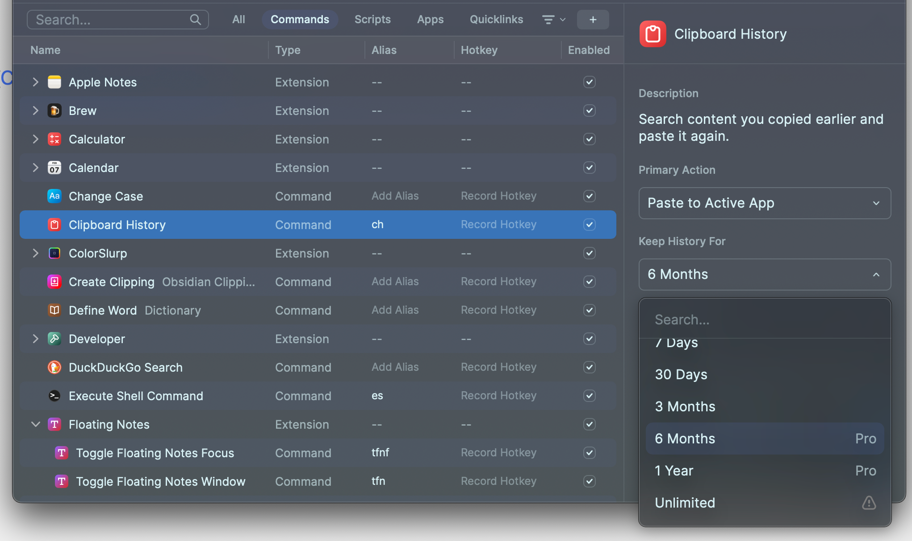

[Astro 3 is here](https://astro.build/blog/astro-3/) and you're looking at a site published with it. I spent a few days last week converting this site and [Friends with Brews](https://friendswithbrews.com) from Astro 2.x to Astro 3, and there are some things I had to learn and decide to make it happen, and most of it has to do with responsive images.

You may recall my long saga of [responsive image generation](/series/responsive-images/) methods for this site and for [Friends with Brews](https://friendswithbrews.com). Most of this journey has revolved around the fact that there are two kinds of optimized images on my sites:

- Site related (logos, images for permanent site pages, etc),
- Content related (images in blog posts or podcast episode show notes).

## Site Related Images

Site related images are easy. I can use whatever the image optimization scheme de jour that Astro uses because these are known, unchanging files and because I refer to them inside Astro components.

In the case of Astro 3, the [astro:assets Image component](https://docs.astro.build/en/guides/images/#image--astroassets) is the official way to create optimized images inside Astro components.

This component is a lot less flexible and capable than the previous [@astrojs/image component](https://docs.astro.build/en/guides/images/#remove-astrojsimage). There's no Picture component, it doesn't resize images from the original size, and as a result it's easy to wind up with larger image sizes than you need and not have smaller physical sizes for responsive views like phone browsers. But it handles Astro SSR mode and prevents CLS (cumulative layout shift), which is really annoying to see.

I have relatively few site images on either this site or [Friends with Brews](https://friendswithbrews.com) – mostly site logos and pictures of the offenders (me on this site and Peter and me on Friends with Brews).

Using Image in an Astro component involves importing the images to be used and setting those imported images as the Image component src.

```astro
---
import { Icon } from "astro-icon/components";
import { Image } from "astro:assets";
import Base from "../layouts/Base.astro";
import site from "../data/site.json"

import av from "../assets/images/ScottLatest.jpg";

let title = "About Me - " + site.title;
let description = "About Scott Willsey";
---

<Base title={title} description={description}>
 <article>
 <h1>About Me</h1>
 <Image
  class="about-av"
  src={av}
  width={600}
  format={"webp"}
  alt="Scott Willsey"
  quality={85}
 />

  (etc, etc, etc)

</Base>
```

It's important to note again that width={600} doesn't result in Image creating a 600 px wide version of the image. It will create a webp image of 85% quality as specified but in the original image dimensions and aspect ratio. The 600 pixel width is used in the HTML that it outputs to tell the browser what to do with it:

```html
<article data-astro-cid-kh7btl4r>
 <h1 data-astro-cid-kh7btl4r>About Me</h1>
 
  <p data-astro-cid-kh7btl4r>Hello, friend.</p>

  
  (etc, etc)    

</article>
```

## Content Related Images

Content related images are images IN the content of the site itself, whether that be blog posts (this site) or podcast episode show notes ([Friends with Brews](https://friendswithbrews.com)). In my case, my content is in Markdown, so my image links are just standard Markdown image links. They are also hyperlinked to the original full-sized image.

```markdown

The one really interesting setting is "Keep History For", which has options for 7 days, 30 days, 3 months, 6 months, 1 year, or unlimited. Unlimited comes with a warning that your hard drive will slowly be eaten alive and you should be ok with that.

[](/images/posts/ClipboardHistoryLengthSetting-E511BEDE-4432-49AB-A442-05069F910E41.jpg)

The Clipboard History view itself is relatively simple. You can have pinned history items, and below those are your history items in reverse chronological order. The beauty of a clipboard history function is that you can copy several things in a row from a source and then worry about pasting them all later without losing any of them.


```

Get rid of all that hyperlink stuff and the Markdown for the image itself looks like this:

```markdown

```

Tangent:

Yes, I put UUIDs in my image names so that I never have to worry about name collisions, however unlikely. I have this automated on my Mac with folder actions. I talked about folder actions in my post about [Automatic Image Processing With AppleScript and Retrobatch](https://scottwillsey.com/autoimageprocess/), but basically the idea is you can set a script to run whenever a specific thing happens to a folder. I can dump a bunch of images into a specific folder and they get output into another folder with the original file name plus a UUID appended.

Anyway, the good news is that the [astro:assets Image component handles images in Markdown](https://docs.astro.build/en/guides/images/#images-in-markdown-files) for you by creating optimized versions in more efficient file types. Here you can see one specific png that it created a webp version for, and the difference in file size.

```bash
scott@Songoku:scottwillsey3.0 main ✗ 2d △ ➜ cd dist/_astro 
scott@Songoku:_astro main ✗ 2d △ ➜ ll FolderActionsSetupMenu*
-rw-r--r--@ 1 scott  staff  527607 Sep 15 18:37 FolderActionsSetupMenu-86B4A871-966E-4A27-A2C5-3FC85E131D6C.4464166b.png
-rw-r--r--@ 1 scott  staff   60900 Sep 15 18:37 FolderActionsSetupMenu-86B4A871-966E-4A27-A2C5-3FC85E131D6C.4464166b_Q8a7k.webp
scott@Songoku:_astro main ✗ 2d △ ➜  
```

One thing that isn't different is the image dimensions:

[](/images/posts/ImageComponentOptimizedVsOrig-5652E165-2DC3-4106-BCF5-D18E63514AD4.jpg)

This means I have to pay more attention to original image sizes that I'd prefer to. I'm hoping in the future this new Images component will gain some of the functionality back that it had before, but my guess is the real monkey in the wrench in doing some of those things is the SSR support.

Right now I have a Folder Action that resizes my images to a maximum width of 1770 pixels. I can use those for the blog post inline images and link to the original sized ones. That gives me a compromise between image size and responsiveness, taking into account the high-resolution nature of most modern screens. Images need to be 2x and in many cases 3x the size they'll be shown at in order to look sharp.

At some point I'll probably revisit this but no matter what I do, astro:assets Image currently will not generate [image srcset](https://developer.mozilla.org/en-US/docs/Web/HTML/Element/img#srcset) HTML for me, so even if I generate multiple sizes for the same file format, only one of them is ever going to get used.

### Markdown vs MDX

You may recall that when I originally converted the site from Eleventy to Astro, I used [MDX](https://mdxjs.com) for my content files instead of Markdown. MDX allows the use of components and would let me directly use the astro:assets Image component in my content for content images the same way I do in my Astro components for site images.

Astro 3 will let you [use the astro:assets Image component directly in MDX](https://docs.astro.build/en/guides/images/#images-in-mdx-files). This gives you more control over the HTML that's generated for your image, but it also comes with extra complexity in terms of the writing process.

I decided a long time ago that I don't want to go down that path any longer because when I'm writing, I don't want to mix implementation details with content. I don't write my blog posts in a code editor, and when I'm writing, I don't want to have to remember how I have everything set up, and I don't want to have to import components and images into a content file. I just want to use Markdown links.

### Image Component vs Astro Remark Eleventy Image

The last Astro 2.x version of this site used [Astro Remark Eleventy Image](https://github.com/ChrisOh431/astro-remark-eleventy-image) to generate responsive images for images inside markdown content. It worked well, it's very flexible, and it had several upsides. The downsides are no support for SSR, if you need that, and it results in a slower build process because it doesn't cache previously rendered images. Because of this latter fact, I decided to move entirely to the astro:assets Image component.

I was also worried about Astro's Image component trying to process images in my Markdown files and fighting Astro Remark Eleventy Image, but I haven't tested to see if this will happen. I may make a branch and link to my public images folder for images in Markdown and see if that avoids a collision between the components. If so, I may wind up using Astro Remark Eleventy Image again to get more responsive images with better file size/quality compromises.

## Conclusion

Even when I'm done, I'm never done. That's the real takeaway here. As with anything, careful consideration of how you use images and what the compromises are between different solutions is required with Astro 3 (and every version of every web framework, honestly). I'm sure there will be much more on the topic of image optimization from me in the future, given my history with it so far.
