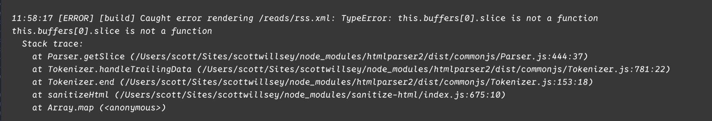

In the past I wrote about [full-text RSS in Astro](https://scottwillsey.com/astro-rss-compiledcontent/), and using sanitize-html on the blog post content to escape and filter html tags. This is or was the [recommended procedure when creating full-text RSS feeds according to Astro's documentation on RSS feeds](https://docs.astro.build/en/recipes/rss/), and worked fine until recently.

At some point, sanitize-html started breaking when [htmlparser2](https://feedic.com/htmlparser2/) was updated (and sanitize-html apparently wasn’t). I started getting the following compilation error:

[](/images/posts/SanitizeErrorMessage-08223da8-ee82-4562-8c91-390fdfeae6f4.jpg)

My temporary solution was to pin htmlparser2 to version 8, which I didn't love, especially since I have multiple Astro sites, and since it would be hard to know when an update would fix the issue.

However, after this problem persisted for awhile, I started wondering what was going on. Surely it must be affecting other people making Astro sites too, but I didn't see any mention of it at all in the [Astro Discord](https://astro.build/chat). I [posted a question about it](https://discord.com/channels/830184174198718474/1487918321906221096/1487918321906221096) and got crickets until today, when a contributor named Armand responded with several helpful bits of information.

First off, he mentioned that instead of sanitize-html, he himself uses [ultrahtml](https://npmx.dev/package/ultrahtml) to handle the html cleanup and parsing. He even provided an example of it in use for me: [astro-blog-full-text-rss/src/pages/rss.xml.ts at latest · delucis/astro-blog-full-text-rss](https://github.com/delucis/astro-blog-full-text-rss/blob/latest/src/pages/rss.xml.ts).

He went on to test my issue and pointed out that my code was calling the async function `post.compiledContent()` without `await`, and this was breaking htmlparser2 as it received a Promise object from sanitize-html, which was passing it on after receiving it from me:

```javascript

content: globalImageUrls(
    site.url,
    sanitizeHtml(post.compiledContent(), {
    allowedTags: sanitizeHtml.defaults.allowedTags.concat(["img"]),
}),

```

I'm not 100% sure why this wasn't breaking in htmlparser2 8.0 and prior, but in fact it WAS resulting in the expected content not being output at all. Instead, where the full-text content should have been for each post in the RSS feed, was an empty `<content:encoded />` tag. So the fact that I was not awaiting the return result of the async `post.compiledContent()` already WAS causing me issues, and I hadn't even noticed.

At any rate, by the time he informed me of how stupid I was (he didn't phrase it that way, but I am), I'd already implemented ultrahtml and moved on.

```javascript title="src/pages/rss.xml.js" {4,5,26-39}
import rss from "@astrojs/rss";
import { experimental_AstroContainer as AstroContainer } from "astro/container";
import { getCollection, render } from "astro:content";
import { transform, walk } from "ultrahtml";
import sanitize from "ultrahtml/transformers/sanitize";
import { rfc2822 } from "../components/utilities/DateFormat";
import site from "../data/site.json";

export async function GET(context) {
  let baseUrl = site.url;
  if (baseUrl.at(-1) === "/") baseUrl = baseUrl.slice(0, -1);

  const container = await AstroContainer.create();

  const posts = (await getCollection("posts"))
    .filter((post) => post.data.draft !== true)
    .sort(
      (a, b) =>
        new Date(b.data.date).valueOf() - new Date(a.data.date).valueOf(),
    );

  const items = [];
  for (const post of posts) {
    const { Content } = await render(post);
    const rawContent = await container.renderToString(Content);
    const content = await transform(rawContent.replace(/^<!DOCTYPE html>/, ""), [
      async (node) => {
        await walk(node, (node) => {
          if (node.name === "a" && node.attributes.href?.startsWith("/")) {
            node.attributes.href = baseUrl + node.attributes.href;
          }
          if (node.name === "img" && node.attributes.src?.startsWith("/")) {
            node.attributes.src = baseUrl + node.attributes.src;
          }
        });
        return node;
      },
      sanitize({ dropElements: ["script", "style"] }),
    ]);
    items.push({
      title: post.data.title,
      link: `${baseUrl}/${post.id}`,
      pubDate: rfc2822(post.data.date),
      description: post.data.description,
      customData: `<summary>${post.data.description}</summary>`,
      content,
    });
  }

  return rss({
    title: site.title,
    description: site.description,
    site: context.site,
    xmlns: {
      atom: "http://www.w3.org/2005/Atom/",
      dc: "http://purl.org/dc/elements/1.1/",
      content: "http://purl.org/rss/1.0/modules/content/",
    },
    items,
  });
}


```

The bottom line is, if you are doing full-text RSS feeds in Astro and you do use sanitize-html or ultrahtml, don't be like me and send a Promise to things that want the Promise's returned object instead.
