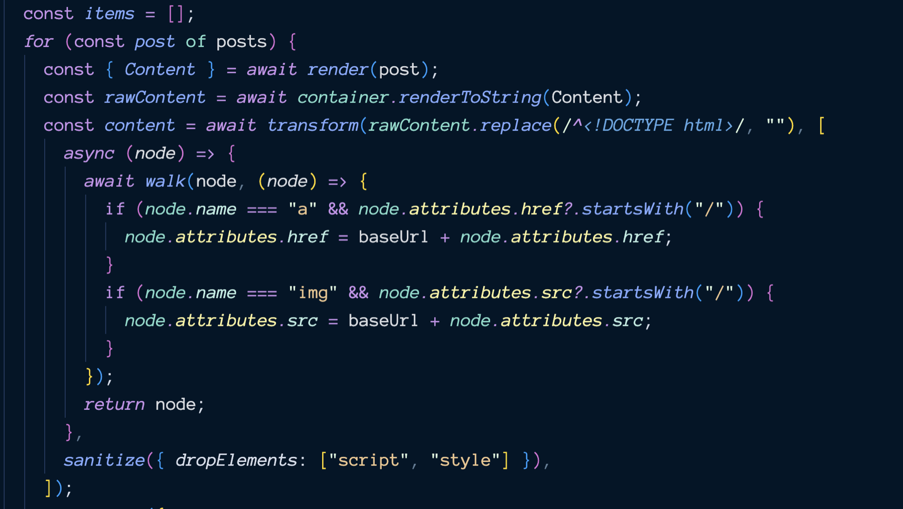

In the past I wrote about [full-text RSS in Astro](https://scottwillsey.com/astro-rss-compiledcontent/), and using sanitize-html on the blog post content to escape and filter html tags. This is or was the [recommended procedure when creating full-text RSS feeds according to Astro's documentation on RSS feeds](https://docs.astro.build/en/recipes/rss/), and worked fine until recently.

At some point, sanitize-html started breaking when [htmlparser2](https://feedic.com/htmlparser2/) was updated (and sanitize-html apparently wasn’t). I started getting the following compilation error:

```

  11:58:17 [ERROR] [build] Caught error rendering /reads/rss.xml: TypeError: this.buffers[0].slice is not a function
  this.buffers[0].slice is not a function
    Stack trace:
      at Parser.getSlice (/Users/scott/Sites/scottwillsey/node_modules/htmlparser2/dist/commonjs/Parser.js:444:37)
      at Tokenizer.handleTrailingData (/Users/scott/Sites/scottwillsey/node_modules/htmlparser2/dist/commonjs/Tokenizer.js:781:22)
      at Tokenizer.end (/Users/scott/Sites/scottwillsey/node_modules/htmlparser2/dist/commonjs/Tokenizer.js:153:18)
      at sanitizeHtml (/Users/scott/Sites/scottwillsey/node_modules/sanitize-html/index.js:675:10)
      at Array.map (<anonymous>)

```

My temporary solution was to pin htmlparser2 to version 8, which I didn't love, especially since I have multiple Astro sites, and since it would be hard to know when an update would fix the issue.

However, after this problem persisted for awhile, I started wondering what was going on. Surely it must be affecting other people making Astro sites too, but I didn't see any mention of it at all in the [Astro Discord](https://astro.build/chat). I [posted a question about it](https://discord.com/channels/830184174198718474/1487918321906221096/1487918321906221096) and got crickets until today, when a contributor named Armand responded with several helpful bits of information.

First off, he mentioned that instead of sanitize-html, he himself uses [ultrahtml](https://npmx.dev/package/ultrahtml) to handle the html cleanup and parsing. He even provided an example of it in use for me: [astro-blog-full-text-rss/src/pages/rss.xml.ts at latest · delucis/astro-blog-full-text-rss](https://github.com/delucis/astro-blog-full-text-rss/blob/latest/src/pages/rss.xml.ts).

He went on to test my issue and pointed out that my code was calling the async function `post.compiledContent()` without `await`, and this was breaking htmlparser2 as it received a Promise object from sanitize-html, which was passing it on after receiving it from me.

I'm not 100% sure why this wasn't breaking in htmlparser2 8.0 and prior, but in fact it WAS resulting in the expected content not being output at all. Instead, where the full-text content should have been for each post in the RSS feed, was an empty `<content:encoded />` tag. So the fact that I was not awaiting the return result of the async `post.compiledContent()` already WAS causing me issues, and I hadn't even noticed.

At any rate, by the time he informed me of how stupid I was (he didn't phrase it that way, but I am), I'd already implemented ultrahtml and moved on.

[](/images/posts/RssXmlJs-2b634ca1-02d4-4a5e-968e-70b09da00710.jpg)

You can see the full source for it [here](https://github.com/scottaw66/scottwillsey/blob/main/src/pages/rss.xml.js).

The bottom line is, if you are doing full-text RSS feeds in Astro and you do use sanitize-html or ultrahtml, don't be like me and send a Promise to things that want the Promise's returned object instead.
