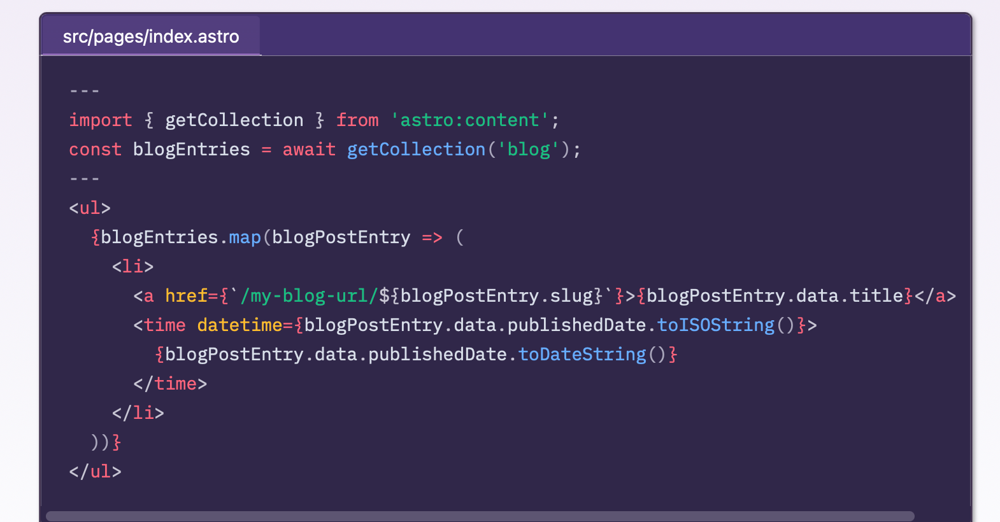
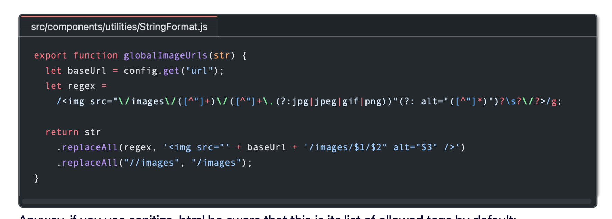

You've seen a lot of code blocks on this site in various posts of mine, primarily because I'm not ashamed to show what a bad programmer I am or how excited I am that I learned something that's probably rudimentary to many people. And while I like how the native [Astro support for the Shiki syntax highlighter](https://docs.astro.build/en/guides/markdown-content/#shiki-configuration) works, I really like how code blocks look in Astro's documentation pages even more. It looks like this:

I like the way they do this because it supports various languages and syntaxes, it allows for a frame with the name of the file being shown if applicable, and in general, it just looks really good.

I posted in the [Astro Discord](https://astro.build/chat) Starlight channel to ask how they tweaked Shiki to make it look like this, because I couldn't tell from the [Starlight source](https://github.com/withastro/starlight). I was looking for rehype markdown plugins or something. [Chris Swithinbank](https://github.com/delucis), who's a huge Astro docs contributor and also contributor of code for the Astro docs application itself, replied to let me know that what they're doing for code blocks in the Astro docs is even simpler than that – it's called [Expressive Code](https://github.com/expressive-code/expressive-code).

[Expressive Code](https://github.com/expressive-code/expressive-code) is really all about code blocks, or syntax highlighting. And it just so happens most or all of the contributors are Astro contributors (including Chris!). This is great news because one of the packages available in Expressive Code is [astro-expressive-code](https://github.com/expressive-code/expressive-code/blob/main/packages/astro-expressive-code/README.md), which is an Astro specific Expressive Code integration. It's so easy that all you have to do is install that one package  in your Astro site and you're in business.

I installed it using the Astro CLI as recommended in the [astro-expressive-code README](https://github.com/expressive-code/expressive-code/blob/main/packages/astro-expressive-code/README.md) with the command `npx astro add astro-expressive-code` (since I'm using npm). After that, I did absolutely nothing except edit all my posts with code blocks to add titles to any code blocks that I wanted to list file names for. Now my code blocks look like this:

Right now I'm just using the default Shiki GitHub theme. I haven't customized the look at all. While they do look fine as is, I will customize the look more when I have time.

If you use Astro and you ever write about code, you should definitely check out [Expressive Code](https://github.com/expressive-code/expressive-code) and its [astro-expressive-code](https://github.com/expressive-code/expressive-code/blob/main/packages/astro-expressive-code/README.md) package.
