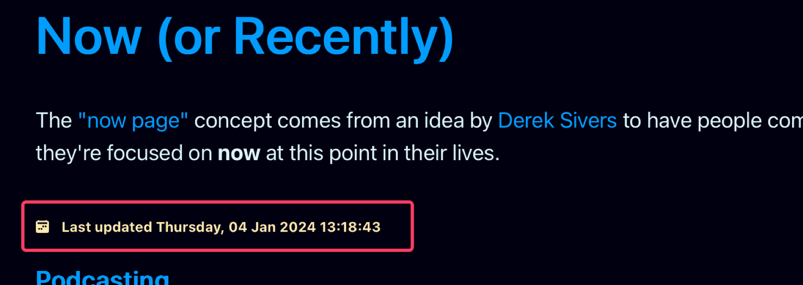

I'm trying to figure out how to use remark plugins in [Astro](https://astro.build) to modify a couple things in posts for me automatically, and along the way I've used remark to add a couple quality of life improvements. The first is an auto-generated table of contents for longer posts that I feel need one, and the second is an auto-generated last modified date for pages based on git commit timestamps.

The benefit of an automatically generated last modified date is that I don't have to remember to update it when I make changes to a page that displays it, like my [now](/now) page or my [links](/links) page. I can just commit my changes and the last modified date will update automatically. It's simple, but it's kind of beautiful.

I basically did exactly what Astro's documentation says to do in a helpful recipe called [Add last modified time](https://docs.astro.build/en/recipes/modified-time/). I created a file called remark-modified-time.mjs and put it in my src/components/utilities folder.[^1]

```js title="remark-modified-time.mjs"

import { execSync } from "child_process";

export function remarkModifiedTime() {
  return function (tree, file) {
    const filepath = file.history[0];
    const result = execSync(`git log -1 --pretty="format:%cI" "${filepath}"`);
    file.data.astro.frontmatter.lastModified = result.toString();
  };
}

```

Then I updated my astro.config.mjs file to reference this as a remark plugin, and to use it in my markdown processing.

```js title="astro.config.mjs" {5, 20}

import { defineConfig } from "astro/config";
import expressiveCode from "astro-expressive-code";
import icon from "astro-icon";
import pagefind from "astro-pagefind";
import { remarkModifiedTime } from './src/components/utilities/remark-modified-time.mjs';
import remarkToc from 'remark-toc';

/** @type {import('astro-expressive-code').AstroExpressiveCodeOptions} */
const astroExpressiveCodeOptions = {
  // Example: Change the themes
  themes: ["material-theme-ocean", "light-plus", "github-dark-dimmed"],
  themeCssSelector: (theme) => `[data-theme='${theme.name}']`,
}

// https://astro.build/config
export default defineConfig({
    site: "https://scottwillsey.com/",
    integrations: [expressiveCode(astroExpressiveCodeOptions), icon(), pagefind()],
    markdown: {
    remarkPlugins: [ remarkModifiedTime, [remarkToc, { heading: "contents" } ] ],
  },
});

```

Once those are set up, it's just a matter of referencing remarkPluginFrontMatter.lastModified in the Astro template.

```astro title="now.astro" {8,26}

---
import { getEntry } from "astro:content";
import { Icon } from "astro-icon/components";
import Base from "../layouts/Base.astro";
import { modifieddate } from "../components/utilities/DateFormat.js";

const now = await getEntry("now", "now");
const { Content, remarkPluginFrontmatter } = await now.render();

let title = now.data.title;
let description = now.data.description;
---

<Base title={title} description={description}>
  <article>
    <h1>{title}</h1>
    <p class="now">
      The <a href="https://nownownow.com/about">"now page"</a> concept comes from
      an idea by <a href="https://sive.rs">Derek Sivers</a> to have people communicate
      what they're focused on <b>now</b> at this point in their lives.
    </p>
    <div class="time">
      <Icon name="bi:calendar2-week-fill" />
      <time datetime={now.data.date}>
        <a href={`/${now.slug}`}
          >Last updated {modifieddate(remarkPluginFrontmatter.lastModified)}</a
        >
      </time>
    </div>
    <div class="now">
      <Content />
    </div>
  </article>
</Base>

```

That's it. Now I have auto-generated last modified dates for any page I feel needs one, thanks to Astro using remark to render markdown and therefore making adding remark plugins super simple.

[](/images/posts/LastUpdatedRemark-35161379-7B49-4BBB-88C0-09240426173A.png)

[^1]: You can put your remark plugin anywhere you want, as long as you reference the path correctly in astro.config.mjs.
