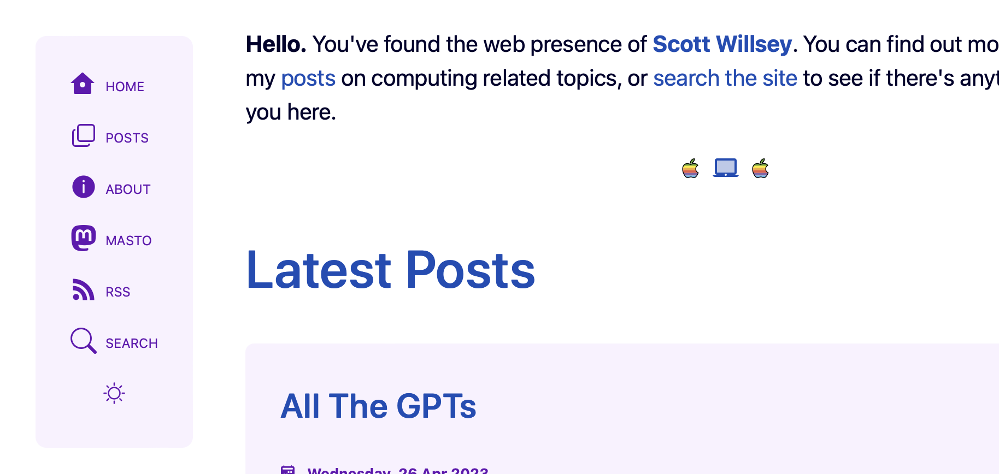

If you're reading this thinking "this site looks a little bit different", you're correct. What started off as an exercise in improving my pagination pager for my blog posts became a bit of a site redesign including moving menu links out of the header into a standalone menu, a new (work-in-progress) pager, and having the home page act as a links/summary page instead of being the full page 1 of my paginated blog posts.

The home page change is probably the most obvious to most people, even though the menu change is the one I personally think improves things the most. Whereas previously I did a couple minor hacks with my pagination logic to have the home page show the first page of blog posts, this isn't really how [Astro](https://astro.build) likes to handle pagination.

Astro expects a [`[bracket]` syntax](https://docs.astro.build/en/core-concepts/routing/#pagination) page that acts as the page that will page through a given collection of items. Because of this, implementing anything more than a simple "more posts" link on the home page became difficult for me. I wrestled with figuring out how to get the home page the information passed via the [page prop](https://docs.astro.build/en/core-concepts/routing/#the-page-prop) like Astro does on a proper paginated page.[^1]

In the end, I gave up and decided to do what Astro seems to think is the right way to set up a blog site, which is to have a landing home page and keep the paginated blog posts off of it. That doesn't mean completely avoiding linking to posts, as you can see from the fact that I have a list of the 5 most recent posts on the home page. But these aren't the complete posts like on the paginated blog post page, and they (obviously) aren't paginated. Links to the 5 most recent posts are there, and that's it.

Personally I don't really know why Astro doesn't have the ability to handle routing pagination with the index page or home page as the first page of items, but they don't. None of the popular sites I enjoy that have daily articles have a landing page with posts hidden behind a link. They all just get down to business and show the visitor the first page of posts, with a pager to move on to older content. Regardless, it's not a hill I want to die on for this site. I do have a project in the works where it may become more of an issue, but I'll cross that bridge when I come to it.

Bridges and hills. Who knew there would be so much geography involved in running a web site?

## Ordering a Menu

Previously on this incarnation of my website (since converting it to Astro), the site header combined the site title (featuring my weird head) and the menu. The menu was just laid out horizontally and didn't change for smaller screens other than to scale down enough to fit.

Besides not being very elegant, this menu structure also has the downside of featuring inherent non-expandability. This is a convoluted way of saying there was no way to cram more onto that menu. I knew that at some point I wanted a side menu that would disappear for small screens, but I wasn't sure how it should look and if I really wanted a hamburger menu that would reveal a hidden mobile menu.

Enter [Ben Smith](https://bensmith.sh), whose website I stumbled across somehow, probably in the Astro Discord Showcase channel. I genuinely feel bad about how much I stole his menu ideas, but it looks good and functions even better. Instead of a hamburger menu, Ben chose an approach of having a hamburger menu looking icon next to the site title for small screens, but having it just jump the visitor down to the same menu as on the full-size site, except now located down at the bottom of the page. I loved it. I stole it. I'm sorry and thank you?

Lest the reader think I also stole the icon idea, you can see from the image of the old menu above that I was already using a menu with icons. In fact, way back when my site was written with [Hugo](https://gohugo.io), I had a menu that was nothing BUT icons. I think it's fair to say this isn't a unique idea.

Also lest the reader wonders whether or not I realize the limitations of my design skills and whether or not I think my site looks stunningly professional, the answers are yes, I do realize my limitations, and no, I don't overestimate my site's appearance. My best is not very good when it comes to UI design or even design of any kind, and I do understand that.

I'm not going to go into the old Pocket Sized Podcast days, but just know that I was publicly criticized by a few listeners for my artwork design skills, or lack thereof. 🤷‍♂️ You can't win them all. Hopefully this site is at least tolerable enough that people won't take time out of their day to chase me down and tell me how bad it is.

[^1]: Say that 10 times fast.
