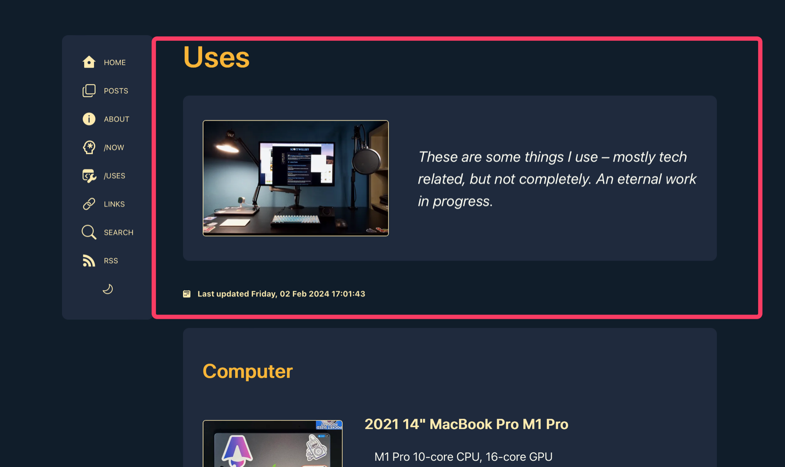
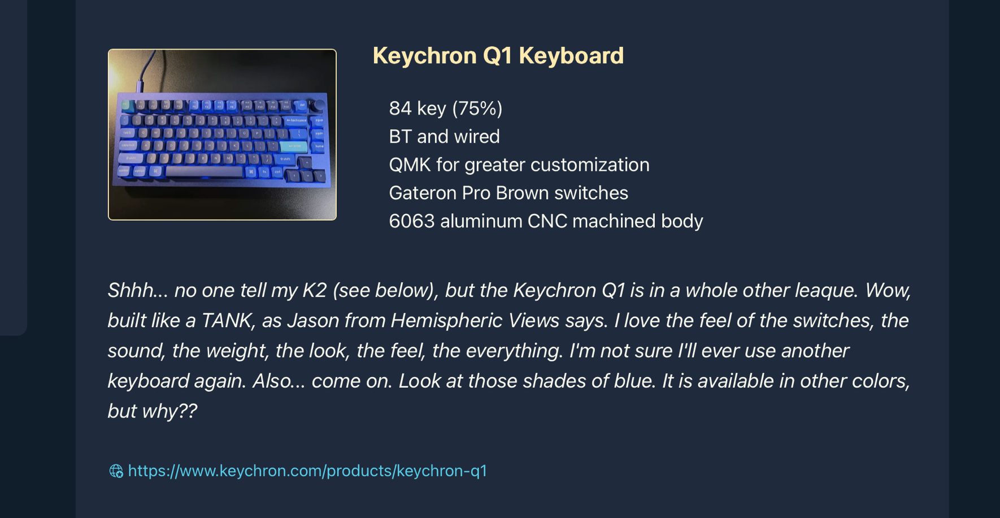

Web frameworks like [Astro](https://astro.build) often allow the use of Markdown for blog post “content”, that is, the actual blog post, and then the page design and programming is in a page template which takes the Markdown and renders its contents in the appropriate place for a fully rendered HTML page. This is convenient and allows excellent separation of written words (“content”) and site rendering mechanisms.

Sometimes, though, what you want to put on the page is more complicated than you can easily do in Markdown. Such is the case with my [/uses](/uses) page on this website.

## Contents

## Background

When I first created my [/uses](/uses) page, I thought I was going to do the same thing I do for my [/links](/links)  and [/now](/now) pages… namely, use Markdown for the “data” (please don’t make me say content again) which would go into the Astro `<Content />` component to render the Markdown into HTML.

But…

As [Jason](https://grepjason.sh/) from [Hemispheric Views](https://hemisphericviews.com/) stated rather enthusiastically during a recent episode, Markdown isn’t always the right tool for the job. And it’s NOT the right tool for the /uses job, because I want a format and flexibility for this page that Markdown makes difficult, if not impossible.

The result is that I created the /now page as an Astro page template with all the “data” (no, I will NOT) thrown in amongst the html tags, just like 1990 calling for its beautiful, manually handwritten pages back. But that’s gross. It’s gross because it’s harder to work with from an adding and editing perspective, and it just seems dumb.

The solution is very simple, and it’s what I do on Friends with Beer for the drinks. I use a JSON data file and render it in different Astro page templates.

## The Starting Point

My original `uses.astro` file looks like this:

```astro title="uses.astro"

<Base title={title} description={description}>
  <article>
    <h1>{title}</h1>
    <div class="use-header">
      <a href={bigmac}
        ><Image src={mac} width="300" densities={[2, 3]} alt="My Computer" /></a
      >
      <p class="uses">{description}</p>
    </div>
    <div class="time">
      <Icon name="bi:calendar2-week-fill" />
      <time datetime={uses.data.date}>
        <a href={`/${uses.slug}`}
          >Last updated {modifieddate(remarkPluginFrontmatter.lastModified)}</a
        >
      </time>
    </div>

    <div class="uses">
      <h2>Computer</h2>
      <div class="item">
        <div class="the-thing">
          <a href={bigmbp}
            ><Image
              src={mbp}
              width="300"
              densities={[2, 3]}
              alt="2021 M1 Pro Macbook Pro"
            /></a
          >
          <div>
            <h3>2021 14" MacBook Pro M1 Pro</h3>
            <ul>
              <li>M1 Pro 10-core CPU, 16-core GPU</li>
              <li>16GB RAM</li>
              <li>1TB SSD</li>
            </ul>
          </div>
        </div>
        <p class="uses">
          It might not be THE most amazing computer, spec-wise, but Apple
          Silicon Macs are game changers. It's quiet, it's cool, it's fast, and
          it's instant-on. I've traditionally hated laptops because of their
          massive compromises, and this removes them all.
        </p>
      </div>

 ... a bunch more items ...

 </div>
  </article>
</Base>
```

The text that is the whole point of the page, namely the items that I use that I wish to present, are just more stuff in a sea of rendering implementation.

You can see for yourself how un-fun it would be to add new items to or edit existing ones. It requires carefully trawling through everything and make sure I’m not messing up nested divs and all kinds of junk. Even with VSCode’s code folding and syntax highlighting, it’s still ugly and nightmarish.

Let's fix this mess by breaking out the data from the drawing, so to speak.

## The Modifications

### A JSON Is Born

Step 1 is creating a data file for the stuff I use. I’m calling it `uses.json`, and I’m putting it in my data folder at `src/data/uses.json`.

Step 2 is figuring out the data structure. I break my stuff up into categories or sections, like “Computer” and “Podcast Recording”.[^1]

You can see that in each category, there are multiple items. Each item consists of:

- The name of the item,
- Some specs,
- An optional link to a website for the item,
- My thoughts about it, aka a description,
- An image of the item.

Based on that, here’s how I’ll structure my JSON data file.

```json title="uses.json"
[
    {
        "Category": "Computer",
        "Items": [
            {
                "Name": "Keychron Q1 Keyboard",
                "Specs": [
                    "84 key (75%)",
                    "BT and wired",
                    "QMK for greater customization",
                    "Gateron Pro Brown switches",
                    "6063 aluminum CNC machined body"
                ],
                "Link": "https://www.keychron.com/products/keychron-q1",
                "Description": "Shhh... no one tell my K2 (see below), but the Keychron Q1 is in a whole other leaque. Wow, built like a TANK, as Jason from Hemispheric Views says. I love the feel of the switches, the sound, the weight, the look, the feel, the everything. I'm not sure I'll ever use another keyboard again. Also... come on. Look at those shades of blue. It is available in other colors, but why??",
                "Image": "Keychron-Q1-encoder-D633B1F6-73A7-472F-90C9-680982767284"
            }
        ]
    }
]

```

This lets me have multiple categories, each with multiple items, each with the item data listed above.

Then I just have to modify my `uses.astro` page template to read it in and map it out to the template I’m using for the “data” section.

### An Astro Page Template Gets Smarter

I lied just a little bit. I *am* going to modify `uses.astro` to parse the JSON data from `uses.json`, but I’m also going to create an Astro component called `UsesItem.astro` that will be used to render the individual items. So `uses.astro` is going to load the JSON file, map through the categories, and every time it hits a list of items, it’s going to hand the rendering for them over to the `UsesItem.astro` component.

This will break it things up, make re-use easier if I ever want to render any of these items elsewhere, and generally make me happier. And I like being happier.

Here’s what the /uses page template, `uses.astro`, looks like now with this approach:

```astro title="uses.astro"
---
import { getEntry } from "astro:content";
import { Icon } from "astro-icon/components";
import { Image } from "astro:assets";
import UsesItem from "../components/UsesItem.astro";
import Base from "../layouts/Base.astro";
import { modifieddate } from "../components/utilities/DateFormat.js";
import usesdata from "../data/uses.json";

import mac from "../assets/images/posts/macsetup-7780B721-09D1-44CC-82B1-E083D8F4A7C9.png";
const bigmac =
  "/images/posts/macsetup-7780B721-09D1-44CC-82B1-E083D8F4A7C9.png";

const uses = await getEntry("uses", "uses");

let title = uses.data.title;
let description = uses.data.description;
---

<Base title={title} description={description}>
  <article>
    <h1>{title}</h1>
    <div class="use-header">
      <a href={bigmac}
        ><Image src={mac} width="300" densities={[2, 3]} alt="My Computer" /></a
      >
      <p class="uses">{description}</p>
    </div>
    <div class="time">
      <Icon name="bi:calendar2-week-fill" />
      <time datetime={uses.data.date}>
        <a href={`/${uses.slug}`}>Last updated {modifieddate(uses.data.date)}</a
        >
      </time>
    </div>
    {
      usesdata.map((use) => {
        return (
          <div class="uses">
            <h2>{use.Category}</h2>
            {use.Items.map((item) => (
              <UsesItem item={item} />
            ))}
          </div>
        );
      })
    }
  </article>
</Base>

<style>
  div.use-header {
    display: flex;
    flex-direction: row;
    column-gap: 3rem;
    justify-content: center;
    align-items: center;
    margin: 0 auto;
    padding: 0.5rem 2rem;
    border-radius: 10px;
    font-weight: 400;
    font-size: 1.2em;
    font-style: italic;
  }
  div.use-header {
    background-color: var(--surface-menu);
  }
  div.use-header img {
    min-width: 225px;
  }
  div.uses {
    background-color: var(--surface-menu);
    padding: 0.1em 2rem;
    margin: 2.25em 0;
    border-radius: 10px;
  }
  div.item {
    margin-bottom: 5rem;
  }
  @media only screen and (max-width: 699px) {
    div.use-header {
      flex-direction: column;
    }
    div.uses {
      padding: 0.1em 0.5rem;
    }
  }
  div.time,
  div.time a {
    font-size: 0.8em;
  }
  div.time {
    margin-top: 2.5rem;
  }
  [data-icon="bi:calendar2-week-fill"] {
    font-size: 0.75rem;
    margin-bottom: -0.05rem;
  }
</style>


```

All the information, or data, or content, about the items is GONE from the html template. It’s all in the JSON file, and `uses.astro` is just a set of display instructions.

Now the only part that’s hard-coded into the page template is the page introduction area indicated by the rectangle marker below, which is right at the beginning of the `<article>` section.

[](/images/posts/UsesTemplate1-E07B61D0-26E3-46ED-9ADB-64F2740B5DA1.jpg)

Everything following it comes from the JSON file and is mapped out in this section:

```js
{
 usesdata.map((use) => {
      return (
          <div class="uses">
          <h2>{use.Category}</h2>
          {use.Items.map((item) => (
           <UsesItem item={item} />
          ))}
          </div>
        );
 })
}
```

Very little of the work of rendering the items is done in `uses.astro`. Instead, it relies on the `UsesItem` component which it imports from `UsesItem.astro`. The current item in the map loop is passed as a prop to the component, which then renders the item detail view. Here’s my `UsesItem.astro` component in its entirety, and half of it is CSS:

```astro title="UsesItem.astro"
---
import { Icon } from "astro-icon/components";
import { Image } from "astro:assets";

const { item } = Astro.props;
---

<div class="item">
  <div class="the-thing">
    <a href={`/images/posts/${item.Image}.jpeg`}>
      <Image
        src={import(`../assets/images/posts/${item.Image}.jpeg`)}
        width="300"
        densities={[2, 3]}
        alt={item.Name}
      />
    </a>
    <div>
      <h3>{item.Name}</h3>
      <ul>
        {item.Specs.map((spec, index) => <li key={index}>{spec}</li>)}
      </ul>
    </div>
  </div>
  <p class="uses">
    {item.Description}
  </p>
  {
    item.Link && (
      <p class="link">
        <a href={item.Link}>
          <Icon name="fluent:globe-star-20-regular" />
        </a>
        <a href={item.Link}>{item.Link}</a>
      </p>
    )
  }
</div>
<style>
  div.the-thing {
    display: flex;
    flex-direction: row;
    column-gap: 3rem;
    border-radius: 10px;
    justify-content: flex-start;
    align-items: flex-start;
    font-size: 1em;
    font-style: normal;
    font-weight: 400;
    column-gap: 2rem;
    margin: 0 auto;
    padding: 0;
  }
  p.uses {
    font-style: italic;
  }
  p.link {
    margin-top: 2em;
    font-size: 0.8em;
  }
  p.link [data-icon] {
    margin-bottom: -0.15em;
  }
  div.item {
    margin-bottom: 5rem;
  }
  @media only screen and (max-width: 699px) {
    div.the-thing {
      flex-direction: column;
      padding: 0 0.5rem;
    }
  }
</style>

```

This uses the [astro:assets Image component](https://docs.astro.build/en/guides/images/#image--astroassets) to optimize the item’s image as specified in `uses.json`. It puts this next to the item name and a list of item features of specs. Under that is my description of what it is or why I like it, followed by an optional link to a website for the item.

You can see that `item.Specs` is an array and so I use `item.Specs.map` to create the list of specs. Also notice where the item URL link is rendered starts with `item.Link &&` which means the following href rendering only happens if `item.Link` indeed exists.

The end result that is rendered is something like the following:

[](/images/posts/UsesKeychronQ1-730DE8A6-538A-4582-850B-C2765FF58127.jpg)

## Summarium

You can definitely use Markdown for site content when appropriate, such as for a standard blog post. For anything more complicated, though, you’ll want to use a data source, like a JSON file, and a page template to parse it and map it. This way your data, or “content”, is separate from the rendering mechanics, but can be laid out on the page more intricately than is possible with a straight Markdown to HTML rendering.

The good news is that Astro page templates and components are super flexible in terms of easily mixing HTML, CSS, and JavaScript, and they’re the right tool to use for a one-off page with a custom layout.

[^1]: That’s all I have right now because instead of adding things I use, I’m busy rewriting how the page is created.
