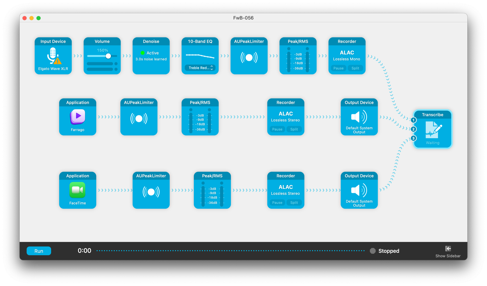

There I was sitting in bed after a long work day, reading [SixColors](https://sixcolors.com/), as one should, when I stumbled across this article: [Audio Hijack adds automatic transcription](https://sixcolors.com/post/2023/11/audio-hijack-adds-automatic-transcription/).

This is kind of exciting. I have mixed feelings about it, actually. On the one hand, not having to laboriously create transcripts after the fact with the admittedly lovely MacWhisper does sound good. On the other hand, I'll still have to edit the transcript to more closely mirror the edited podcast, since this will transcribe the live recorded version of the conversation instead of the edited version.

Anyway, who cares – obviously I'm going to try this out for the next recording of [Friends with Brews](https://friendswithbrews.com) and see how it goes. Here's my setup, which I believe *should* let me get an attributed transcription:

I've used MacWhisper's Transcribe Podcast feature on the last two episodes of Friends with Brews I've transcribed to get speaker attribution. You can see it in action on the [transcription for Episode 52 – If I Were a Beer](https://friendswithbrews.com/transcripts/52/). If I can replicate that while recording the podcast instead of as a separate task later, you can bet that Audio Hijack Transcribe block will be value added.
