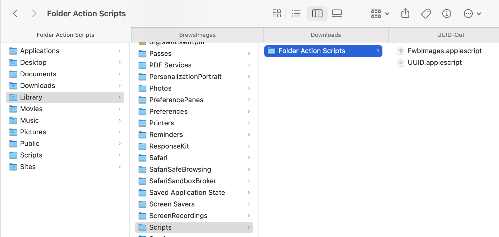
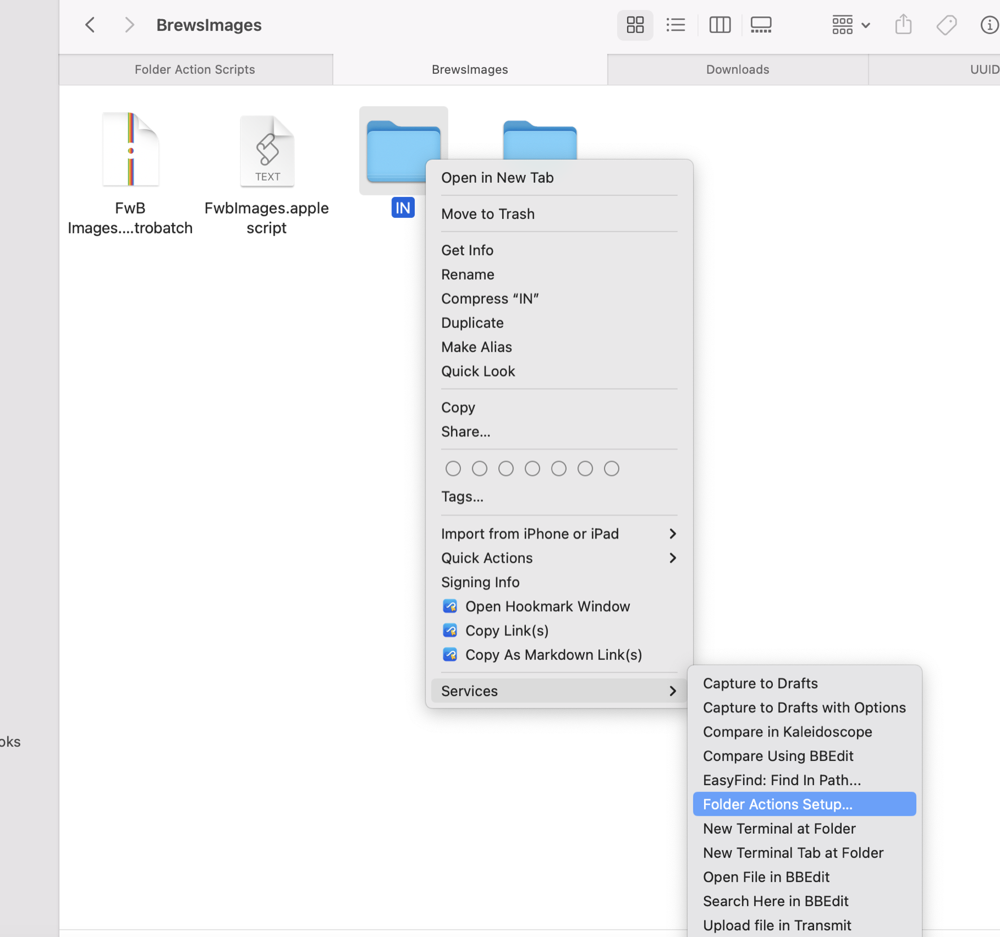
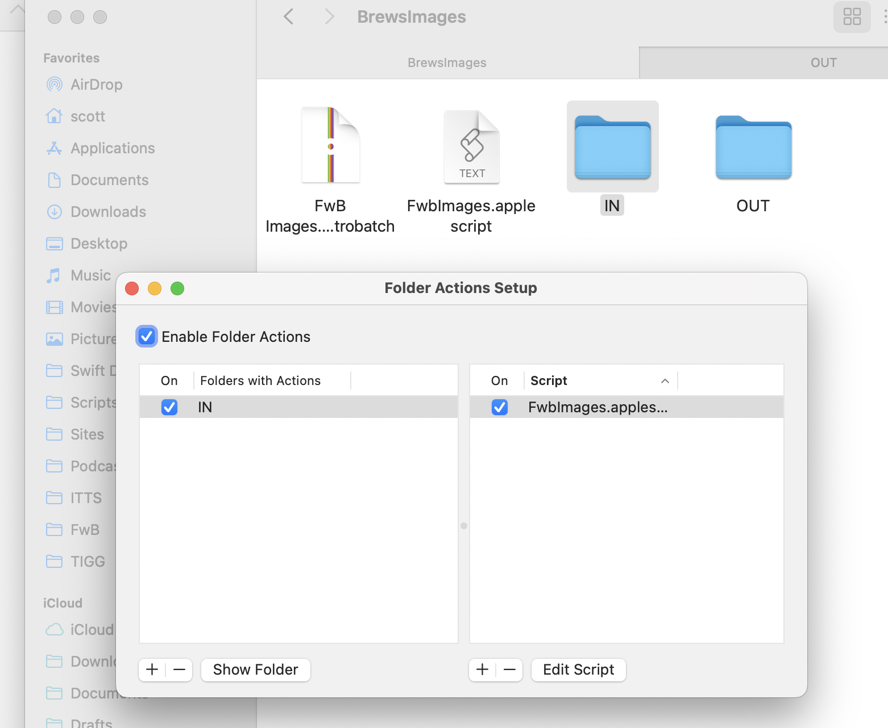

Every episode of [Friends with Brews](https://friendswithbrews.com), I need to generate images for the drinks to include in the podcast chapter artwork and (more importantly) to feature on the website. What I create is a square image in PNG format (for reasons I won't get into here, but more on the image format later) that has a naming scheme that reflects the manufacturer, the drink name, and a UUID to make sure I never accidentally have file naming collisions (although that should never happen anyway in this use case). I used to do this manually, but no longer.

At some recent point in my life, I purchased a copy of [Flying Meat](https://flyingmeat.com/)'s [Retrobatch](https://flyingmeat.com/retrobatch/). I don't remember why, other than I was manually tweaking images for Friends with Brews already, and I am a very happy customer of Flying Meat's other product, [Acorn](https://flyingmeat.com/acorn/). Acorn is the image editor that I was using to get beverage images ready for the site – it's simple but powerful, and it's human-friendly, as their tagline "the image editor for humans" attests. Anyway, Retrobatch is all about batch image processing, and I'm pretty sure my thought process was along the lines of getting out of the manual image tweaking business for Friends with Brews.

Flying Meat has dumped a ton of features, scriptability, and customizability into Retrobatch. You can get a taste of some of its capabilities on the [product description page](https://flyingmeat.com/retrobatch/). One thing I couldn't figure out how to do in Retrobatch though was to easily append a UUID to the image filenames. Retrobatch allows for all kinds of dynamic naming schemes for files, but I couldn't see a way to get the filename without the extension, append the output of an AppleScript or JavaScript block on it, and save it to that concatenated string plus the extension. Generating the UUID in Retrobatch isn't the issue - I could just run an AppleScript or JavaScript in a Retrobatch script block that does it - but modifying the filename the way I want is (apparently) not easily done.

AppleScript, however, can talk to both the shell and Retrobatch, so I can use it to fire up Retrobatch processing, generate a UUID with a shell command, and finally, rename all the files in the OUT folder to include the UUID before the file extension.

```applescript

-- Use Retrobatch to square images and save them as PNG
tell application "Retrobatch"
 set d to open ((POSIX file "/Users/scott/Documents/Podcasts/FwB/BrewsImages/FwB Images.retrobatch") as alias)
 tell d
  execute input items "/Users/scott/Documents/Podcasts/FwB/BrewsImages/IN" output folder "/Users/scott/Documents/Podcasts/FwB/BrewsImages/OUT"
 end tell
end tell

-- Generate a UUID
set uuid to (do shell script "uuidgen")

tell application "Finder"
 -- Get a list of all files in the input directory
 -- Create POSIX path string
 set PosixPath to "/Users/scott/Documents/Podcasts/FwB/BrewsImages/OUT"

 -- Convert POSIX path into colon path
 set imagePath to (POSIX file PosixPath) as string

 set fileList to every file of folder imagePath

 -- Loop through each file and copy it to the output directory with a new name
 repeat with aFile in fileList
  set fileName to name of aFile

  set fileExtension to name extension of aFile
  set baseName to text 1 thru ((length of fileName) - (length of fileExtension) - 1) of fileName
  set newName to baseName & "-" & uuid & "." & fileExtension
  set aFile's name to newName
 end repeat
end tell

```

But, wait – there's more! It turns out macOS natively supports folder events such that you can run a script when something happens in a folder. This means I can have it run my AppleScript, with a slight modification, whenever I drop the images into my IN folder, and it'll put the formatted images into my OUT folder and rename them with the UUID added.

The trick to this is in adding my AppleScript (slightly modified) to my `~/Library/Scripts/Folder Action Scripts` folder. Note the ~ indicating this is in the user folder's Library folder, not the top level `/Library` folder.

First the AppleScript modification: A line at the top and a line at the bottom which tell it to only execute the AppleScript when new items are added to the folder:

```applescript

on adding folder items to theAttachedFolder after receiving theNewItems

... (original AppleScript here) ...


end adding folder items to

```

The full script now looks like this:

```applescript

on adding folder items to theAttachedFolder after receiving theNewItems

 -- Use Retrobatch to square images and save them as PNG
 tell application "Retrobatch"
  set d to open "/Users/scott/Documents/Podcasts/FwB/BrewsImages/FwB Images.retrobatch"

  delay 5

  tell d
   execute input items "/Users/scott/Documents/Podcasts/FwB/BrewsImages/IN" output folder "/Users/scott/Documents/Podcasts/FwB/BrewsImages/OUT"
  end tell
 end tell

 -- Generate a UUID
 set uuid to (do shell script "uuidgen")

 tell application "Finder"
  -- Get a list of all files in the input directory
  -- Create POSIX path string
  set PosixPath to "/Users/scott/Documents/Podcasts/FwB/BrewsImages/OUT"

  -- Convert POSIX path into colon path
  set imagePath to (POSIX file PosixPath) as string

  set fileList to every file of folder imagePath

  -- Loop through each file and copy it to the output directory with a new name
  repeat with aFile in fileList
   set fileName to name of aFile

   set fileExtension to name extension of aFile
   set baseName to text 1 thru ((length of fileName) - (length of fileExtension) - 1) of fileName
   set newName to baseName & "-" & uuid & "." & fileExtension
   set aFile's name to newName
  end repeat

  move theNewItems to the trash
 end tell

end adding folder items to

```

For the AppleScript to execute automatically on a folder, first it needs to be located in `~/Library/Scripts/Folder Action Scripts`.

[](/images/posts/FolderActionScriptsFolder-BD0E8CCA-F2E3-487E-AF1C-3B67CF321DEF.jpg)

Once I had the AppleScript there, I right-clicked my input folder, selected `Services` and then `Folder Action Setup`.

[](/images/posts/FolderActionsSetupMenu-86B4A871-966E-4A27-A2C5-3FC85E131D6C.jpg)

On the "Folder Action Setup" dialog box, I clicked on the action name on the right to reveal a dropdown with my AppleScript in the list. I chose the AppleScript, made sure "Enable Folder Actions" was checked, and closed the dialog box.

[](/images/posts/FolderActionsSetup-1081E829-4FB6-447A-88A5-BC7EE5F934F6.jpg)

Now I have a folder that I can drop images into, and they automatically get formatted and renamed and placed in my output folder.

There IS one thing to remember about renaming files in a folder that watches for new items: renaming a file will trigger the script again because it appears to Finder to be a new item. That means if you rename an item in the input folder and the script doing the renaming is set to execute whenever new items appear, it'll run repeatedly on the same file and the name won't be what you want. This is why I move the files to the output folder before changing the name by adding the UUID to it.

This workflow doesn't completely remove all manual labor because I still have to download the files, determine whether or not I need to pre-crop so the Retrobatch square crop action won't remove something I want, and finally maybe add a background using Acorn if the original image background is transparent. I think I can probably get Retrobatch to handle that last part for me... I hope. I haven't tried yet.

At the start of this post, I said I'd mention image formats again. I just wanted to point out that regardless of what format I save them to my site src folder in, they get optimized and output in a more responsive-friendly size and format. I use PNG because by being consistent I can overcome an interesting Vite feature regarding dynamic image imports and still get the job done.

As always, I'm really bad at explaining things clearly, so hit me on [Mastodon](https://appdot.net/@scottaw) or [Bluesky](https://bsky.app/profile/scottwillsey.com) if none of this makes sense.
