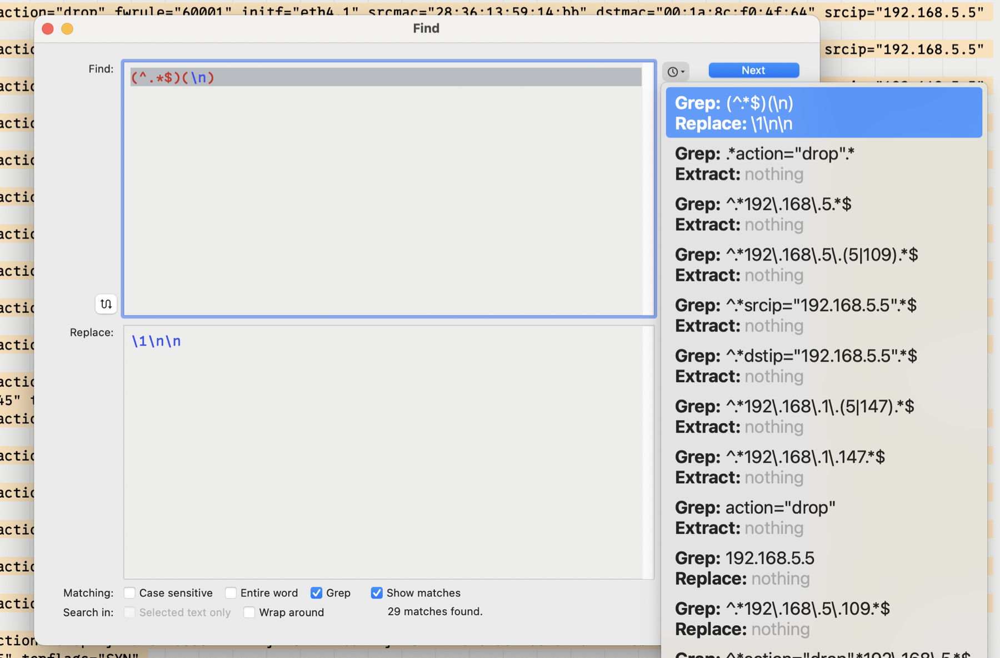
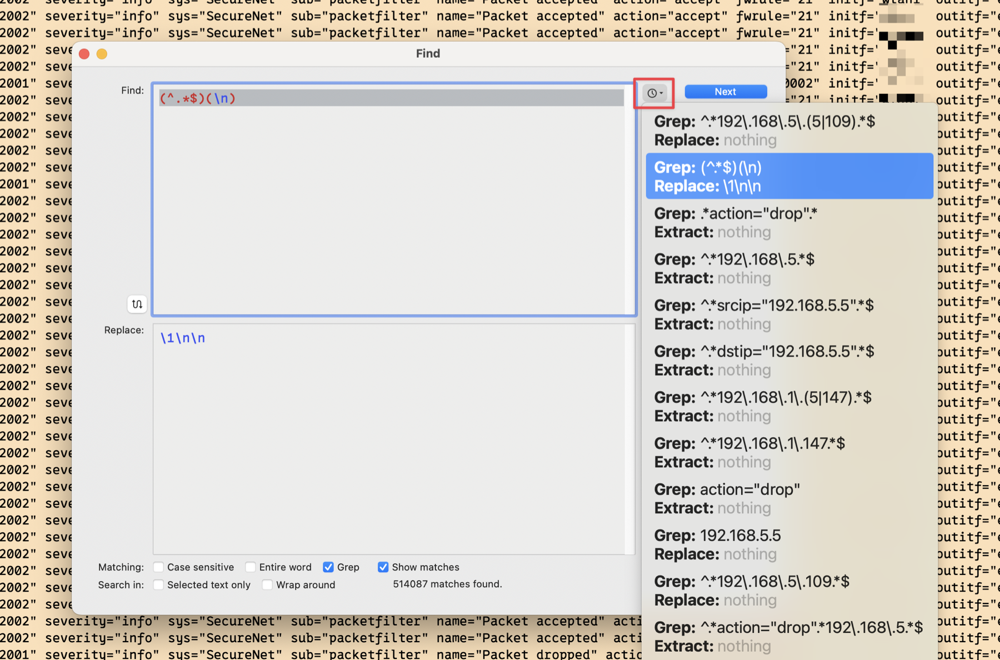

Long-time Mac users will undoubtedly have heard of [BBEdit](https://www.barebones.com/products/bbedit/index.html). BBEdit is the favorite Mac text editor of many old Mac users[^1] for various types of writing, including programming, notes, articles, and basically any type of writing Mac nerds can do.

Personally, I wouldn’t program using BBEdit. [Visual Studio Code](https://code.visualstudio.com) and offshoots like [Cursor](https://www.cursor.com) are much better for that. I wouldn’t write this blog post in it. That’s what I use [Bear](https://bear.app) for. And, in my humble-ish opinion, they’re much better at those tasks than BBEdit is.

But there is a specific use that BBEdit can’t be topped for on the Mac – log file analysis. It’s like BBEdit was made specifically for it.

Here’s a UTM firewall packet filter log containing all entries for a given day, downloaded right from the UTM’s log file interface.

If I want to look at only entries for 192.168.5.5 and 192.168.5.109, I can open the Search dialog box with ⌘F and put in a regular expression to search for that.

Right in the Search dialog box, before even hitting “Find All”, it shows me at the bottom how many matches there are – 3505 of them.

If I do hit “Find All”, it opens a new window containing those lines at the top of the window, and, if I click on one of them, the log file they are in with the highlighted line in view at the bottom of the window. It’s great for contextualizing matches.

But what if I want a document that contains those matching lines and nothing else? That’s what the “Extract” button on the Search dialog box is for. By clicking that instead of “Find All”, a new document is created in BBEdit that contains just the matching lines named “Extracted occurrences of (insert regular expression search string here)”.

I use this all the time to drill down further and further without having to edit any files or keep search results windows open. Let’s say I have a subset of IP addresses extracted, like anything in the 192.168.5.x range, and I want to see only lines that have a firewall action of “drop” in them. In other words, I want to ignore all cases where the firewall passed the traffic along and only see when it blocked it for those IP addresses.

Very simple. While viewing the document of extracted 192.168.5 matches, ⌘F again and enter a new regular expression looking for lines where action=“drop”. The search dialog shows 29 matches.

Hit the “Extract” button and extract the 29 matches to a new document.

Sometimes when viewing results like this I want blank lines between them so I use a regular expression find and replace when doing this, and click the “Replace All” button in the search dialog, which acts on the active document and replaces all matches with what I want – in my case, the same result lines but followed by 2 newlines after each of them.

Much better for my tired old eyes.

And now for some additional niceties of BBEdit search:

1. You can save your searches and access them using the “g” button on the Search dialog to get a dropdown list to choose from.

2. You can also, as my examples in this post illustrate, pull up previously used searches from the search history feature by clicking the clock icon button on the search dialog, and choosing from the dropdown list.

3. There’s also a multi-file search you can open separately from regular search, with the same features mentioned above, using ⇧⌘F. It lets you choose the files to search in with great granularity, and it has the same “Find All”, “Replace All”, and “Extract” functions as the regular active file search function. This means you can extract all instances of a specific thing contained in multiple files to one new document.

One important thing about composing a search in BBEdit if you do want to extract to a new document is that you need to compose your regular expression to include a full line and not just the exact search terms specified. For example, if you just search for “192.168.5” like this, and then Extract:

You get this:

Not very useful if you’re into context or understanding of any kind. But if you use a regular expression that looks like this (since in my case, the log is separate lines of logged events):

Now you get the full line for each matching line:

That’s because the search was created with a regular expression of `^.*192\.168\.5.*$`, which looks for start of line, any characters any number of times followed by 192.168.5, followed by any number of any characters, followed by end of line. When using regular expressions as search terms, make sure that the Grep option next to “Matching:” in the search dialog box is checked so that the search term acts as a regular expression instead of a literal string.

I’m sure there’s much more that I haven’t even discovered about BBEdit and searching and extracting yet, but these are some things that I use all the time and find indispensable. If your job or hobby requires you to parse log files very often, I recommend a copy of BBEdit even if you never use it for anything else. It’s still very worth the price for that.

[^1]: I’m old too, so this is fair game. And it’s true. I don’t think many new and or young Mac users use or even know about BBEdit.
