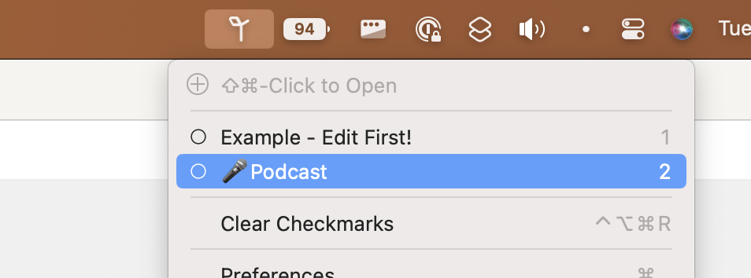

I've written a bunch of words on this site about programming stuff in [Astro](https://astro.build), but there are bunches of other things that can be scripted too. Literal Bunches in fact – enter [Bunch](https://bunchapp.co), a Mac automation app for launching apps and running commands with just a click. It's written by [Brett Terpstra](https://brettterpstra.com), which is a name any Mac automation geek will know.

Bunch works as a menubar app that lists your [Bunches](https://bunchapp.co/docs/bunch-files/). Click on a Bunch in the list, and it executes whatever is inside that Bunch, be it names of apps to launch or to close, or commands that can include system tasks, AppleScripts, Automator workflows, or even Bash scripts.

By default, Bunches are toggles – the first time you click on a Bunch name in the menubar list, the Bunch opens. Any apps or commands that are set to open or run do so. The next time you click the Bunch in the menubar list, it does the reverse. It closes any apps that are not explicitly set to remain open when the Bunch is toggled off (or "closed", in Bunch parlance). It also runs any commands you have set up specifically to run when the Bunch is closed.

[](/images/posts/Bunch-menu-bar-01F5FA78-F3B1-4D2D-B163-E1361EA70ABF.webp)

Talking about in the abstract isn't super helpful. So here's a podcast Bunch of mine! Please note that I'm still not super fluent in Bunch and this is void where prohibited and etc, etc, etc.

```applescript
---
title: 🎤Podcast
---
call_app = ?[FaceTime, Discord, Skype, Zoom] "Which calling app?"

Farrago
${call_app}

%Safari
https://docs.google.com/


%Finder
- ~/Documents/Podcasts/FwB
- ~/Library/Mobile Documents/com~apple~CloudDocs/Documents/Podcasts/FwB
- ~/Music/Audio Hijack

Audio Hijack^

(audio output AirThingies)
(audio input Shure Beta 87a & Farrago)

!<<#On Close

___

#[On Close]
studio = $ studio_display_check.sh

if studio is "true"
    (audio output studio display speakers)
else
    (audio output MacBook Pro Speakers)
end

```

That's a lot. Here's how it works:

```applescript
---
title: 🎤Podcast
---
```

This top section is frontmatter and just determines what this Bunch is called in the menubar.

`call_app = ?[FaceTime, Discord, Skype, Zoom] "Which calling app?"` pops up a dialog box with a menu too choose which app I'm talking to cohosts on. Truthfully, it's going to almost always be FaceTime for [Friends with Brews](https://friendswithbrews.com), but other people on other podcasts use different ones. Slight aside, I'm a firm believer of podcasters always recording their end locally and the editor using all the original (better sounding) tracks, but not everyone does this.

```applescript
Farrago
${call_app}
```

The next couple lines open my soundboard app [Farrago](https://rogueamoeba.com/farrago/) and then whichever communication app I selected from the menu mentioned above.

```applescript
%Safari
https://docs.google.com/
```

These two lines open Safari and then load Google Docs, which we use for show notes. The `%Safari` notation with the percent sign means that when I close the bunch, Safari is not closed along with the other apps in this bunch, but stays open.

```applescript
%Finder
- ~/Documents/Podcasts/FwB
- ~/Library/Mobile Documents/com~apple~CloudDocs/Documents/Podcasts/FwB
- ~/Music/Audio Hijack
```

This section opens a finder window and opens tabs for me with some podcast related file locations.

`Audio Hijack^` just opens Audio Hijack and makes it the active (focused) program.

```applescript
(audio output AirThingies)
(audio input Shure Beta 87a & Farrago)
```

These illustrate one of Bunch's coolest features, the ability to call system level commands. These lines do just what they look like: They set my Mac to output audio through my AirPods Pro and to use my virtual [Loopback](https://rogueamoeba.com/loopback/) device that combines my mic and my soundboard as my audio in. This means I can set FaceTime or Zoom (or whatever app we're talking on) to use this as its audio input, and my cohosts can hear whatever I play on the soundboard.

I'm going to cover the rest of this Bunch all at once.

```applescript
!<<#On Close

___

#[On Close]
studio = $ studio_display_check.sh

if studio is "true"
    (audio output studio display speakers)
else
    (audio output MacBook Pro Speakers)
end

```

Basically the first line of this says "hey, when this Bunch is closed (toggled off), run the #On Close snippet". The On Close snippet is in a special section at the bottom that is reserved for any snippets or snippet fragments you want to include.

My On Close snippet just runs a shell script located in the same folder as the Bunch to see if I'm connected to my Studio Display or not, and if I am, sets the output back to the Studio Display speakers. Otherwise, it sets the output to the Mac's internal speakers.

Because this only runs when the Bunch is closed, meaning I'm done podcasting, this is exactly what I want.

This looks confusing, and I'm not going to lie – it took me awhile to get this working the way I wanted. Part of my issue was that I didn't understand how Bunches work by default, and I thought I had to make a "Start Podcasting" Bunch and a "Stop Podcasting Bunch", not realizing that it was set to toggle and just by choosing "Podcasting" again it would close any apps I didn't explicitly say not to close. The rest of it was just learning the syntax. Fortunately, Brett has written [excellent documentation for Bunch](https://bunchapp.co/docs/).

The fact that you can use conditional logic and use the output from shell scripts and set system settings and so many other things makes this a super flexible, powerful automation tool for the Mac. I used to open all these programs and set my audio settings manually, and now it requires just that many fewer clicks every time I want to podcast.

By the way, Brett has many more amazing utilities. Check out [Gather CLI](https://brettterpstra.com/projects/gather-cli/), for example, which lets you fetch the contents of a web page and have them converted to markdown syntax. It's amazing and it's perfect for doing things like saving information to [Obsidian](https://obsidian.md).
