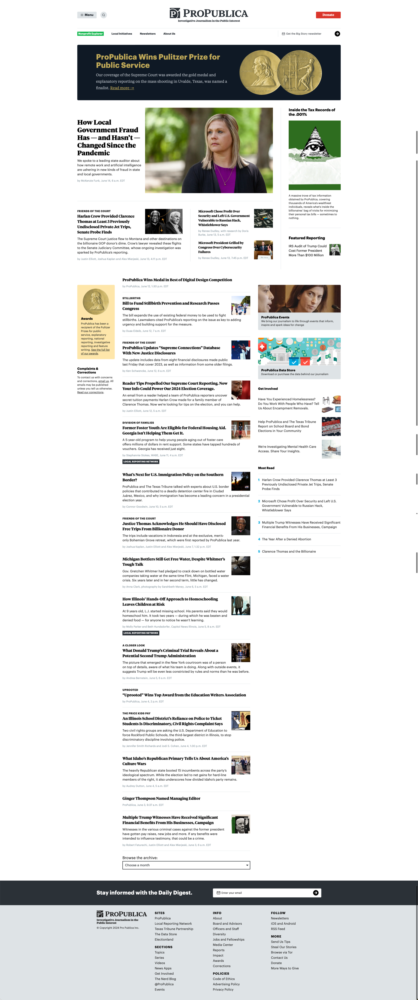

I wrote about [OCR in CleanShot X](https://scottwillsey.com/cleanshotx-text-recog/) in my last post, and my friend David Nelson reminded me of another stellar feature of CleanShot X – scrolling screenshots.

<iframe src="https://mastodon.social/@dmnelson/112601523300995070/embed" class="mastodon-embed" style="max-width: 100%; border: 0" width="400" allowfullscreen="allowfullscreen"></iframe>

It's true, this is a great feature. It's a little counterintuitive to get it to work initially, but once you get it, you'll use this all the time. I have a keyboard shortcut set up to initiate a scrolling screenshot, but you can do it from the CleanShot X menubar icon (or even from Raycast – more on that later). All I have to do is hit ⇧⌥⌘4 to start the scrolling capture using CleanShot X. Then it's a little odd - it wants you to drag an ouline around the area to be scrolled. Usually this means my full browser window. Then click Start Capture, click Auto-Scroll, click Done when it finishes, and then you have a long screenshot.

<iframe width="560" height="500" src="https://www.youtube.com/embed/tjKms_r-l0Y" title="YouTube video player" frameborder="0" allow="accelerometer; autoplay; clipboard-write; encrypted-media; gyroscope; picture-in-picture; web-share" referrerpolicy="strict-origin-when-cross-origin" allowfullscreen></iframe>

Here's the result.

I originally put a screenshot of my own site's home page here, but It looks a little funny because I have a site menu that doesn't disappear up the page as it scrolls, so the menu looks long and repetitive in a way that it isn’t. Page scrollbars have similar issues, but overall, it's a great feature that's useful if you have a need to document a long document of any kind.
