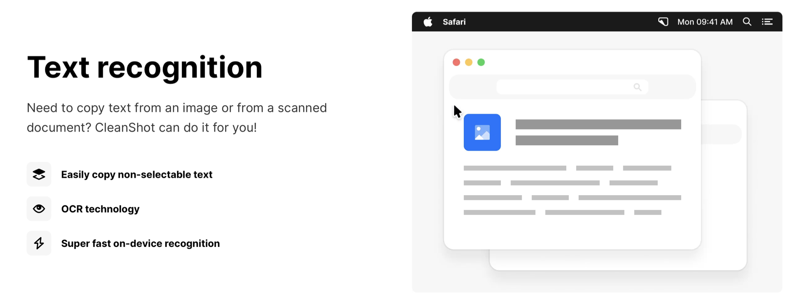
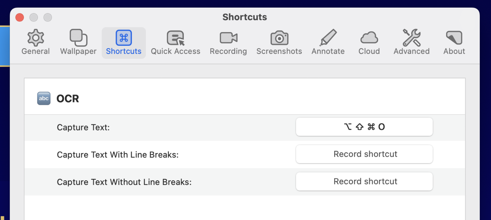
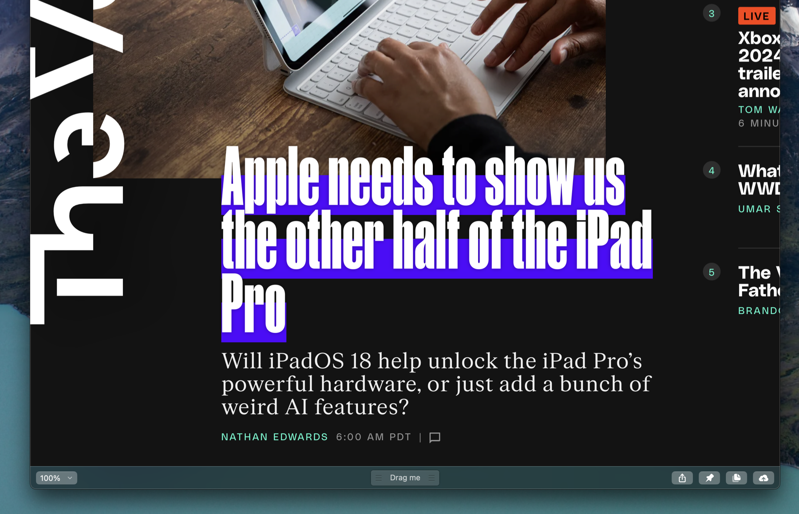
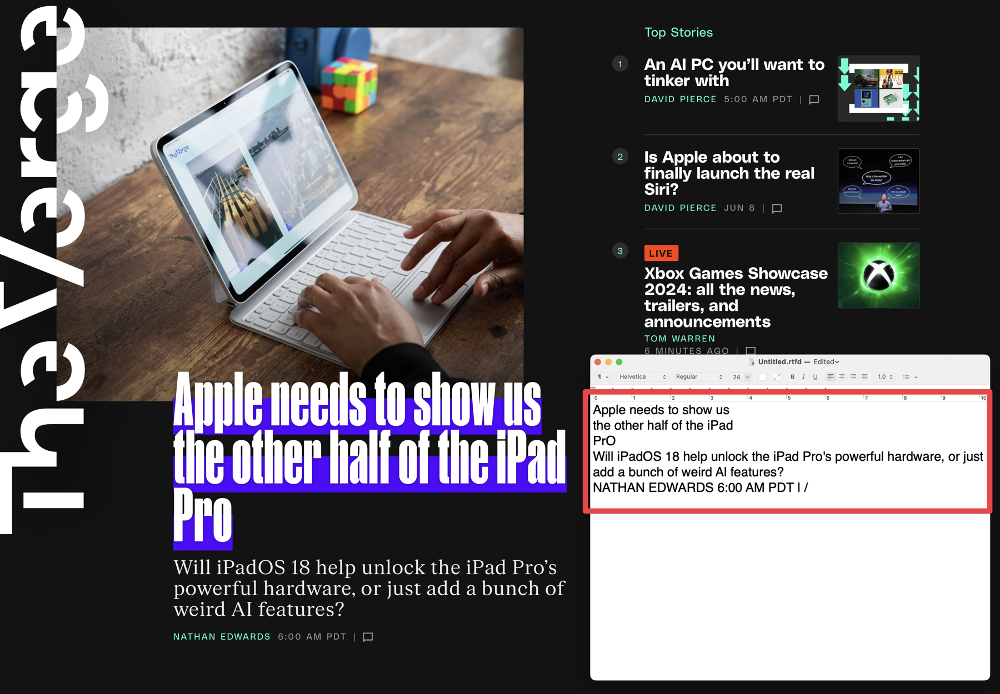

I love this modern era of computing, and do you know why? Text Recognition, also known as OCR in many apps, is amazing in so many apps and OSes now, and it is very useful.

I’ve written about [Image Search Text Recognition in Raycast and ScreenFloat](https://scottwillsey.com/image-text-recog/) before. Another Mac app that has Text Recognition using OCR technology (according to its own website) is [CleanShot X](https://cleanshot.com).

CleanShot X does Text Recognition a little differently than other apps. With CleanShot X, you can use a keyboard shortcut to bring up a capture tool, exactly like a screenshot capture tool, and you drag over the area you want text recognition in. In my case, I have ⌥⇧⌘O set as my keyboard shortcut.

Let’s say I have a screenshot of the title of The Verge’s recent iPad Pro article, for some inexplicable reason.

I can hit ⌥⇧⌘O, drag over the part of the image with the text I want to capture, and release. CleanShot X automatically detects all text in that region and copies it to the clipboard. Then I can (also inexplicably) open TextEdit and paste it in.

I like the simplicity of it and the fact that I get to define the region to look for text in, and the fact that it just copies all text in that region to the clipboard without me having to pick and choose words or lines or paragraphs or whatever.

Here’s a little tip for you Windows users: Snipping Tool has Text Recognition built in too. You can fire it up and capture onscreen notes that people are typing in Teams meetings and use the Text Recognition tool to grab the text for yourself in case the presenter forgets to send out a particular set of notes they’re typing up as they’re talking. It’s great. I do it all the time.

There are lots of Text Recognition examples in macOS and iOS and apps that run on those platforms, and I celebrate them all. We live in a golden age of utility software.
