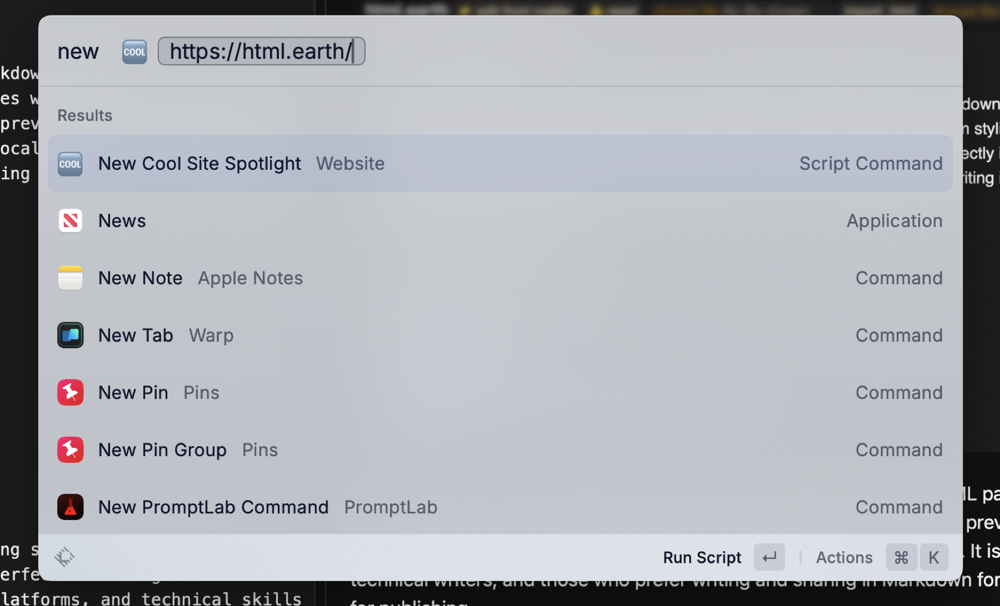

I like to highlight different cool or interesting sites by featuring them in my [Cool Site Spotlight](https://scottwillsey.com/links/#CoolSiteSpotlight) on my links page. I put a new one up every one or two weeks, and put a link to the last one in the [Cool Sites Archive](https://scottwillsey.com/links/#cool-sites-archive) section of the links page.

The data for the current one is a simple JSON file called spotlight.json, and it looks like this:

```json title="spotlight.json"
{
  "Site": "https://html.earth/",
  "Title": "html.earth: Markdown to HTML Converter & Site Generator",
  "Description": "html.earth is a free site generator that converts Markdown to HTML. It comes with a front matter editor, custom styling field, and import & export options.",
  "Image": "HtmlDotEarth-5F9FE361-5512-40BF-A78E-468190030F83"
}
```

Up until now, when it’s time to spotlight a new site, I’ve been grabbing a markdown link of the site title and URL using [Hookmark](https://hookproductivity.com/) and then using the title and URL from that to put in the Title and Site property values. I then run a Raycast script command to rename, resize, and reformat the site screenshot and put it in the appropriate directories in my own site’s local [Astro](https://astro.build/) project. Once I have the image name, I can put it in spotlight.json in the Image property value, minus the file extension, for reasons I’ll write about someday in a separate post.

Anyway, it’s been a fairly manual process, and I finally got tired of it yesterday. So I wrote a Raycast script command called “New Cool Site Spotlight” to do it for me.

[](/images/posts/RaycastNewCoolSiteSpotlightScriptCommand-D984CF94-AFA0-4147-9ED3-F89DB39DA721.jpg)

As you can see, the script command takes one parameter: the URL of the site I want to feature in [Cool Site Spotlight](https://scottwillsey.com/links/#CoolSiteSpotlight).

The first thing the script command does is look at spotlight.json in its current state and grabs the title and URL of the current site, which it formats into a Markdown link and puts on the clipboard. It also sticks a dash in front of it for good measure, since the list of previous cool sites IS actually a list, and Markdown list elements start with a dash. This is all handled by a function called `create_cool_site_archive_link`.

```python
def create_cool_site_archive_link():
    # Open the Spotlight JSON file
    SPOTLIGHT_JSON_FILE = '/Users/scott/Sites/scottwillsey/src/data/spotlight.json'
    with open(SPOTLIGHT_JSON_FILE, 'r') as f:
        data = json.load(f)

    # Get the 'Site' and 'Title' values
    site = data.get('Site')
    title = data.get('Title')

    # Create a markdown link
    markdown_link = f'- [{title}]({site})'
    pyperclip.copy(markdown_link)
```

The script command then calls a function named `get_page_info` which uses the URL to grab the page and extract its title and description.

```python
def get_page_info(url):
    # Get the title and description from the page
    response = requests.get(url)
    soup = BeautifulSoup(response.text, 'html.parser')
    title = soup.find('title').text
    description = soup.find('meta', {'name': 'description'})
    description = description['content'] if description else None
    return title, description
```

Finally, the script command calls `write_spotlight_json`, which replaces the contents of spotlight.json with the new information.

```python
def write_spotlight_json(title, description, url):
    # Create the JSON for the new Cool Site Spotlight entry
    IMAGE_DIR = '/Users/scott/Scripts/scottwillsey/scottwillsey-images/In'
    SPOTLIGHT_JSON_FILE = '/Users/scott/Sites/scottwillsey/src/data/spotlight.json'
    png_file = next((f for f in os.listdir(IMAGE_DIR) if f.endswith('.png')), None)
    if png_file:
        png_file = os.path.splitext(png_file)[0]
    entry = {
        "Site": url,
        "Title": title,
        "Description": description,
        "Image": png_file
    }
    # If all values are present, write the JSON to the file
    if all(entry.values()):
        with open(SPOTLIGHT_JSON_FILE, 'w') as f:
            json.dump(entry, f, indent=4)
    return entry
```

One interesting thing you might notice is that it looks in `/Users/scott/Scripts/scottwillsey/scottwillsey-images/In` for any image file that ends in `.png`, which it then extracts the file name minus the extension from. Once it’s done that, it creates a dictionary named `entry`. If all keys in `entry` have corresponding values, it writes the dictionary as JSON into spotlight.json, replacing whatever was there previously.

Here’s the full New Cool Site Spotlight Raycast script command:

```python title="new-cool-site-spotlight.py"
#!/Users/scott/Scripts/python/venv/bin/python

# Required parameters:
# @raycast.schemaVersion 1
# @raycast.title New Cool Site Spotlight
# @raycast.mode fullOutput

# Optional parameters:
# @raycast.icon 
# @raycast.argument1 { "type": "text", "placeholder": "Cool Site URL" }
# @raycast.packageName Website

# Documentation:
# @raycast.description Create the JSON for Cool Site Spotlight for scottwillsey.com from a URL
# @raycast.author scott_willsey
# @raycast.authorURL https://raycast.com/scott_willsey

import sys
import json
import pyperclip
import requests
from bs4 import BeautifulSoup
import os

url = sys.argv[1]

def create_cool_site_archive_link():
    # Open the Spotlight JSON file
    SPOTLIGHT_JSON_FILE = '/Users/scott/Sites/scottwillsey/src/data/spotlight.json'
    with open(SPOTLIGHT_JSON_FILE, 'r') as f:
        data = json.load(f)

    # Get the 'Site' and 'Title' values
    site = data.get('Site')
    title = data.get('Title')

    # Create a markdown link
    markdown_link = f'- [{title}]({site})'
    pyperclip.copy(markdown_link)

def get_page_info(url):
    # Get the title and description from the page
    response = requests.get(url)
    soup = BeautifulSoup(response.text, 'html.parser')
    title = soup.find('title').text
    description = soup.find('meta', {'name': 'description'})
    description = description['content'] if description else None
    return title, description

def write_spotlight_json(title, description, url):
    # Create the JSON for the new Cool Site Spotlight entry
    IMAGE_DIR = '/Users/scott/Scripts/scottwillsey/scottwillsey-images/In'
    SPOTLIGHT_JSON_FILE = '/Users/scott/Sites/scottwillsey/src/data/spotlight.json'
    png_file = next((f for f in os.listdir(IMAGE_DIR) if f.endswith('.png')), None)
    if png_file:
        png_file = os.path.splitext(png_file)[0]
    entry = {
        "Site": url,
        "Title": title,
        "Description": description,
        "Image": png_file
    }
    # If all values are present, write the JSON to the file
    if all(entry.values()):
        with open(SPOTLIGHT_JSON_FILE, 'w') as f:
            json.dump(entry, f, indent=4)
    return entry

create_cool_site_archive_link()
title, description = get_page_info(url)
if not (title and description):
    sys.exit(1)
print(write_spotlight_json(title, description, url))
```

You may still have questions about the image file, such as how I create it, why it’s in a directory called `/Users/scott/Scripts/scottwillsey/scottwillsey-images/In`, and what I mean when I say I rename and reformat it first. You may also wonder why all that isn’t part of THIS script command intead of being something I do separately still. I’ll write about that soon.

In the meantime, I’ve gone from manually tweaking a JSON file with multiple copy and paste edits when I want to update [Cool Site Spotlight](https://scottwillsey.com/links/#CoolSiteSpotlight) to simply copying a URL from the browser and running a Raycast script command by executing a keyboard command. It’s so much nicer now!
