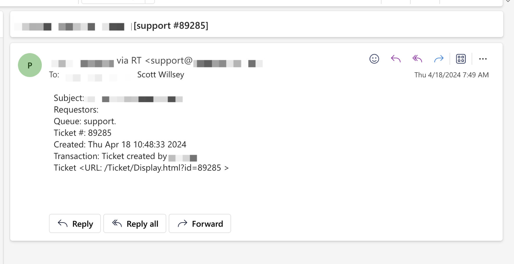
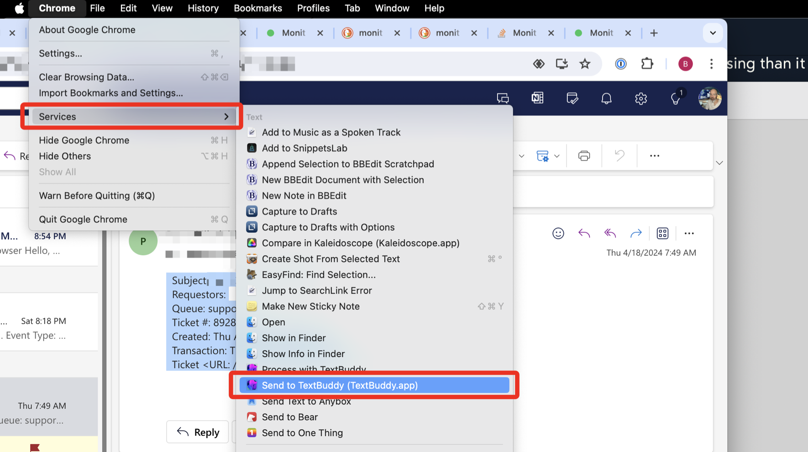
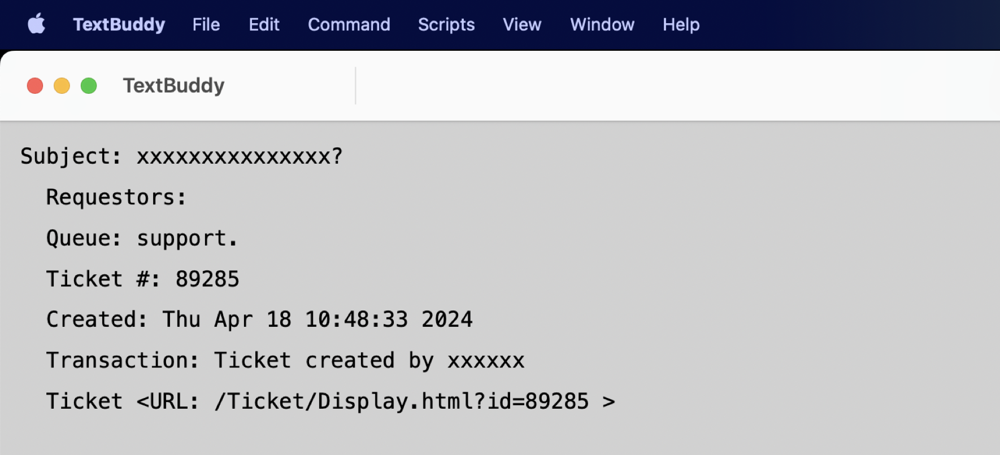
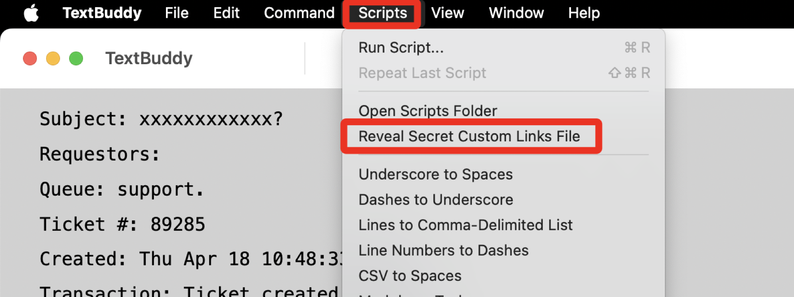
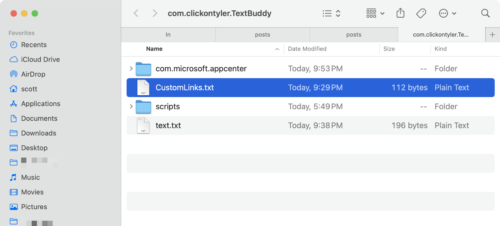
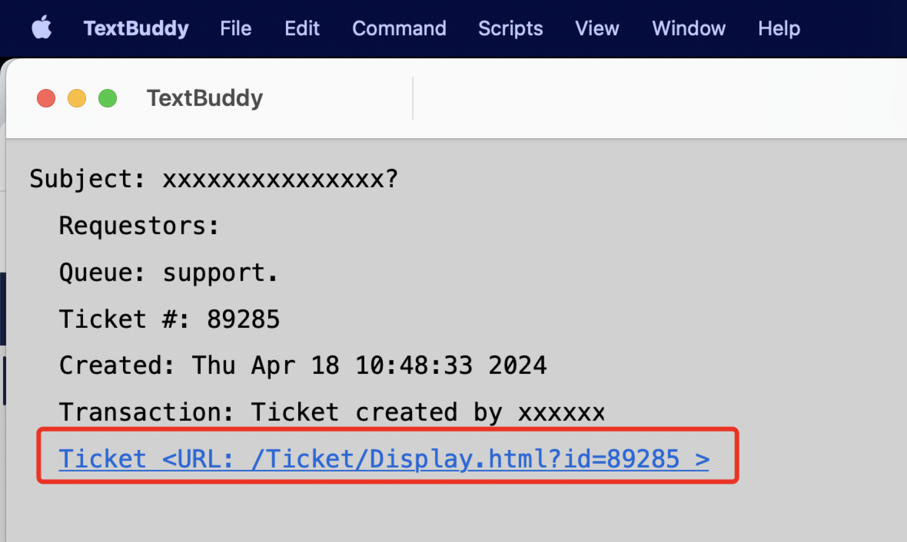
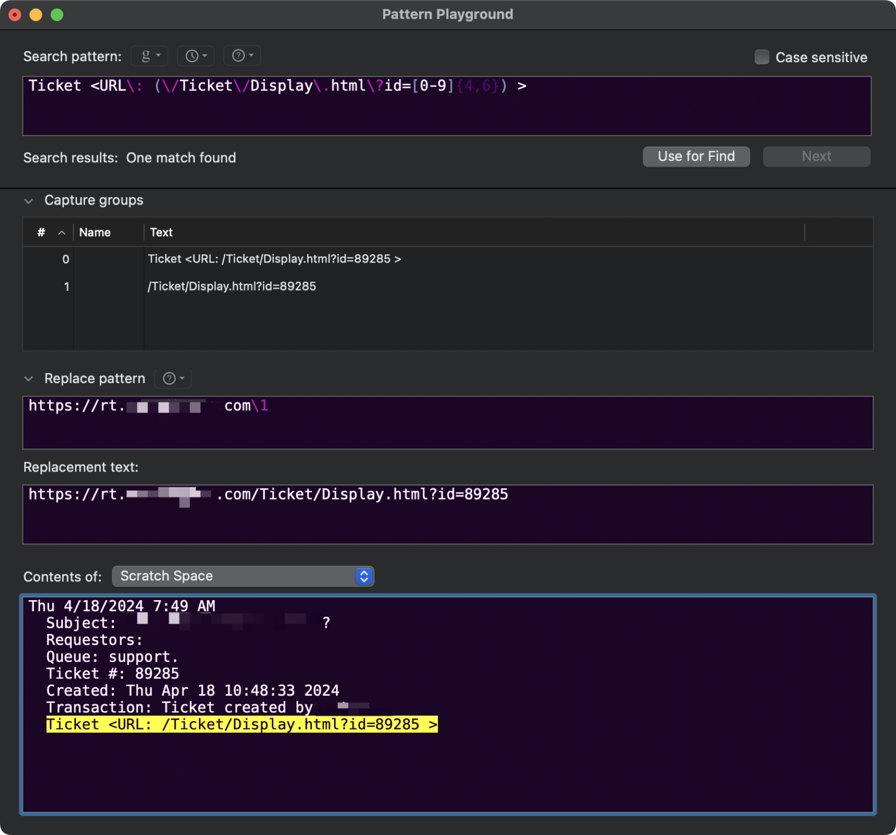

[TextBuddy](https://retina.studio/textbuddy/) is a macOS utility app I love that lets you process text in all sorts of interesting ways. I actually intend to talk about it in detail more some time, or more likely write several posts about it highlighting specific use cases. Today I learned about a feature of [TextBuddy](https://retina.studio/textbuddy/) called [Custom Links](https://retina.studio/textbuddy/custom-links/) that I’d been woefully unaware of.

Custom Links basically applies regular expressions to any text in TextBuddy’s text window and turns matches for any of the regular expressions into clickable links based on your specification.

Huh?

It sounds more confusing than it is. Here’s an example that works perfectly, even if it’s not necessarily the best or only way to solve this problem. But it is a an instance of something that produces unhelpful link fragments that I want to convert to useful, clickable links.

Let’s say you get emails from your ticketing system and they include links to the ticket in question that look like the following:

[](/images/posts/TicketEmail-12439F99-9561-4F21-8B64-D0B31E98E529.jpg)

<URL: /Ticket/Display.html?id=89285 > is not a useful link, but if you add your RT instance’s domain name to it, it can be. That’s where TextBuddy’s Custom Links feature comes in.

First of all, copying text from any app to TextBuddy is simple – just highlight the text, and choose **Services - Send to TextBuddy** from the app menu (the menu with the app’s name in it, like Chrome in this case) or right-click the highlighted text and choose **Services - Send to TextBuddy**.

[](/images/posts/ServicesMenu-5B76A1F3-2461-4D43-A94E-6035434080B8.jpg)

This results in the following text in TextBuddy’s text window in my case.

[](/images/posts/TextBuddyNoLink-632E04EC-27BD-4E3F-95E4-210436AAA7E7.jpg)

Yeah, that Ticket URL is still not helpful.

To set up the Custom Link, click the TextBuddy Scripts menu and choose “Reveal Secret Custom Links File”. This opens a finder window to ~/Library/Application Support/com.clickontyler.TextBuddy, revealing a file called CustomLinks.txt.

[](/images/posts/CustomLinksFileMenuOption-ABFAAF1E-6B6E-412B-A746-69E5E8BEBE0B.jpg)

[](/images/posts/CustomLinksTextFile-ABFAAF1E-6B6E-412B-A746-69E5E8BEBE0B.jpg)

Open the file in an editor. If you haven’t added anything to it previously, it’ll be empty. This file should contain two lines per Custom Link – the first line for the regular expression and the second line to act as a template for the URL to create for the Custom Link. In my example case, I added the following two lines:

```
Ticket <URL\: \/Ticket\/Display\.html\?id=([0-9]{4,6}) >
https://rt.domain.com/Ticket/Display.html?id={{1}}
```

This looks for anything that looks like `<URL: /Ticket/Display.html?id=12345 >` , where 12345 can be any 4 to 6 digit number, and uses that number to create a URL of `https://rt.domain.com/Ticket/Display.html?id=12345` from it.

I guess in retrospect I could have included everything from Ticket through the number in the capture group instead of just the number itself. Then I could have simplified the url template string. That method looks like this:

```
Ticket <URL\: (\/Ticket\/Display\.html\?id=[0-9]{4,6}) >
https://rt.domain.com{{1}}
```

The change to the regular expression is subtle – I move the first parenthesis for the capture group from right in front of `[0-9]` to right in front of `\/Ticket` instead.

Once you have what you want, save the file so that your regular expression and URL template string can go into effect.

Now you can highlight the offending text in your email and choose Services - Send to TextBuddy from your browser’s app menu (the menu with the browser’s name, such as Chrome in this example) to get it into TextBuddy’s text window.

And thanks to the magic of Custom Links, although the link in the copied text LOOKS the same in TextBuddy, it’s now a clickable link with the correct URL as the target.

[](/images/posts/TextBuddyClickableLink-0BA5F58C-8535-4A2F-85E2-B197B2324490.jpg)

By the way, I tested my regular expression in [BBEdit](https://www.barebones.com/products/bbedit/index.html) using its [Pattern Playground](https://www.barebones.com/support/technotes/PatternPlaygrounds.html) feature. If you have BBEdit and you haven’t used this yet, you can find it in the File menu under “New - Pattern Playground”, or in the Search menu’s “Pattern Playground” option.

[](/images/posts/BBEditPatternPlayground-528B8A6C-A525-4944-86DB-FBABEC13A3F9.jpg)
