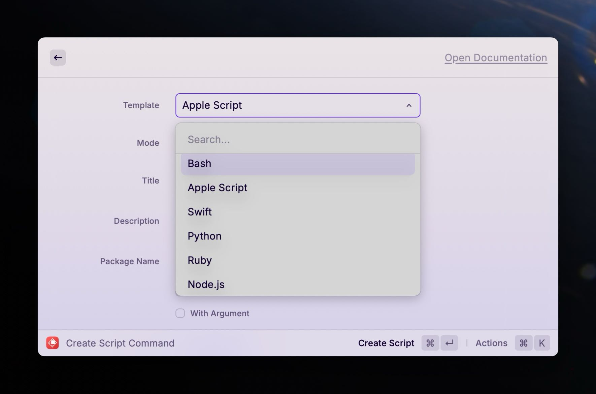
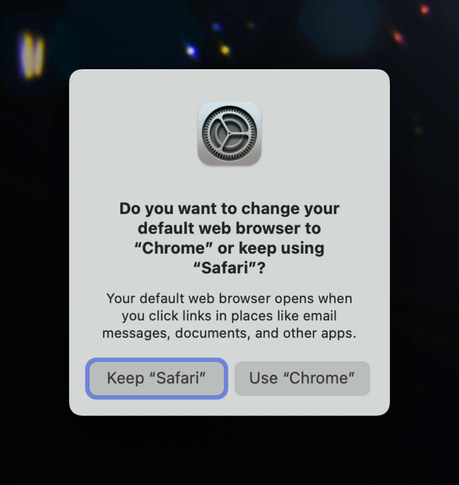
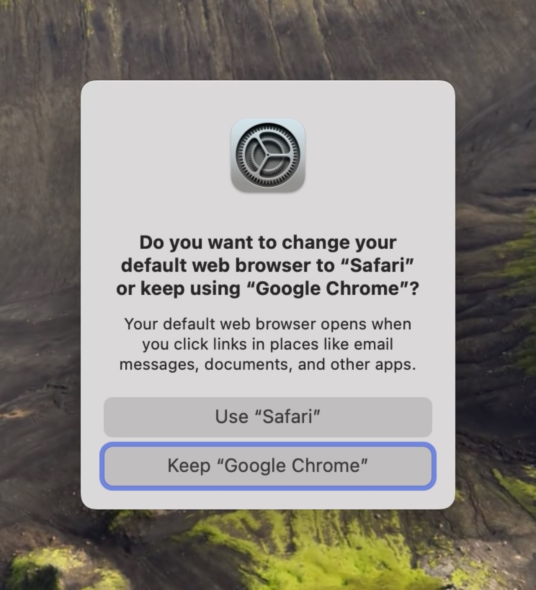
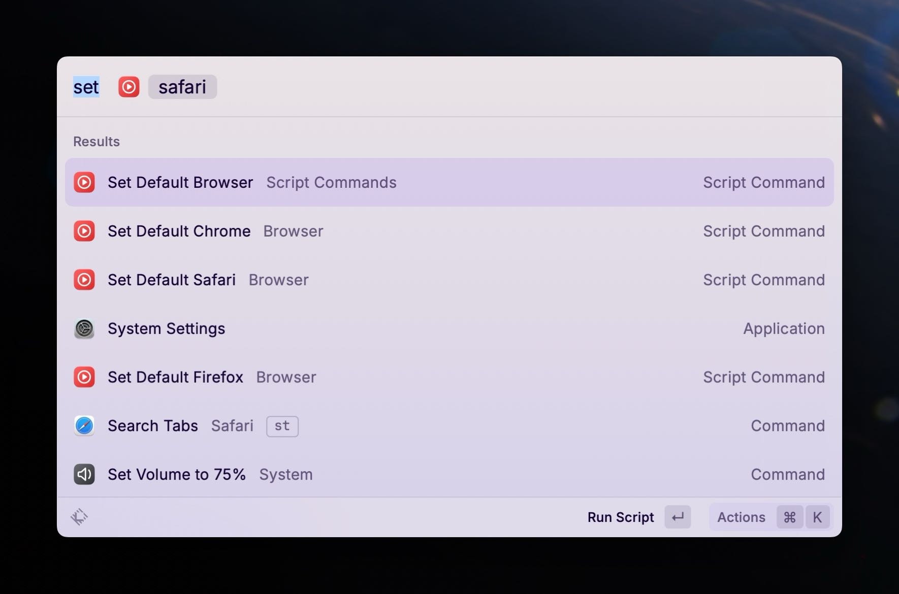

As you saw from my [Default Apps December 2023](https://scottwillsey.com/default-apps-2023/) post, I use Safari for personal use and Chrome for web work and for some administrative and server-related tools that work best in it. The downside to this is that links go to the default browser from things like 1Password, Fastmarks, and email messages, for example. This means when I'm using Chrome, what I really need is for it to be my default browser, and the rest of the time, Safari to be.

Because I'm a [Raycast](https://www.raycast.com/) user, I was intrigued by the [Raycast Script Commands GitHub repo](https://github.com/raycast/script-commands/tree/master). The script command examples in this repo include [system commands](https://github.com/raycast/script-commands/tree/master/commands/system) that include default browser scripts for Arc, Chrome, Chromium, Firefox, and Safari.

## Raycast Script Commands

Raycast script commands are basically scripts that are registered in Raycast and have hooks that let it interact with them to pass parameters and show output in Raycast, if desired. These can be Bash scripts, AppleScript, Swift, Python, Ruby, or Node.js scripts.

[](/images/posts/RaycastCreateScriptCommand-F9B0DF82-4E67-4FB3-AC44-4ADDBB2DDF46.jpeg)

## Raycast Default Browser Script Commands

The default browser scripts in the Raycast script command repo rely on a very short Objective-C program that you compile on your Mac called [`defaultbrowser`](https://github.com/kerma/defaultbrowser), which lets you change your default browser from the command line. Given this, you might be surprised to learn that these script commands are AppleScript, and not Bash scripts. The reason is simple: buttons.

When you tell your Mac to switch default browsers using `defaultbrowser`, you are presented with a dialog box giving you the option to set whatever browser you wanted as your new default, or to keep whatever browser is the current default. Bash scripts can't click buttons, but AppleScript can. It can also run Bash scripts, which lets us call `defaultbrowser` from within the AppleScript.

Here's the `default-browser-safari.applescript` script from the Raycast script commands repo:

```AppleScript

#!/usr/bin/osascript

# Dependency: requires defaultbrowser (https://github.com/kerma/defaultbrowser)
# Install via Homebrew: `brew install defaultbrowser`

# Required parameters:
# @raycast.schemaVersion 1
# @raycast.title Default to Safari
# @raycast.mode silent
# @raycast.packageName Browser

# Optional parameters:
# @raycast.icon images/safari.png

# Documentation:
# @raycast.author Marcos Sánchez-Dehesa
# @raycast.authorURL https://github.com/dehesa
# @raycast.description Set Safari as the default browser.

set repeatCount to 0

tell application "System Events"
 try
  my changeDefaultBrowser("safari")
  repeat until button 2 of window 1 of process "CoreServicesUIAgent" exists
   delay 0.01
   set repeatCount to repeatCount + 1
   if repeatCount = 15 then exit repeat
  end repeat
  try
   click button 2 of window 1 of process "CoreServicesUIAgent"
   log "Safari is now your default browser"
  on error
   log "Safari is already your default browser"
  end try
 on error
  log "The \"defaultbrowser\" CLI tool is required: https://github.com/kerma/defaultbrowser 🔥"
 end try
end tell

to changeDefaultBrowser(thebrowser)
 do shell script "
  if ! command -v defaultbrowser &> /dev/null; then
    exit 1
  fi
  defaultbrowser " & thebrowser & "
  exit 0
 "
end changeDefaultBrowser

```

The top half is information for Raycast. Then the AppleScript portion gets going. First it calls a function[^1] that runs the `defaultbrowser` command line program with the string `safari` as a parameter value. Then it runs a loop waiting for the confirmation dialog box to pop up. It waits until either the window exists or it's looped 15 times. Finally, it tries to click button 2 of the dialog box. The reason it tries to click button 2 is because the dialog looks like the following image – or at least, it's supposed to. More on that later.

[](/images/posts/DefaultBrowserSwitchToChromeDialog-AA19A58F-FDE4-48B3-9BEA-3B33737D5081.jpg)

This means when you send it a request to change your default browser from Safari to Chrome, for example, you'll get a dialog box with two buttons, the first of which cancels the change and the second of which executes the change to Chrome.

I created new Raycast script commands using the appropriately named "Create Script Command" command in Raycast, and then copied the AppleScripts from the repo into them. Hooray! End of blog post, right?

Except there was a problem.

## Chrome Does It Differently

Everything worked great whenever I tried switching from any browser that wasn't Chrome to any other browser. But whenever I tried switching FROM Chrome back to something else, it never worked.

A simple test using `defaultbrowser` directly in the command line showed me why. Chrome's confirmation dialog box is different. It looks like this:

[](/images/posts/DefaultBrowserSwitchFROMChromeDialog-97582602-7500-42FA-8558-557BA479147E.jpeg)

You see the problem. The command scripts assume that button 2 is the button for making the switch, but in the case of Chrome's dialog box, it's the other way around. Button 1 makes the change and button 2 keeps the current default browser setting.

I honestly don't know whose responsibility this is, Google's or Apple's, and I don't really care. I presume it's Google's because I presume at one point the Raycast versions of these script commands worked, even when switching away from Chrome as the default browser, so my guess is Google changed something about Chrome's confirmation dialog. I don't know. Honestly, I would have thought this was entirely handled by macOS.

## Modifying the Default Browser Scripts to Handle the Chrome Dialog Box

The solution is simple: if switching from Chrome, click button 1. Otherwise, click button 2. Since the script could be switching to a non-Chrome browser from a different non-Chrome browser, this means I need to check. And that sent me down a rabbit hole that I refuse to admit the time duration of, because it was long enough to need to add an "s" to "hour".

But it goes like this:

On macOS, your default browser setting is one of many settings saved in `com.apple.launchservices.secure.plist` in your local Library/Prefences folder (`~/Library/Preferences`). You can search for it. If you type the following, you'll get a LONG output that includes two lines you care about:

```bash
plutil -p ~/Library/Preferences/com.apple.LaunchServices/com.apple.launchservices.secure.plist
```

Those two lines are:

```bash
"LSHandlerRoleAll" => "com.apple.safari"
"LSHandlerURLScheme" => "https"
```

That's if Safari is your current default browser, of course. It could be org.mozilla.firefox or com.google.chrome, for example. But you want to search for a line with `LSHandlerRoleAll` set to some browser, followed by a line called `LSHandlerURLScheme` set to `https`.

Fortunately, [awk](https://opensource.com/article/20/9/awk-ebook) was made for things like this, and also fortunately, AppleScript can run shell commands. So I made another function for my default browser AppleScripts to see what the current browser is.

```AppleScript

to getCurrentDefaultBrowser()
 set filePath to "~/Library/Preferences/com.apple.LaunchServices/com.apple.launchservices.secure.plist"
 set output to do shell script "plutil -p " & filePath & " | awk '/LSHandlerRoleAll/{a=$3}/LSHandlerURLScheme/{if($3==\"\\\"https\\\"\") print a}'"
 return output
end getCurrentDefaultBrowser

```

Now, before running the part of the script that runs `defaultbrowser` before waiting for a button to click, it checks which browser is the current default browser. If it's com.google.chrome, then my script clicks button 1 for me. Otherwise it clicks button 2.

```AppleScript

#!/usr/bin/osascript

# Dependency: requires defaultbrowser (https://github.com/kerma/defaultbrowser)
# Install via Homebrew: `brew install defaultbrowser`

# Required parameters:
# @raycast.schemaVersion 1
# @raycast.title Set Default Safari
# @raycast.mode silent
# @raycast.packageName Browser
# Optional parameters:
# @raycast.icon images/safari.png
# Documentation:
# @raycast.author scott_willsey
# @raycast.authorURL https://raycast.com/scott_willsey

set currentDefaultBrowser to my getCurrentDefaultBrowser()

set repeatCount to 0
tell application "System Events"
 try
  my changeDefaultBrowser()
  repeat until button 2 of window 1 of process "CoreServicesUIAgent" exists
   delay 0.01
   set repeatCount to repeatCount + 1
   if repeatCount = 15 then exit repeat
  end repeat
  try
   if currentDefaultBrowser contains "com.google.chrome" then
    click button 1 of window 1 of process "CoreServicesUIAgent"
   else
    click button 2 of window 1 of process "CoreServicesUIAgent"
   end if
   log "Safari is now your default browser"
   on error
    log "Safari is already your default browser"
  end try
  on error
   log "The \"defaultbrowser\" CLI tool is required: https://github.com/kerma/defaultbrowser"
 end try
end tell

to getCurrentDefaultBrowser()
 set filePath to "~/Library/Preferences/com.apple.LaunchServices/com.apple.launchservices.secure.plist"
 set output to do shell script "plutil -p " & filePath & " | awk '/LSHandlerRoleAll/{a=$3}/LSHandlerURLScheme/{if($3==\"\\\"https\\\"\") print a}'"
 return output
end getCurrentDefaultBrowser

to changeDefaultBrowser()
 do shell script "
 if ! command -v defaultbrowser &> /dev/null; then
  exit 1
 fi
 defaultbrowser " & "safari" & "
 exit 0
 "
end changeDefaultBrowser


```

Now when I have Chrome set as my default browser and I don't want that anymore, my Raycast default browser command scripts work as intended, and will actually manage to set my default browser to the desired one.

## A Parameterized Version of the Default Browser Command Script

Just in case anyone else cares, I also created a parameterized version of the script that lets me type in the browser name as a raycast command parameter so that the same script can switch to any browser I want.

[](/images/posts/ParameterizedDefaultBrowserScriptCommand-4707113A-7D69-40A2-8AED-37C94DFA8D56.jpeg)

```AppleScript

#!/usr/bin/osascript

# Required parameters:
# @raycast.schemaVersion 1
# @raycast.title Set Default Browser
# @raycast.mode silent

# Optional parameters:
# @raycast.icon images/Safari.png
# @raycast.argument1 { "type": "text", "placeholder": "Browser Name" }

# Documentation:
# @raycast.author scott_willsey
# @raycast.authorURL https://raycast.com/scott_willsey

on run argv
    # check for null or empty item 1 of argv
    if (item 1 of argv) is "" then
        log "You must enter a browser name."
    else
        set currentDefaultBrowser to my getCurrentDefaultBrowser()
        set browserName to item 1 of argv

        set repeatCount to 0

        tell application "System Events"
            try
                my changeDefaultBrowser(browserName)
                repeat until button 2 of window 1 of process "CoreServicesUIAgent" exists
                    delay 0.01
                    set repeatCount to repeatCount + 1
                    if repeatCount = 15 then exit repeat
                end repeat
                try
                    if currentDefaultBrowser contains "com.google.chrome" then
                        click button 1 of window 1 of process "CoreServicesUIAgent"
                    else    
                        click button 2 of window 1 of process "CoreServicesUIAgent"
                    end if
                    log browserName & " is now your default browser"
                on error
                    log browserName & " is already your default browser"
                end try
            on error
                log "The \"defaultbrowser\" CLI tool is required: https://github.com/kerma/defaultbrowser"
            end try
        end tell
    end if

end run

to getCurrentDefaultBrowser()
    set filePath to "~/Library/Preferences/com.apple.LaunchServices/com.apple.launchservices.secure.plist"

    set output to do shell script "plutil -p " & filePath & " | awk '/LSHandlerRoleAll/{a=$3}/LSHandlerURLScheme/{if($3==\"\\\"https\\\"\") print a}'"
    return output
end getCurrentDefaultBrowser

to changeDefaultBrowser(browserName)
 do shell script "
  if ! command -v /opt/homebrew/bin/defaultbrowser &> /dev/null; then
    exit 1
  fi
  defaultbrowser " & browserName & "
  exit 0
 "
end changeDefaultBrowser

```

[^1]: Custom handler in AppleScript parlance, apparently
