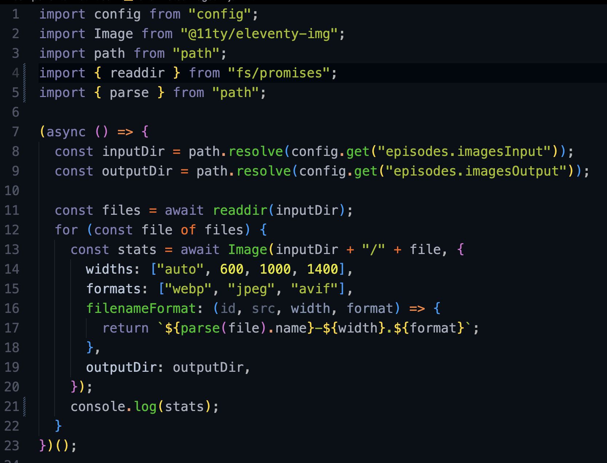

As [I mentioned in my last post](/more-astro-image-markdown/), I want to use standard markdown (text only, no ability to use components) for [Friends with Brews](https://friendswithbrews.com) episodes so that I can use [Astro's ability to render full post body content](https://docs.astro.build/en/guides/rss/#including-full-post-content) of each episode in the RSS feed. This way the RSS feed shows each episode's show notes instead of just a summary.

Step 1 of the Great Show Note Images odyssey is generating optimized versions of any images to be included in episode show notes. Figuring out which images those are is easy – I have a directory named src/images/episodes, and I'll just dump my images in there.

From there it's a matter of reading all the files in the directory, generating the desired sizes, and dumping them in public/images/episodes, which in the published site will be located at /images/episodes.

Because I'm not doing this inside an Astro file with pre-imported or pre-linked images, I can't use the Astro Image component like I do for all the other images on the [Friends with Brews website](https://friendswithbrews.com). I need something I can call from a JavaScript function. Fortunately, as I noted last time, I can use the eleventy-image plugin this way. Ben Holmes details how on his website in [Picture perfect image optimization for any web framework](https://bholmes.dev/blog/picture-perfect-image-optimization/) article.

If you look at section 4 of his post, Using 11ty image with any framework, you can see a script Ben wrote to look in a directory and generate optimized images for each image file in the directory in the specified widths and formats using the Node package [@11ty/eleventy-img](https://www.npmjs.com/package/@11ty/eleventy-img).

I modified the script a little bit as shown below. I _would_ have included it as a code block instead of an image, but for some reason it triggers modsecurity on my server and blocks the IP of whoever tries to load this page. Not exactly ideal.

[](/images/posts/episode-image-script-1.png)

If I run this script with the following images in src/images/episodes

```sh frame="code"
-rw-r--r--@ 571969 Oct  4  2020 18749389.jpg
-rw-r--r--@ 723612 Jan  4 23:20 ChonkChart-816246A9-8775-4561-B9DA-1D9E7E0413B1-20220323095602.png
```

the script generates the following images in public/images/episodes:

```sh frame="code"
-rw-r--r--@ 11229 Jan  9 13:36 18749389-1000.avif
-rw-r--r--@ 54111 Jan  9 13:36 18749389-1000.jpeg
-rw-r--r--@ 29588 Jan  9 13:36 18749389-1000.webp
-rw-r--r--@ 15438 Jan  9 13:36 18749389-1400.avif
-rw-r--r--@ 85912 Jan  9 13:36 18749389-1400.jpeg
-rw-r--r--@ 44008 Jan  9 13:36 18749389-1400.webp
-rw-r--r--@ 41218 Jan  9 13:36 18749389-4000.avif
-rw-r--r--@ 331928 Jan  9 13:36 18749389-4000.jpeg
-rw-r--r--@ 150688 Jan  9 13:36 18749389-4000.webp
-rw-r--r--@ 6960 Jan  9 13:36 18749389-600.avif
-rw-r--r--@ 26053 Jan  9 13:36 18749389-600.jpeg
-rw-r--r--@ 16014 Jan  9 13:36 18749389-600.webp
-rw-r--r--@ 30453 Jan  9 13:36 ChonkChart-816246A9-8775-4561-B9DA-1D9E7E0413B1-20220323095602-600.avif
-rw-r--r--@ 78709 Jan  9 13:36 ChonkChart-816246A9-8775-4561-B9DA-1D9E7E0413B1-20220323095602-600.jpeg
-rw-r--r--@ 60118 Jan  9 13:36 ChonkChart-816246A9-8775-4561-B9DA-1D9E7E0413B1-20220323095602-600.webp
-rw-r--r--@ 38504 Jan  9 13:36 ChonkChart-816246A9-8775-4561-B9DA-1D9E7E0413B1-20220323095602-677.avif
-rw-r--r--@ 98443 Jan  9 13:36 ChonkChart-816246A9-8775-4561-B9DA-1D9E7E0413B1-20220323095602-677.jpeg
-rw-r--r--@ 78596 Jan  9 13:36 ChonkChart-816246A9-8775-4561-B9DA-1D9E7E0413B1-20220323095602-677.webp
```

This is good news. First of all, Ben did all of my work for me. Second, I can generate optimized images without having to know anything about them in advance. Now I just have the very little problem of replacing image links in my episode markdown file with [picture elements](https://developer.mozilla.org/en-US/docs/Web/HTML/Element/picture) that contain the sources for the different file types and srcsets for each of the different image sizes.

By the way, check out the file size differences on the optimized versions versus the originals in those file listings! Even the full width and height optimized images are quite a bit smaller in terms of file size than the originals, and the smaller ones are minute compared to the images I started with.

A couple of things I'd like to note about working with [eleventy-img](https://www.11ty.dev/docs/plugins/image/) here:

- Eleventy-img doesn't stupidly try to generate image sizes larger than the original. If you specify `widths: ["auto", 600, 1000, 1400]` and one of the images is only 677 pixels wide, it will only generate the 600 and 677 pixel width versions (the "auto" option tells eleventy-img to also make a copy at the original size).
- As you must have guessed by now, just because eleventy-img was developed as a plugin for the Eleventy SSG framework, it's just JavaScript and can be installed with npm and used with any other Node.js compatible framework. That includes Astro.

Next time I write anything on this site, it may be completely incoherent depending on what Rube Goldberg mechanism I come up with for getting the responsive html for images into my show notes markdown files in the correct location. My writing workflow allows for a few different possibilities since I already know in advance the default width I want these images. Maybe next time I'll detail that workflow and what options I think might be available to me, and then we can get into implementation.
