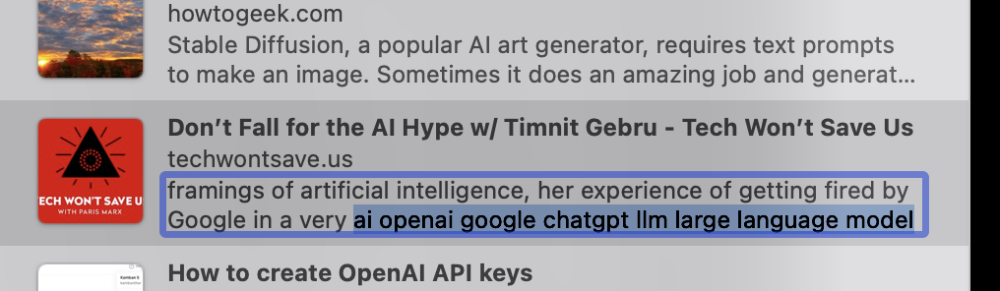
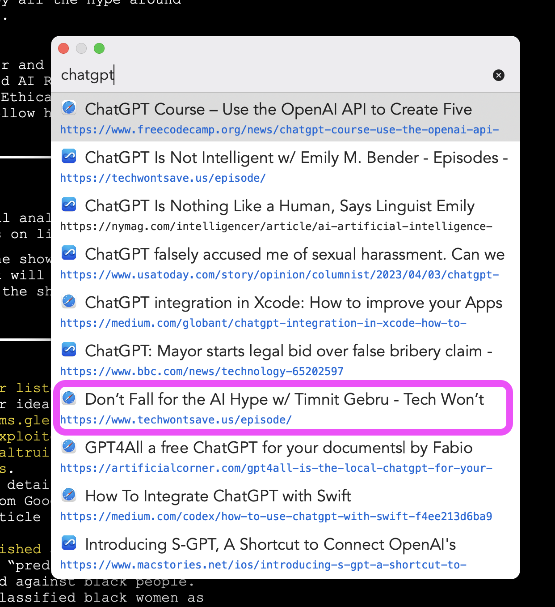

In my [last post](https://scottwillsey.com/safari-bookmarks/), I talked about the bizarre world of Safari bookmark descriptions and how to edit them, and I justified this weird tangent on my part by the fact that I want to use [Fastmarks](https://retina.studio/fastmarks/) for searching for and opening bookmarks.

[Fastmarks](https://retina.studio/fastmarks/) is a blazing fast, keyboard shortcut driven utility for searching bookmarks. And it's stupendously quicker than accessing bookmarks any other way I've tried, including online services, even with integrated plugins and apps.

The problem I had though was that, as I mentioned last time, I intended to pseudo-tag my bookmarks by putting keywords in the bookmark descriptions. [Safari supports bookmark descriptions](https://discussions.apple.com/thread/252322786), although it does its best to hide them. Sadly, I discovered that Fastmarks doesn't use description data for searching bookmarks.

At least, it didn't. Until I emailed the Fastmarks developer, Tyler Hall of [Retina Studio](https://retina.studio), who promptly sent me a test build with descriptions indexed in Fastmarks along with the previously searched bookmark title and URL.

It's glorious.

Now I can edit bookmark descriptions and throw some keywords in at the end, like this:

And searching for any of those keywords will bring up the bookmark in my Fastmarks search results.

By the way, not only is Tyler clearly a superior human based upon the utilities he codes, he also was super open and responsive to the idea of adding descriptions to the Fastmarks search index. Once again, an indie Mac developer shows what makes the Mac great - people who care about the platform and about user experience.
