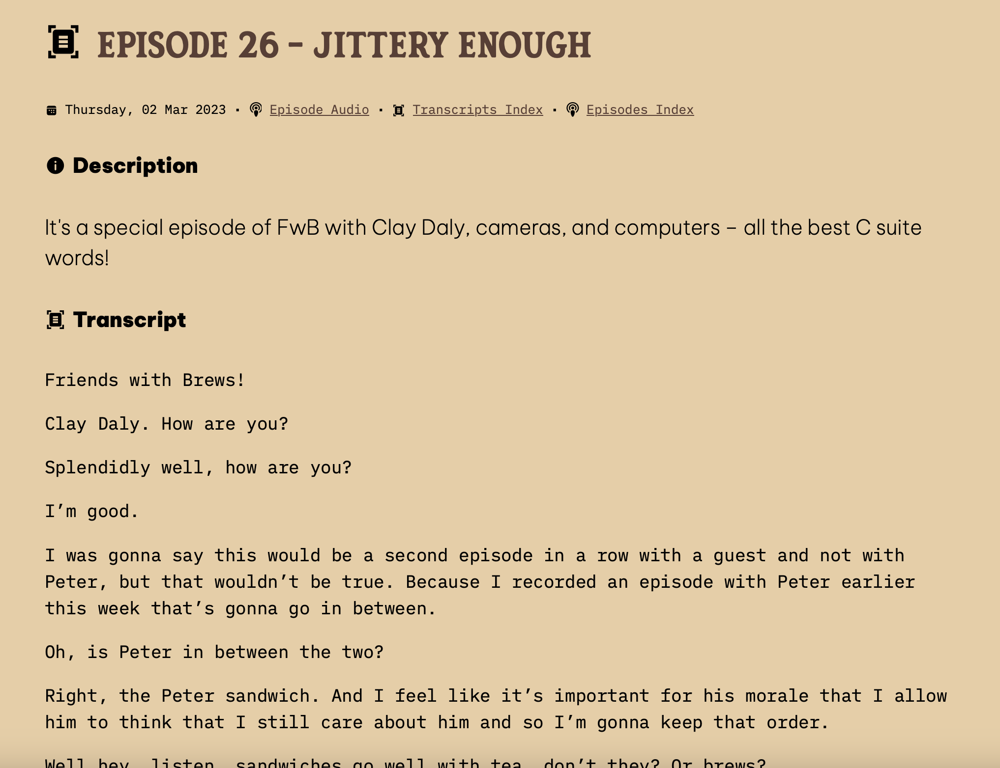

I [talked before about Whisper.cpp](https://scottwillsey.com/whispering-transcripts/) and my goal of getting episode transcripts up on the [Friends with Brews website](https://friendswithbrews.com). That day is here! We now have transcript functionality on the site.

You'll notice I said transcript functionality. I'm weasel-wording it a bit there because now I need to generate transcripts for all the episodes. So far I have them for episodes [1](https://friendswithbrews.com/transcripts/T1/), [22](https://friendswithbrews.com/transcripts/T22/), and [26](https://friendswithbrews.com/transcripts/T26/) (the current podcast episode as of this writing).

On the Friends with Brews homepage, click the Transcripts link under the podcast description paragraph, and you'll see a list of available transcripts.

In addition, any episodes with available transcripts will show a transcript link under its episode title.

The transcript pages themselves have links to the episode page, to the transcripts index, and to the episodes index, in addition to an episode description followed by the transcript.

I still have more work to do on this feature. I plan to make the raw transcripts downloadable, and also to integrate them into the RSS feed with srt formatting, at the suggestion of [John Chidgey](https://engineered.space/users/chidgey).

One thing you'll notice right away is the transcripts are not perfect. I haven't done any A B testing yet, but I think the transcript better separates transitions in speakers if I only output the transcript as a raw text file and don't simultaneously output the srt file and the raw text file. At any rate, Whisper.cpp doesn't know about individual speakers, and so there are no names showing who is saying what.

Also, Whisper gets some things wrong, and there will occasionally be some confusing text that doesn't exactly match what we were saying at that point. Overall though, I think they're pretty good and at least you can search the site and find what episode contained some specific mention of something. Again, it's not perfect - if you search for Shaquille O'Neal (mentioned in [episode 1](https://friendswithbrews.com/1/)), you won't find him, because the transcript butchered the spelling of his name and I didn't fix every typo that Whisper.cpp made.

Still, I think having transcripts, even imperfect ones, is a net gain for the site and the podcast. It adds more work for me as I have to generate them and then clean them up, but now that I have the functionality built into my [Astro](https://astro.build) code, getting newly generated transcripts published is a snap.
