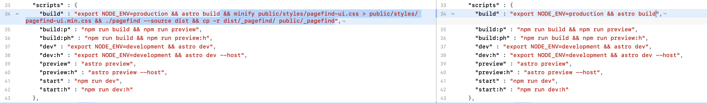

In my last post, I had a comparison of two different versions of the `scripts` portion of my site's `package.json` file. You may have wondered, "how did he so easily compare his current site build script with a site build script version from long ago?"

The answer is using `git diff` with not only a filename for the file to compare, but with commit IDs of the two commits in question. It looks like this:

```sh frame="code"
git diff 5298935609b106365c2786a711c844395539a43d cfcbb396fb29e1e100908152f002ae2f9f6d3f29 package.json
```

And if you use a difftool for comparing changes, just change `diff` to `difftool` in the above:

```sh frame="code"
git difftool 5298935609b106365c2786a711c844395539a43d cfcbb396fb29e1e100908152f002ae2f9f6d3f29 package.json
```

Then your difftool of choice opens and you can compare the two versions of the same file from two different commits side by side:

[](/images/posts/GitDiffTool-DF155BA0-CF87-46DC-8DBB-DF87B267513A.png)

In order to find commit IDs, the command `git log` will do the trick. The commit at the top is your latest commit. You can even search for a particular phrase with `git log`, which I did in order to find my first Pagefind implementation.

```sh frame="code"
git log -S pagefind

```

I just had to page down a bit to get to where I first finished adding Pagefind prior to using Astro-Pagefind and then grab that commit ID for the comparison:

```sh frame="code"
commit 5298935609b106365c2786a711c844395539a43d
Author: Scott Willsey <someone@something.com>
Date:   Mon Feb 27 15:26:40 2023 -0800

    Adds public/_pagefind files for dev mode
```

And, finally, in the interest of fairness, I dug through my git history and found what it takes to implement pagefind index build into the site build process, and it's much simpler than what I wrote previously. Most of what I had in my build script for Pagefind prior to Astro-Pagefind was copying files to the public directory so Pagefind would function in dev mode. All you really need to integrate pagefind directly is something like this:

```sh frame="code"
"build" : "export NODE_ENV=production && astro build && ./pagefind --source dist"
```

Git remains awesome, and its flexibility in allowing you to use helper apps of your choice does too.
