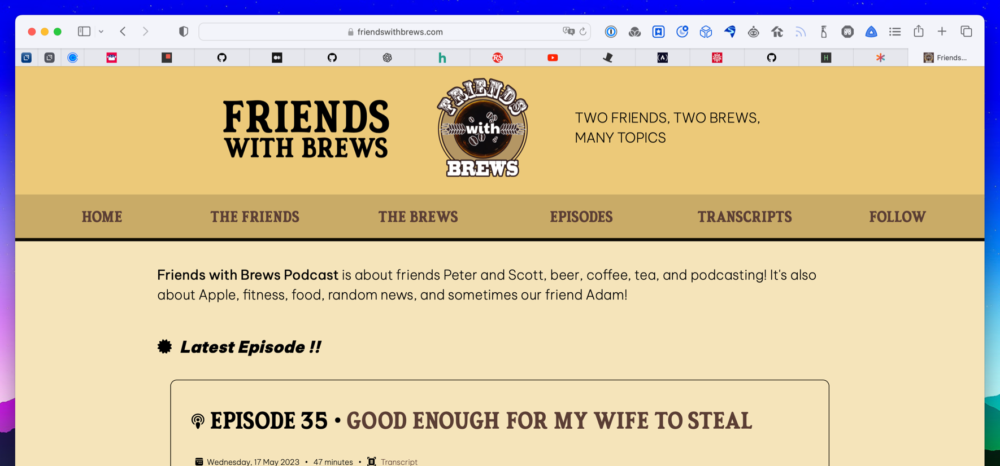
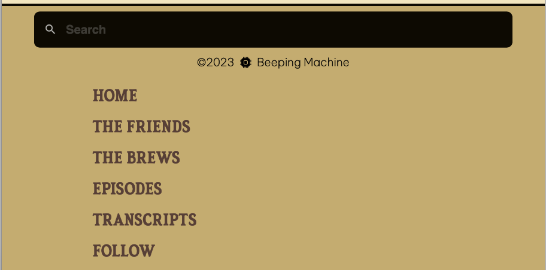

One of the beautiful things about CSS grid (and in my opinion, there are many) is the ability to name grid sections (template areas) and then assign the children (the grid items) to those sections. This means you can do useful things like change where a grid item displays when the site is viewed on smaller screens.

I used this capability recently when doing a redesign of [Friends with Brews](https://friendswithbrews.com). Previously, the navigation menu was just four links: [Home](https://friendswithbrews.com), [The Friends](https://friendswithbrews.com/friends/), [The Brews](https://friendswithbrews.com/brews/1/), and [Episodes](https://friendswithbrews.com/episodes/1/). I had links for our RSS feed and other ways to subscribe on the home page underneath the introduction paragraph. The reason I did this is so that on small screens, I could just reduce the size of the text and still fit all four links in the header without having to really change the layout much (although with the two links on either side of the logo arranged in rows, one over the other, instead of all four links on one row).

Once I added transcripts to the site, the number of links I needed started growing. And I already wanted to link directly to the [Follow](https://friendswithbrews.com/follow/) page listing the various ways to subscribe to the podcast, along with our Mastodon account. So I knew I needed to make the site navigation menu more flexible. I decided to make use of the strategy I've employed on this site's menu and just shuffle the menu to the bottom of the page for small screens narrower than 900 pixels. In addition, the Friends with Brews menu would switch from being a horizontal, page-wide list of links to a vertical list when the viewport is less than 900 pixels wide.

CSS Grid makes this trivial. It might not seem intuitive to put vertical page sections in a grid, given that they'll just lay out vertically one over the other with straight html and no CSS at all, but doing so allows you to name sections and thus move them around in the order of the page stack.

In wide browsers, the menu appears right under the site header, with the menu items laid out horizontally.

[](/images/posts/NewFwbDesktop.png)

For views narrower than 900px wide, the menu shifts down to the bottom of the page, with menu links stacked vertically.

[](/images/posts/NewFwbResponsive.png)

Here's the html for my Base.astro page layout that makes up the base of every page on Friends with Brews:

```html title="Base.astro"
<body>
  <div id="wrapper-grid">
    <header />
    <aside><menu /></aside>
    <main>
      <slot />
    </main>
    <footer />
  </div>
</body>
```

Don't worry too much about `<Header />`, `<Menu />`, `<slot />`, and `<Footer />`, except to take it as how the page is laid out in full-sized view: site header, then menu, then main content, and then the footer.

And here's the CSS for the div with the ID `wrapper-grid`:

```css
div#wrapper-grid {
  display: grid;
  grid-template-rows: auto auto 1fr auto;
  grid-template-areas:
    "header"
    "menu"
    "main"
    "footer";
  justify-items: center;
}
```

You can see I have set up grid template areas named `header`, `menu`, `main`, and `footer`. The desired correlation to the html sections should be clear. But this just sets up the fact that those template areas exist. In order to determine what html goes in what grid template area, each of those sections needs to state their membership using the grid-area property.

```css
header {
  width: 100%;
  background-color: var(--header-surface);
  display: flex;
  flex-direction: column;
  justify-content: center;
  align-items: center;
  grid-area: header;
}

div.nav-container {
  width: 100%;
  margin: 0 auto;
  background-color: var(--menu-surface);
  border-bottom: solid 5px var(--menu-border);
  grid-area: menu;
}

main {
  max-width: 80ch;
  min-height: calc(100vh - 330px); /*100 vh - header & footer h */
  margin: 0 auto;
  padding: 1rem 2rem 3rem;
  grid-area: main;
}

.footer {
  width: 100%;
  margin: 0 auto;
  padding: 0.5rem 0;
  border-top: 3px solid var(--menu-border);
  font-size: 1rem;
  background-color: var(--menu-surface);
  color: var(--menu-text);
  grid-area: footer;
}
```

The [grid-area property is really a shorthand for `grid-row-start`, `grid-column-start`, `grid-row-end`, and `grid-column-end`](https://developer.mozilla.org/en-US/docs/Web/CSS/grid-area). I could have (and almost did) use the properties instead to layout my grid.

To move the menu to the bottom for narrow screens, I use a simple media query to rearrange the grid areas inside the wrapper-grid div.

```css
/* Screens under 900px have the menu under the main content with a link to the menu up near the title */
@media only screen and (max-width: 899px) {
  div#wrapper-grid {
    display: grid;
    grid-template-rows: min-content min-content min-content min-content;
    grid-template-areas: "header" "main" "footer" "menu";
  }
}
```

Tada! Instant re-placement (not replacement) of the menu to the bottom of the page!

As far as switching the menu from horizontal to vertical layout, that's because the nav ul is also a grid, and it's laid out with `grid-template-columns: repeat(6, 1fr);` in wide view, and `grid-template-rows: repeat(6, 1fr);` in narrow view. It's as simple as switching from column to row view using another media query for narrow screens.

Have a look at the [documentation for grid-template-areas](https://developer.mozilla.org/en-US/docs/Web/CSS/grid-template-areas). It's a pretty cool CSS feature, and it reinforces my love for CSS grid.
