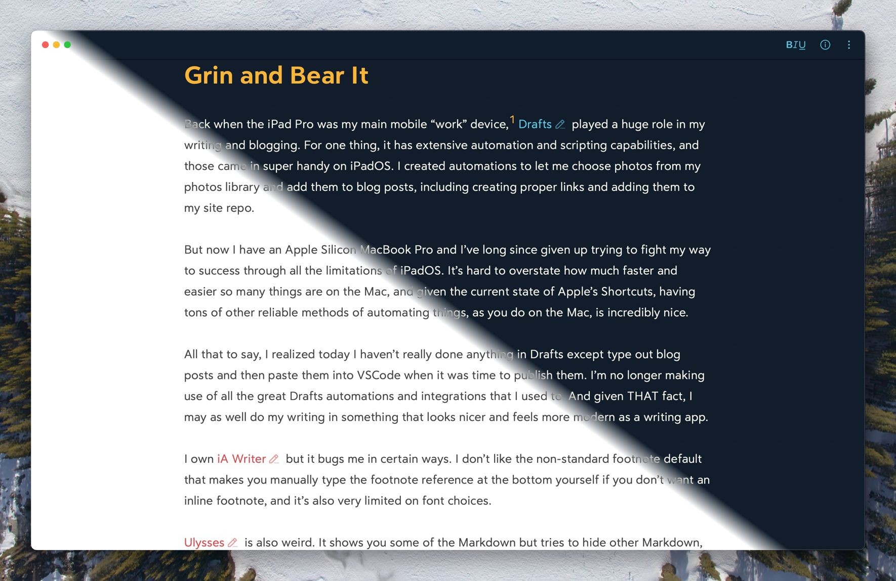

Back when the iPad Pro was my main mobile “work” device,[^1] [Drafts](https://getdrafts.com) played a huge role in my writing and blogging. For one thing, it has extensive automation and scripting capabilities, and those came in super handy on iPadOS. I created automations to let me choose photos from my photos library and add them to blog posts, including creating proper links and adding them to my site repo.

But now I have an Apple Silicon MacBook Pro and I’ve long since given up trying to fight my way to success through all the limitations of iPadOS. It’s hard to overstate how much faster and easier so many things are on the Mac, and given the current state of Apple’s Shortcuts, having tons of other reliable methods of automating things, as you do on the Mac, is incredibly nice.

All that to say, I realized today I haven’t really done anything in Drafts except type out blog posts and then paste them into VSCode when it was time to publish them. I’m no longer making use of all the great Drafts automations and integrations that I used to. And given THAT fact, I may as well do my writing in something that looks nicer and feels more modern as a writing app.

I own [iA Writer](https://ia.net/writer) but it bugs me in certain ways. I don’t like the non-standard footnote default that makes you manually type the footnote reference at the bottom yourself if you don’t want an inline footnote, and it’s also very limited on font choices.

[Ulysses](https://ulysses.app) is also weird. It shows you some of the Markdown but tries to hide other Markdown, like URLs, in very inconvenient ways. It’s been a long time since I thought I was a fan of Ulysses.

Before Ulysses, it was [Byword](https://www.bywordapp.com) for me. To say it looks a little basic now is a bit of an understatement.

That leaves [Bear](https://bear.app) as the only realistic Markdown writing option for me, and I have to say, I like how the editor looks. That’s important to me. If it wasn’t, I’d still be using Drafts because it’s a great app and I do really like Greg Pierce and the work he does on it. It’s just not as important to me on the Mac now as it was on iPadOS.

I’m a person who has a lot of idiosyncrasies, and one of them is that I need a nice looking editor to be able to enjoy the writing process. Bear definitely looks nice. The defaults are nice, customizing it is simple, and things like images and links look really nice in it.

Below is an image showing both the light and dark themes I’m currently using in Bear.

There’s not a lot I need to do in order to incorporate Bear into my writing workflow. I already have a script that names my images and puts copies of them in the right locations to both be optimized for the blog and to be able to link to the original. I’ll need to put an automation somewhere in the publish chain that updates the post’s Markdown file with those image paths and creates the links to the larger, original images. But that was also something I needed to do for my Drafts workflow, and hadn’t yet.

Also I think playing with Bear has given me some ideas for improving my site CSS a bit… 🤔

[^1]: Not my WORK work device, but my personal project work device
