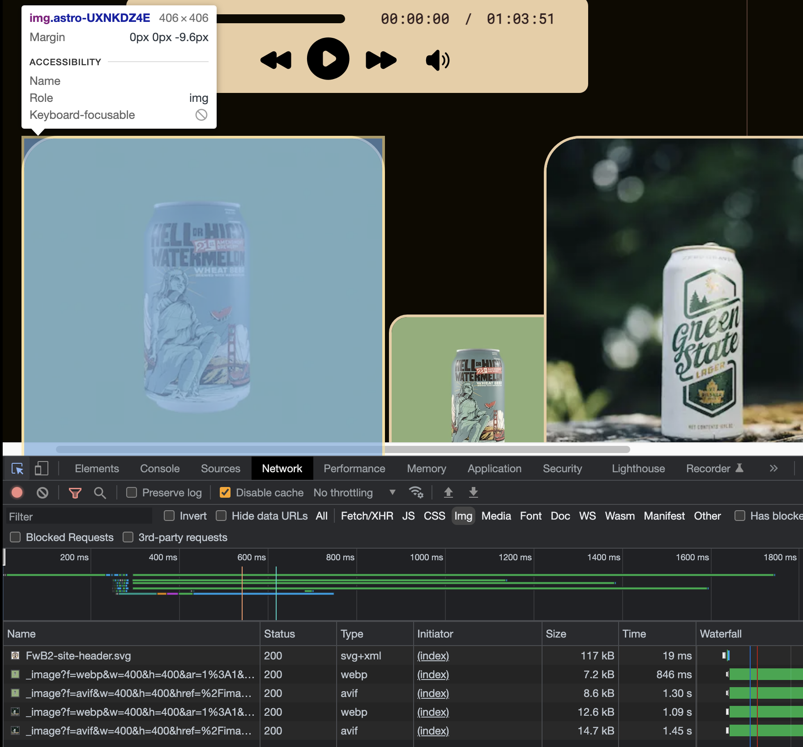
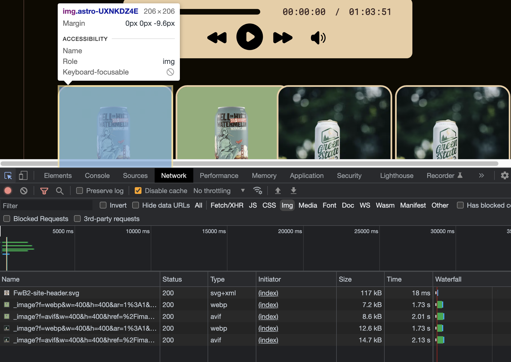

It's been a few days since I've written anything, and I'm going to make my tardiness up to you with some detailed science experiments. You can find [part 1](https://scottwillsey.com/image-rabbit-hole-1/) and [part 2](https://scottwillsey.com/image-rabbit-hole-2/) of this series [here](https://scottwillsey.com/image-rabbit-hole-1/) and [here](https://scottwillsey.com/image-rabbit-hole-2/).

This article will be helpful for understanding responsive images in general, but also the [@astrojs/image](https://www.npmjs.com/package/@astrojs/image) [Astro](https://astro.build) component for generating responsive images in particular.[^1] I'm not the fastest learner and it generally requires me to poke around at things awhile before I understand how they work, so browser developer tools are a must in my process.

First off, I owe [Tony Sull](https://twitter.com/tonysull_co?s=21&t=Ibi4YXw9kwwLY5ExPYmJ-Q), author of Astro Image, a public apology. In the midst of converting some sites of mine from [Eleventy](https://www.11ty.dev) to [Astro](https://astro.build), I found my images on my astro sites to look really low resolution compared to what I was getting in Eleventy with the [eleventy-image](https://www.11ty.dev/docs/plugins/image/) plugin. Failing to understand how responsive images work (but thinking I did) and failing to perform the right tests and sanity checks made me think I was writing equivalent code and getting different results. I even went so far as to complain about the image quality from Astro Image in the [Astro Discord](https://astro.build/chat) a couple of times.

**But I was wrong.** Astro Image works just fine. It's me, myself, and I that wasn't working just fine.

When using Astro Image to generate responsive images, two factors have to be taken into consideration:

1. The differences between Astro Image's Picture component and Image component,
2. How browsers choose responsive image sources for the user's screen resolution/pixel-ratio and viewport size.

## Astro Image's Picture component

I showed in [Part 2 of the Responsive Image Rabbit Hole](https://scottwillsey.com/image-rabbit-hole-2/) how the Picture component can be used to generate multiple sources with their own srcsets for any given image, and what the resulting HTML would look like. I showed how the Image component would generate one width of image based on your input at whatever quality and format you specified. In contrast to Picture, you get one image width and one image format.

I also talked about needing to take screen resolution and pixel-ratio into account in order to generate images large enough to look good on high resolution displays when displayed at the desired width.

The result is that making images of high enough resolution on a high pixel-ratio screen with the Picture component is easy.

For example, here I want 600, 900, 1200, and 1500 pixel-wide versions of the image in avif, webp, and png, and I plan to display it at 200px wide.

```astro
<Picture
  src={`/images/beer/${beer.image}.png`}
  widths={[600, 900, 1200, 1500]}
  aspectRatio="1:1"
  sizes="200px"
  formats={["avif", "webp", "png"]}
  alt={`${beer.brewery} ${beer.name}`}
/>
```

Checking the result with Chrome developer tools, the image is displayed at 200px wide and the image downloaded is the 600px wide version.

[](/images/posts/NormalView-200px-400px-2FA1BD80-9E3E-406B-B3AF-3E8796E7DEE8.jpg)

Let's additionally generate 200 and 400px wide images to see which one gets downloaded to display at my desired 200px width.

```astro
<Picture
  src={`/images/beer/${beer.image}.png`}
  widths={[200, 400, 600, 900, 1200, 1500]}
  aspectRatio="1:1"
  sizes="200px"
  formats={["avif", "webp", "png"]}
  alt={`${beer.brewery} ${beer.name}`}
/>
```

The answer is that the 400px image gets downloaded to display at 200px wide. Why? Simple... My iMac has a screen with a pixel-ratio of 2. It wants a 2x image for any given display width.

[](/images/posts/200px-400px-2FA1BD80-9E3E-406B-B3AF-3E8796E7DEE8.jpg)

Now let's use Chrome's responsive device mode and look at what happens on an iPhone 12 Pro screen with the exact same Picture component parameters as above, still generating image widths at 200, 400, 600, 900, 1200, and 1500px wide.

[](/images/posts/200px-600px-2FA1BD80-9E3E-406B-B3AF-3E8796E7DEE8.jpg)

Now we get the 600px wide image in order to display it nicely, because the iPhone 12 Pro has a screen pixel-ratio of 3.

You can use the console in your browser developer tools to show you the pixel-ratio for your computer's screen as well as any simulated devices in responsive mode. Below are the pixel-ratios for my 27" 5K iMac screen and the screen of the iPhone 12 Pro that I used for the above tests.

[](/images/posts/DevicePixelRatioMac-2FA1BD80-9E3E-406B-B3AF-3E8796E7DEE8.jpg)

[](/images/posts/DevicePixelRatioiPhone-2FA1BD80-9E3E-406B-B3AF-3E8796E7DEE8.jpg)

The Mac has a device pixel ratio of 2, so it needs and receives the 400px wide image to display at 200px, and the iPhone has a device pixel ratio of 3, so it wants and receives a 600px wide image to display nicely at 200px. If you have a picture element in your page and you are getting a larger image than you expect given what you set for the image size in the Picture sizes attribute, check your display window pixel ratio. Chances are it's higher than 1.

## Astro Image's Image component

The Astro Image Picture component lets us easily overcome this, but it's not so clear how to do so with the Image component. Image component accepts one width in its width attribute, and it has no concept of sizes. Setting the width (and height and aspect ratio if needed or desired) determines the size of image generated.

This means either one of two things: You're going to get a fuzzy image on high resolution displays if you set width to the actual display width you want, or you're going to set it higher than your desired display width and you're just going to get an image displayed wider than desired and that is still fuzzy.

For example, let's throw an Image component in the mix. Let's give it a width of 200px because that's what size we want our image to be. Let's look at it next to the unchanged Picture component with the settings we last used above.

```astro
<Image
  src={`images/beer/${beer.image}.png`}
  width={200}
  aspectRatio="1:1"
  format="webp"
/>
<Picture
  src={`/images/beer/${beer.image}.png`}
  widths={[400, 600, 900, 1200]}
  aspectRatio="1:1"
  sizes="200px"
  formats={["avif", "webp", "png"]}
  alt={`${beer.brewery} ${beer.name}`}
/>
```

All these images are being displayed at 200 x 200px, as desired. But only the ones from the Picture component are nice and sharp, because it's using 400px wide images for those. The Image component is generating a single 200px wide image and using that, and it's noticeably blurrier than the 400px wide 2x image.

[](/images/posts/Image-200px-400px-2FA1BD80-9E3E-406B-B3AF-3E8796E7DEE8.jpg)

Ok, fine, you say. Give image a width of 400 and call it done. That is in fact the correct answer (assuming your site never gets displayed on a screen with a higher pixel ratio than 2), but guess what? You're also telling it to generate an img tag with a width attribute set to 400. I'm sure it's not going to surprise you to see what happens next:

[](/images/posts/Image-400px-400px-2FA1BD80-9E3E-406B-B3AF-3E8796E7DEE8.jpg)

To add insult to injury, not only is it displayed at twice the size you actually want, it's still fuzzy by comparison because it's not acting as a 2x image. It's just a bigger 1x image on a screen with a pixel ratio of 2. Wah, wah.

Astro Image's Image component doesn't generate srcsets like the Picture component does, even though we saw in [Part 1 of this Response Image Rabbit Hole](https://scottwillsey.com/image-rabbit-hole-1/) that the HTML img tag does support srcsets.

**If you use the Astro Image component, you will need to generate an image large enough to look good on screens with pixel ratios of 2 and 3, and then use CSS to control the display size.**

In order to conduct these experiments for you, I got rid of any CSS related to image size. I'm going to put img class height and width properties back in, like this:

```css
.beer-image img {
  height: 200px;
  width: 200px;
  border: 3px solid var(--menu-surface);
  border-radius: 10%;
  aspect-ratio: 1;
  margin-bottom: -0.6rem;
}
```

The result is the image from both the Image component and the Picture component are displayed at 200 x 200px, and both use 400 x 400px images as source files. Both now look equally sharp on my Retina display.

[](/images/posts/Image-all-400-2FA1BD80-9E3E-406B-B3AF-3E8796E7DEE8.jpg)

## Lesson learned

The lesson I learned is very simple:

- Use the Astro Image Picture component and make sure to use sizes to control the display size and use widths to generate sizes that will look good on high density displays, OR
- Use the Image component, set the width that will look good on screens that want 2x and 3x images, and control the display size with CSS.

[^1]: For simplicity, I'll reference it as Astro Image.
