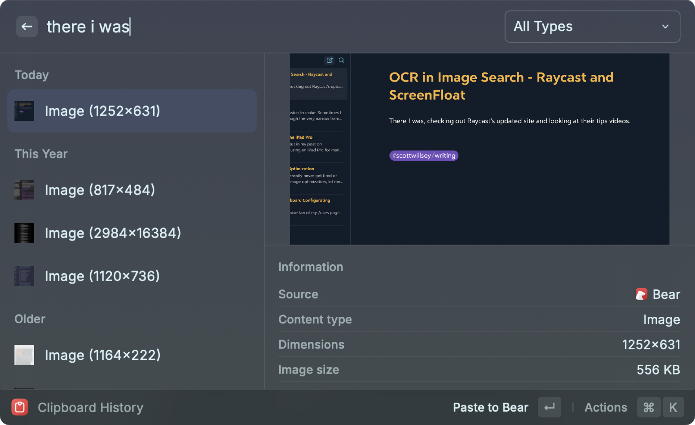
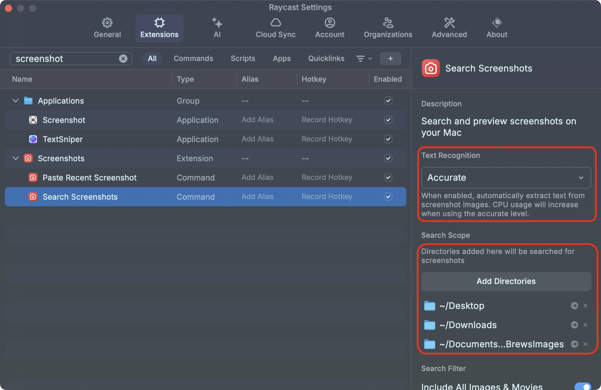
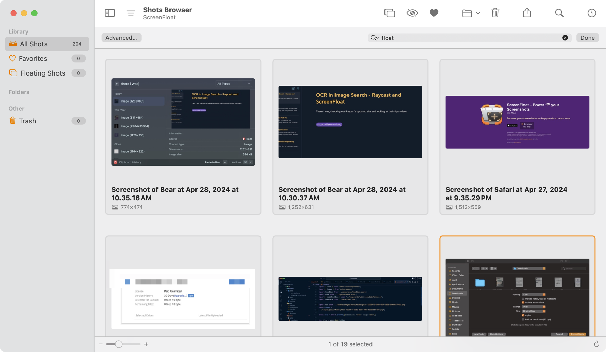

There I was, checking out [Raycast](https://www.raycast.com)’s [updated website](https://www.raycast.com) and looking at their tips videos, when I stumbled on the tip called [Find Images by Text](https://www.youtube.com/watch?v=c96IXGOo6E4). Although I knew that Raycast would keep copied images in the clipboard history, what I did NOT know is that you can search those images not just by words matching the title, but words matching text IN the image.

Example: I hit ⌘ Space (that's Command Space) to invoke Raycast, type **ch** (my alias for the Clipboard History function), and start typing “there I was”. Look at the results:

The first result is a file called Image (1252x631), which is a screenshot of this blog post when I started writing it, taken with [ScreenFloat](https://www.screenfloatapp.com) and copied into the clipboard. Raycast sees the words “there I was” in the image and returns it as a match to my clipboard history search. Pretty cool.

Raycast will also let you designate folders to search for screenshots in, apart from images in clipboard history, and you can apply text recognition to those search as well. Open Raycast Settings by toggling Raycast open and typing ⌘, (that’s Command comma), select Extensions, search for the Search Screenshots command, and then verify that Text Recognition is not disabled but shows one of the accuracy level options instead.

All that Raycast functionality is great, but since I’m using ScreenFloat to take my screenshots, what if I don’t want to have to copy an image into the clipboard or save it in one of those files to find it by text recognition? ScreenFloat has search by text recognition covered too.

[ScreenFloat](https://www.screenfloatapp.com) saves screenshots you’ve taken in the Shots Browser. You can open the Shots Browser with your assigned keyboard shortcut (⇧⌘1 in my case), hit ⌘F to start a search, and type the word “float”. The results are anything that has the word “float” in the image name, or anything that has the text “float” in the image itself somewhere.

You can also see from the image above that ScreenFloat names the screenshots with the name of the app that was being screenshotted.[^1] You can rename images at any time in ScreenFloat, of course.

This is all pretty amazing and handy,  and it sure makes finding things on my Mac a lot easier than before I used either of these tools. I love great software like these apps, and I love developing systems that mesh with my brain and that I can use and remember instinctively.

As [Peter](https://infosec.exchange/@nikolaidis) said when I showed him the ScreenFloat text recognition search, “I really, really, *really* wish Notion would add OCR.”

Me too, Peter. Me too.

[^1]: I genuinely have no clue if that’s a word.
