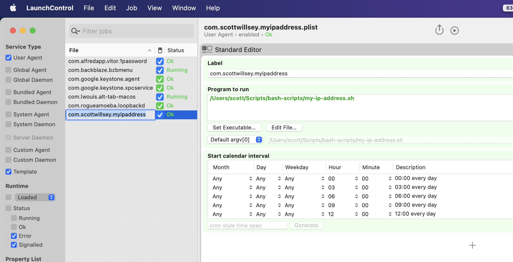
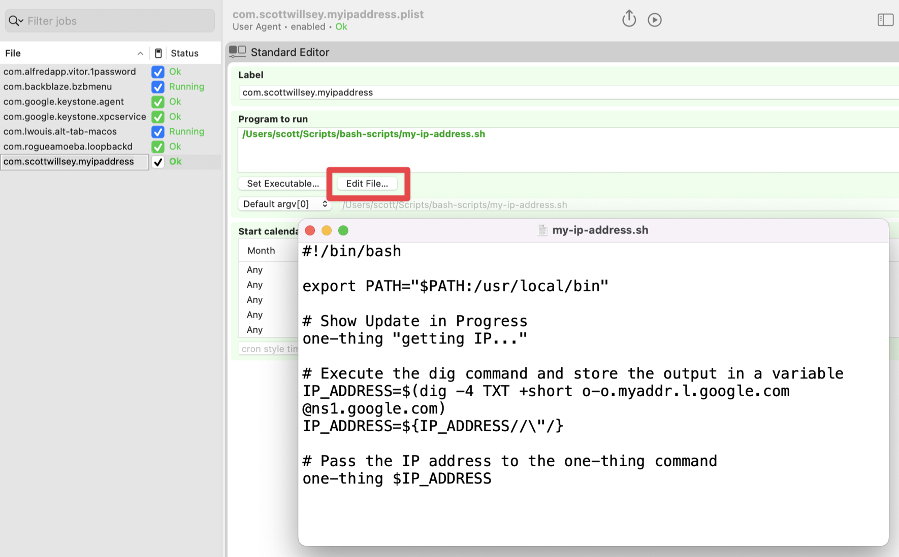

I inadvertently lied to you. [I bragged about using a bash script to get my current external IP address](https://scottwillsey.com/one-more-thing/) and putting it in my menu bar with One Thing, and about scheduling that to happen on a predetermined frequency by creating a LaunchDaemon plist and registering it with launchctl. But there's just one problem.

It didn't actually _work_.

After a bunch of digging around, I figured out the reason was I was making some extremely basic scripting errors, but I'm glad it happened because along the way I also learned about some changes to how launchctl works in current macOS versions, and also about a program called [LaunchControl](https://soma-zone.com/LaunchControl/).

My primary error was that I forgot about how the Unix PATH and execution environment interaction works. Basically in Unix, your PATH variable dictates what directories the shell will look in to find the application or script you are telling it to execute, whether in a script or at the command prompt. I forgot that just because I could run my script at the command prompt and have it work, that didn't meant that it would execute in the same environment with the same PATH as mine when executed as a LaunchAgent entry, even though the LaunchAgent is in my user directory's Library/LaunchAgents directory. Therefore it could neither find one-thing (located in /usr/local/bin) in order to run that, nor could it find node.js which one-thing relies on (also in /usr/local/bin).

The solution was to add /usr/local/bin to the PATH variable for the environment that launchd runs my script in.

```sh frame="code"
#!/bin/bash

export PATH="$PATH:/usr/local/bin"

# Show Update in Progress
one-thing "getting IP..."

# Execute the dig command and store the output in a variable
IP_ADDRESS=$(dig -4 TXT +short o-o.myaddr.l.google.com @ns1.google.com)
IP_ADDRESS=${IP_ADDRESS//\"/}

# Pass the IP address to the one-thing command
one-thing $IP_ADDRESS
```

Very simple.

Along the way though, before I realized my remedial error, I was worried that Ventura was causing permission errors or blocking executing of the script by launchd. As I researched this possible angle, I discovered a program called [LaunchControl](https://soma-zone.com/LaunchControl/). LaunchControl describes itself this way:

> LaunchControl is a fully-featured launchd GUI allowing you to create, manage and debug system- and user services on your Mac.

As you may remember, launchd handles User Agents (~/Library/LaunchAgents), Global Agents (/Library/LaunchAgents), Global Daemons (/Library/LaunchDaemons). LaunchControl allows easy viewing, execution, and modification of all of these in one location.

[](/images/posts/LaunchControl-20E2C710-2E7A-416A-A046-221876C80836.jpg)

It also allows for easy editing of the file being run by the Agent or Daemon, which makes trying things simple.

[](/images/posts/LaunchControlEditScript-20E2C710-2E7A-416A-A046-221876C80836.jpg)

You don't need LaunchControl to create and edit Agents and Daemons. You can create and edit plist files manually and many (most?) people do. But LaunchControl makes it easy in the same way that most people would much rather use VSCode or some other context-aware IDE to work on projects than to do it in TextEdit. It's a powerful tool that makes something that is a chore easier and less error prone, and that seems like a good thing to me.
