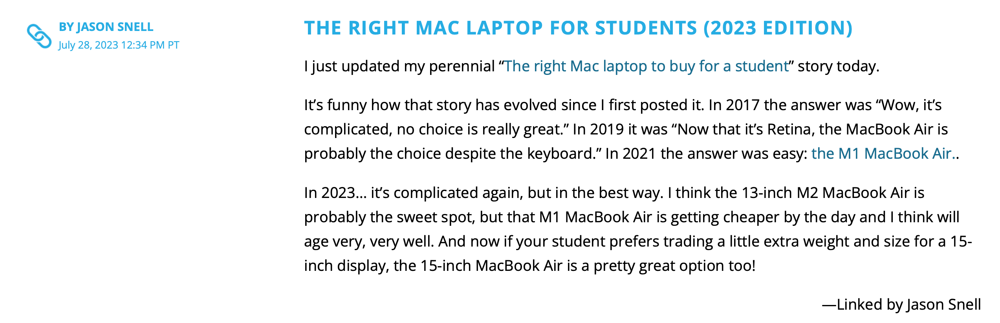

Thanks entirely to Tiffany White, I finally implemented something that's been on my site to-do list for some time, but that I've never gotten around to actually doing until now: link posts.

You've seen link posts before, certainly so if you read a lot of Mac related blogs like [Daring Fireball](https://daringfireball.net), [SixColors](https://sixcolors.com), or [MacStories](https://www.macstories.net). The idea is the title of the post links to an article on another site, and then you add some commentary and maybe quote part of the article in your post.

[](/images/posts/SixColorsLinkPost-EDA8EA55-4DF2-41CD-8A78-88C1277FBDA4.png)

[Tiffany](https://github.com/twhite96) created an issue on my site repo asking if I'd setup link post support in Astro yet. I had it on my to-do list, namely in my Obsidian kanban board for this site, but I hadn't done it yet because I haven't really wanted to link to too many external articles here. But Tiffany creating an issue for me gave me the motivation to figure out how I would do it.

## Adding the Url Link

In order to add the URL that the post title should link to, I decided to add a front matter item called **link**:

```yaml
---
title: "How to use Raycast and how it compares to Spotlight and Alfred"
description: Raycast compared to Spotlight and Alfred.
date: "2023-07-28T09:00:00-07:00"
link: "https://www.theverge.com/23170431/raycast-how-to-macos-search-extensions-alfred-spotlight"
keywords: ["mac", "raycast", "apps", "utility", "alfred", "spotlight"]
slug: "raycast"
---
```

## Adding the Link to the Collection Schema

Because I'm using [Astro Content Collections](https://docs.astro.build/en/guides/content-collections/), I also needed to add this to my [collection schema](https://docs.astro.build/en/guides/content-collections/#defining-a-collection-schema). Not all posts will have a link front matter item, so it needs to be optional.

```ts title="src/content/config.ts"
import { z, defineCollection } from "astro:content";

export const collections = {
  posts: defineCollection({
    schema: z.object({
      title: z.string(),
      description: z.string(),
      link: z.string().optional(),
      date: z.string().transform((str) => new Date(str)),
      keywords: z.string().array(),
    }),
  }),
};

```

[Zod](https://docs.astro.build/en/guides/content-collections/#defining-datatypes-with-zod) allows for optional entries, so links is defined as a `z.string().optional()`.

## The Astro Code for Link Post Titles

The rest of the work is done in a new component for creating the blog post title called PostTitle.astro.

```astro title="src/components/PostTitle.astro"
---
import config from "config";
import { Icon } from "astro-icon/components";
import path from "path";
import { titleCase } from "./utilities/StringFormat.js";

const { post } = Astro.props;
---

<a
  href={post.data.link
    ? post.data.link
    : new URL(
        path.join(config.get("posts.path"), post.slug),
        config.get("url"),
      )}
>
  {post.data.link ? <Icon name="ion:ios-link" /> : ""}
  {titleCase(post.data.title)}
</a>

<style>
  [data-icon] {
    width: 1em;
    margin-bottom: -0.3rem;
  }
</style>
```

I check for the existence of the link front matter value in two places: one for creating the href for the post title, and the other to decide whether or not to show the link icon next to the post title indicating that this is a link post.

If post.data.link exists, I use that as the href for the title link, otherwise I use the url of my blog post as the href so that my blog post links to itself as usual.

Now in my Post.astro component which creates the blog post layout, I call my PostTitle component instead of just creating the title in Post.astro itself.

```astro title="src/components/Post.astro"
---
import type { CollectionEntry } from "astro:content";
import config from "config";
import { Icon } from "astro-icon/components";
import path from "path";
import { postdate } from "../components/utilities/DateFormat.js";
import PostTitle from "./PostTitle.astro";

interface Props {
  post: CollectionEntry<"posts">;
}

const { post } = Astro.props;
const { Content } = await post.render();
---

<article>
  <header>
    <h1>
      <PostTitle post={post} />
    </h1>
    <div class="time">
      <Icon name="bi:calendar2-week-fill" />
      <time datetime={post.data.date}>
        <a
          href={new URL(
            path.join(config.get("posts.path"), post.slug),
            config.get("url"),
          )}
        >
          {postdate(post.data.date)}
        </a>
      </time>
    </div>
  </header>
  <Content />
</article>
```

This is the result:

[](/images/posts/MyLinkPost-1AE68B36-13DD-4184-B02D-758980D93F16.png)

Before implementing PostTitle to create link post titles when appropriate, I just created the title directly in Post.astro with the following:

```astro
<!-- old way of creating post title -->
<a
  href={new URL(
    path.join(config.get("posts.path"), post.slug),
    config.get("url"),
  )}
>
  {titleCase(post.data.title)}
</a>
```

As you can see, it's just a subset of what's now in PostTitle.astro, namely just the portion that assumes the post title should just link back to the post itself. But you can see how easy it was to go from that to the new PostTitle component that can handle both link posts and regular posts.

## Improvements

That's it! There are still some improvements to be made. Besides just showing the link icon next to the title of a link post, I probably want to change the color of the title slightly and maybe change the post background color very subtly to indicate that it's not just the usual site post.

I also plan to make quote sections a little more stylish by adding some nice quote marks around them to offset them just a little bit more than they already are.
