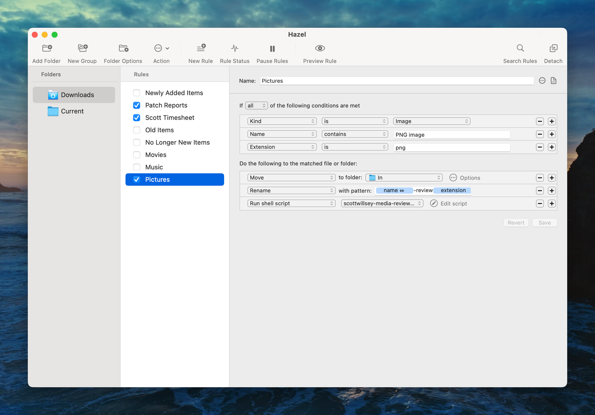
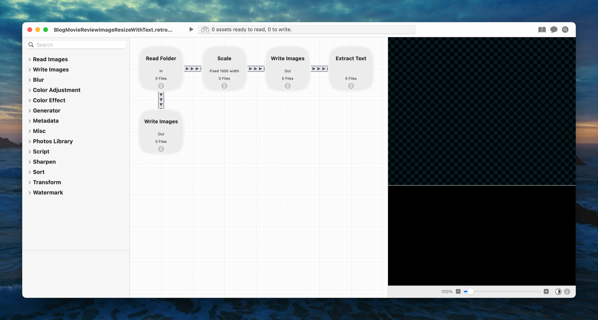
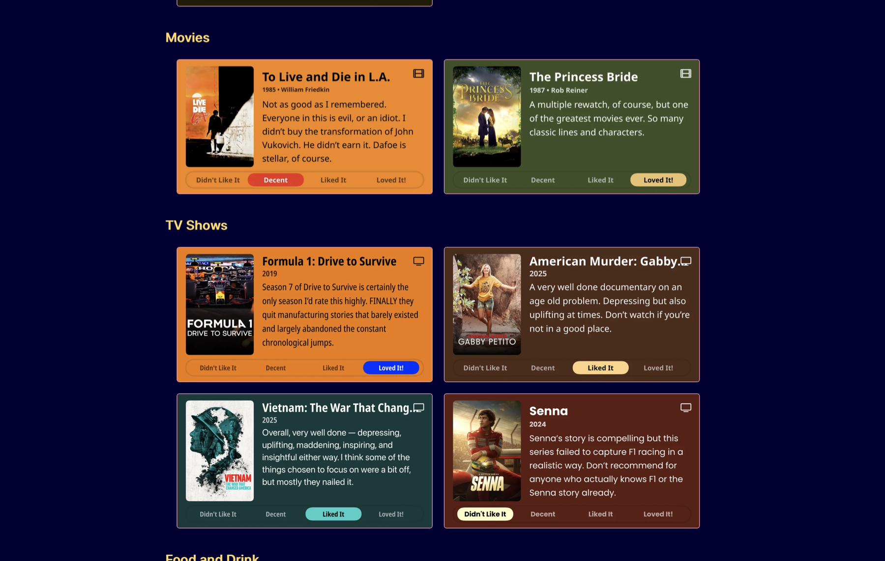

## Contents

## Updating the Look of My /now Page

The [now page](https://nownownow.com/about) is a cool concept by [Derek Sivers](https://sive.rs/) for talking about what you’re doing now in your life. I use [my /now page](https://scottwillsey.com/now/) slightly differently, to just list things I’ve been reading, drinking, eating, watching, listening to, and sometimes playing recently.

Initially everything on my now page was bullet lists of text links. This works, and it’s fine, but I also was a little envious of how nice some other people’s media logs looked with artwork for their movies and shows. I’m thinking of [Robb Knight’s Almanac](https://rknight.me/almanac/), Habib Cham’s [Books](https://www.chamline.net/books/) page, and [Cory Dransfeldt](https://www.coryd.dev/)’s [Music](https://www.coryd.dev/music/), [Watching](https://www.coryd.dev/watching/), and [Currently Reading](https://www.coryd.dev/books/) pages, for example.

As I was rolling how to improve my [/now](/now) page around in the back of my mind, [Matt Birchler](https://birchtree.me/) release a neat little iOS app called [Quick Reviews](https://quickreviews.app/). Quick Reviews is based on a web utility he’s had for awhile now which lets you create little images with media reviews, complete with artwork, and share them with people.

As I played with the iOS app version of Quick Reviews and saw how it exported the images, I realized I could build a workflow around them for incorporating them into my [/now](/now) page.[^1] Most importantly for any change to the page to make it look better was that it not take much more time to update on a regular basis. The text link version was easy – I have scripts that pull my Trakt history for the Movies and TV Shows portions of the page and return formatted markdown bullet list items. All I have to do is paste them where I want them.

Thanks to the power of scripting and the wonderful array of automation utilities for macOS, I’ve been able to find a way to make updating my [/now](/now) page with Quick Reviews images equally quick and painless. So get ready, because the rest of this article exists to show you how it’s done.

By the way, I made a handy little video of the automation workflow in action which you can watch here or on [YouTube](https://www.youtube.com/watch?v=iK1bnaAoczc), or jump to the [detailed workflow description](#automating-quick-reviews) below to keep reading.

<https://www.youtube.com/watch?v=iK1bnaAoczc>

## Automating Quick Reviews

### Step 1: Quick Reviews

The first link in my automation chain is [Quick Reviews](https://quickreviews.app/) by [Matt Birchler](https://birchtree.me/). This is an iOS app that lets you choose a piece of media to review and allows you to add artwork, your rating, and your text review to a nicely formatted image.

First you choose a Media Type (Movie, TV Show, Game, Book, Music, or Other), give it the title of the media, and either add artwork or use Magic Mode to add one if it’s a Movie, TV Show, or Game, and then add your text review and choose a rating. You can customize the text that gets used for ratings to your own liking (⭐⭐⭐⭐⭐ use emoji stars if you want!) at an app level, by the way.

Next, edit the image colors for background and rating highlight, edit the font and font styles, and  save or export the image. In my case, I use export and share and then AirDrop it to my Mac.

[](/images/posts/WritingAReview-C2EE3053-D3DD-4942-9B37-2C10FFD0B9B9.jpg)

### Step 2: Hazel

When I AirDrop the Quick Reviews image to my Mac, several things happen automatically, thanks in large part to a wonderful Mac utility called [Hazel](https://www.noodlesoft.com/), by Noodlesoft. Hazel does one thing: it watches folders that you tell it to. But then it allows you to perform a ton of different actions on those folders, or files in those folders, based on triggers you specifiy.

[](/images/posts/HazelPicturesWorkflow-695698C9-DB44-4B9F-BA7C-E677882B53B5.jpg)

In my case, I have Hazel watch my Downloads folder for incoming images that have the png extension and that have file names containing “PNG image”. These criteria are based on the exported Quick Reviews file name and type. If any files meeting those criteria hit the Downloads folder, they’re moved to `/Users/scott/Scripts/scottwillsey/scottwillsey-images/In`, renamed in a specific way, and then a Bash script called `scottwillsey-media-review-images.sh` is run.

Here’s the entirety of that script:

```bash title="scottwillsey-media-review-images.sh" wrap showLineNumbers=false

#!/bin/bash

# Required parameters:
# @raycast.schemaVersion 1
# @raycast.title ScottWillsey Media Review Images
# @raycast.mode silent

# Optional parameters:
# @raycast.icon ../icons/scottwillsey.png
# @raycast.packageName Website

# Documentation:
# @raycast.description Resizes and copies images for the ScottWillsey site's /now page media reviews.
# @raycast.author scott_willsey
# @raycast.authorURL https://raycast.com/scott_willsey

/Applications/Retrobatch.app/Contents/MacOS/Retrobatch --workflow /Users/scott/Scripts/scottwillsey/scottwillsey-images/BlogMovieReviewImageResizeWithText.retrobatch &

wait

/Users/scott/Scripts/scottwillsey/scottwillsey-images/scottwillsey_review_images.py

```

You can see that it’s written as a Raycast script command, which is why all the weird comments are in there, but I don’t run it from Raycast because I let Hazel call it directly when I AirDrop the image.

First, it runs a Mac app called [Retrobatch](https://flyingmeat.com/retrobatch/) with a specific Retrobatch workflow, waits for that to finish, and then runs a Python script.

Which takes us to Step 3...

### Step 3: Retrobatch

[Retrobatch](https://flyingmeat.com/retrobatch/) is a stupendously amazing image automation tool from [Flying Meat Software](https://flyingmeat.com/). Its whole job is image batch processing.

The particular Retrobatch workflow that I run in this case takes images from `/Users/scott/Scripts/scottwillsey/scottwillsey-images/In`, where Hazel moved them, and creates two copies – one resized to 1000px wide and saved as a png, and the other full-sized but saved as a jpg. Both of these are saved to `/Users/scott/Scripts/scottwillsey/scottwillsey-images/Out`.

The purpose of having two copies is so that I can display an optimized version in my articles and have those link to the full-sized image if the reader clicks on them – more on this later.

[](/images/posts/RetrobatchWorkflow-58C216B3-F566-4828-A34A-5C16EDC7137B.jpg)

One other important thing this Retrobatch workflow does is to extract the text from the resized image and save that text in a file in the Out folder with the same file name as the corresponding image, except with a .txt extension.

I need the text from the image to create my image link alt text for the website, and the fact that Retrobatch can extract this for me makes the fully automated nature of this process possible. I don’t have to make a copy of the text while typing my review on the phone and send it to the Mac somehow. It’s literally delivered in the image and extracted on the Mac by Retrobatch. It’s beautiful.

Now Retrobatch is done. For each review image in `/Users/scott/Scripts/scottwillsey/scottwillsey-images/In`, there is now a corresponding resized png, full-sized jpg, and text file with the text from the image saved in `/Users/scott/Scripts/scottwillsey/scottwillsey-images/Out`.

When Retrobatch finishes, the `scottwillsey-media-review-images.sh` script that started the Retrobatch workflow moves on to the next step – running a Python script called `scottwillsey_review_images.py`.

### Step 4: Python Script

The Python script is much more involved than the Bash script was. I’m just going to show you the whole thing and then walk though it.

```python title="scottwillsey_review_images.py" wrap

#!/Users/scott/Scripts/python/venv/bin/python
import os
import shutil
import pyperclip
from pathlib import Path
import uuid

# Set paths
output_path = "/Users/scott/Scripts/scottwillsey/scottwillsey-images/Out"
input_path = "/Users/scott/Scripts/scottwillsey/scottwillsey-images/In"
review_images_path = "/Users/scott/Documents/Sites/ScottWillsey/Reviews"
public_image_path = "/Users/scott/Sites/scottwillsey/public/images/posts"
assets_image_path = "/Users/scott/Sites/scottwillsey/src/assets/images/posts"

# Initialize empty string for file links
file_links = ""
# Generate new UUID
new_uuid = str(uuid.uuid4())

# Loop through files in output directory
for file in os.listdir(output_path):
    alt_text = "Review Image"
    if file.endswith(".png"):
        # Get base name without extension
        base_name = os.path.splitext(file)[0]
        # create UUID name
        uuid_name = base_name + "-" + new_uuid
        # Look for corresponding text file
        txt_file = os.path.join(output_path, f"{base_name}.png.txt")
        if os.path.exists(txt_file):
            with open(txt_file, "r") as f:
                alt_text = f.read().strip().replace("\n", " ")
        # Create markdown link
        file_links += f"[](/images/posts/{uuid_name}.jpg)\n"

# Copy to clipboard
pyperclip.copy(file_links)

# Copy files to site public images directory and move files from input to review images directory
for file in os.listdir(input_path):
    # Get base name and extension
    base_name, ext = os.path.splitext(file)
    # Create new filename with UUID
    new_filename = f"{base_name}-{new_uuid}{ext}"
    src_file = os.path.join(input_path, file)
    # Move file to review images directory
    dst_file = os.path.join(review_images_path, file)
    shutil.move(src_file, dst_file)

# Delete all .txt files in output directory
for file in os.listdir(output_path):
    if file.endswith(".txt"):
        os.remove(os.path.join(output_path, file))

# Move files from output to site src assets images directory
for file in os.listdir(output_path):
    # Get base name and extension
    base_name, ext = os.path.splitext(file)
    # Create new filename with UUID
    new_filename = f"{base_name}-{new_uuid}{ext}"
    src_file = os.path.join(output_path, file)
    
    if ext.lower() == '.png':
        dst_file = os.path.join(assets_image_path, new_filename)
        shutil.move(src_file, dst_file)
    elif ext.lower() == '.jpg':
        dst_file = os.path.join(public_image_path, new_filename)
        shutil.move(src_file, dst_file)


```

The gist of the script is simple, although it does several things:

#### Python Script Part 1: Create Markdown Links

```python showLineNumbers=false wrap
# Set paths
output_path = "/Users/scott/Scripts/scottwillsey/scottwillsey-images/Out"
input_path = "/Users/scott/Scripts/scottwillsey/scottwillsey-images/In"
review_images_path = "/Users/scott/Documents/Sites/ScottWillsey/Reviews"
public_image_path = "/Users/scott/Sites/scottwillsey/public/images/posts"
assets_image_path = "/Users/scott/Sites/scottwillsey/src/assets/images/posts"

# Initialize empty string for file links
file_links = ""
# Generate new UUID
new_uuid = str(uuid.uuid4())

# Loop through files in output directory
for file in os.listdir(output_path):
    alt_text = "Review Image"
    if file.endswith(".png"):
        # Get base name without extension
        base_name = os.path.splitext(file)[0]
        # create UUID name
        uuid_name = base_name + "-" + new_uuid
        # Look for corresponding text file
        txt_file = os.path.join(output_path, f"{base_name}.png.txt")
        if os.path.exists(txt_file):
            with open(txt_file, "r") as f:
                alt_text = f.read().strip().replace("\n", " ")
        # Create markdown link
        file_links += f"[](/images/posts/{uuid_name}.jpg)\n"

# Copy to clipboard
pyperclip.copy(file_links)
```

This creates a UUID to add into the image file names. Then it looks at every file in the Retrobatch output directory (`/Users/scott/Scripts/scottwillsey/scottwillsey-images/Out`), checks to see if it’s a png, and gets its base file name if so.

After getting the png file base name, the script looks for a corresponding txt file, which will contain the extracted review text. If it finds one, it reads the contents of the file to use as image alt text.

Next, it creates a markdown link for the png image complete with alt text, and a link to the larger jpg image. Then it appends this markdown link to the file_links variable.

Finally, it copies the complete file_links variable to the clipboard. This results in markdown for the images ready to paste into the [/now](/now) page. The markdown basically looks like this, albeit with a few extra bits of text from the extracted text that I clean up:

```markdown wrap showLineNumbers=false
[](/images/posts/PngImage42999A84080-review-6126286a-a138-4551-8892-ad278b0bfa5f.jpg)
```

#### Python Script Part 2: Archive All Images in the Retrobatch Input Folder

```python showLineNumbers=false wrap
# Copy files to site public images directory and move files from input to review images directory
for file in os.listdir(input_path):
    # Get base name and extension
    base_name, ext = os.path.splitext(file)
    # Create new filename with UUID
    new_filename = f"{base_name}-{new_uuid}{ext}"
    src_file = os.path.join(input_path, file)
    # Move file to review images directory
    dst_file = os.path.join(review_images_path, file)
    shutil.move(src_file, dst_file)
```

This part is simple. It just renames the images with the UUID included in the file name and moves them from the Retrobatch input folder to a review images archive folder. This is just a folder for me to keep copies of my reviews in, it has nothing to do with generating the website.

#### Python Script Part 3: Delete All Text Files in the Retrobatch Output Folder

```python showLineNumbers=false wrap
# Delete all .txt files in output directory
for file in os.listdir(output_path):
    if file.endswith(".txt"):
        os.remove(os.path.join(output_path, file))
```

Again, very simple. This just deletes all the text files in the Retrobatch output folder. I don’t need them anymore as I have the text in the markdown links.

#### Python Script Part 4: Rename and Move the Image Files to Use on the Website

```python showLineNumbers=false wrap
# Move files from output to site src assets images directory
for file in os.listdir(output_path):
    # Get base name and extension
    base_name, ext = os.path.splitext(file)
    # Create new filename with UUID
    new_filename = f"{base_name}-{new_uuid}{ext}"
    src_file = os.path.join(output_path, file)
    
    if ext.lower() == '.png':
        dst_file = os.path.join(assets_image_path, new_filename)
        shutil.move(src_file, dst_file)
    elif ext.lower() == '.jpg':
        dst_file = os.path.join(public_image_path, new_filename)
        shutil.move(src_file, dst_file)

```

This loops through all files in the Retrobatch output folder (since only images remain here) and does the following with each:

- Gets the base file name and file extension,
- Creates a new filename with the UUID added in between the base file name and extension,
- Moves the image to `/Users/scott/Sites/scottwillsey/src/assets/images/posts` with the new UUID-included file name if it’s a png file,
- Or moves the image to `/Users/scott/Sites/scottwillsey/public/images/posts` with the new UUID-included file name if it’s a jpg.

That’s the entirety of the script. Once it’s done, there are no images left in the Retrobatch input and output folders, there are jpg and png images in the correct website source folders for use on the compiled [/now](/now) page, and there are corresponding Markdown links in the clipboard ready to paste into the [/now](/now) page content source Markdown file.

### Step 5: Profit

The results are something like the image below, or actually what you see if you click the link for the [/now](/now) page on the site menu. It’s the one that looks like a clock.

[](/images/posts/ReviewsAutomationResult-F4F474EA-7E6E-429C-A5F9-A0E81E53703A.jpg)

There are definitely improvements that could be made, but this is a great start, and it’s proof that sometimes things that look like a very manual process can be automated, thanks largely to the great ecosystem of Mac indie programmers who make outstanding irreplaceable utilities like Hazel and Retrobatch.

If you want to see a comparison of the old style, imageless [/now](/now) page and the current beautiful one, just look at the image below. On the right is the new, Quick Reviews-ified version, on the left is the old one. Or, to put it another way, on the left is the before now, and on the right is the now now.

[](/images/posts/NowOldAndNew-08EE12D0-DF52-425E-9F2C-82F048FD4865.jpg)

## Summarium

That’s a lot of words, so let’s summarize the process here:

1. Scott Willsey creates a review in Quick Reviews on iOS,
2. Scott Willsey AirDrops it to his Mac,
3. Hazel renames and moves the image and runs a Bash script,
4. Bash script runs a Retrobatch workflow and waits for it to finish,
5. Retrobatch makes two copies of the image, a full-sized jpg and a smaller png, as well as a text file containing the extracted text from the image,
6. Bash script runs a Python script,
7. Python script constructs the Markdown links and moves the Retrobatch images into the correct locations for the site to compile and display on the [/now](/now) page,
8. Scott Willsey pastes the Markdown links into the [/now](/now) page source Markdown file,
9. Scott Willsey says “Damn, that is cool!” and goes to make another cup of coffee.

[^1]: If you’re asking yourself right now “Is this guy going to make EVERY reference to his [/now](/now) page a hyperlink to it?”, the answer is yes. Yes, I am.
