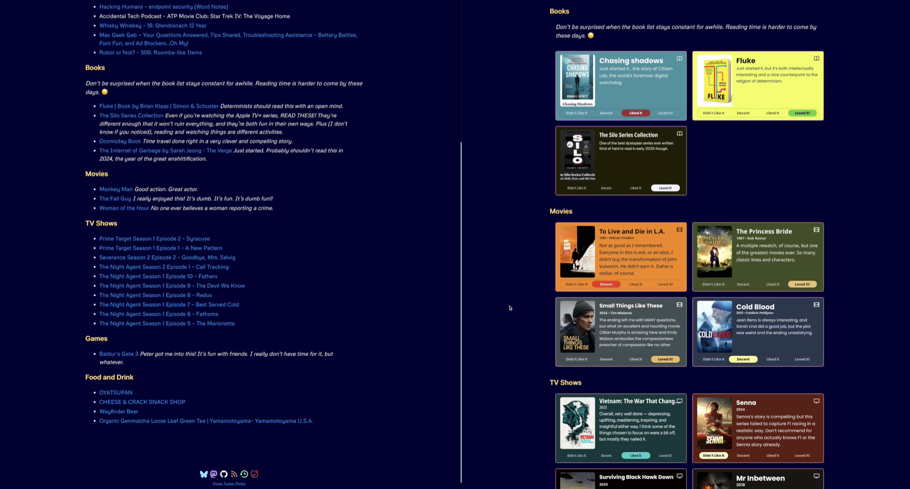

## Contents

## Updating the Look of My /now Page

The [now page](https://nownownow.com/about) is a cool concept by [Derek Sivers](https://sive.rs/) for talking about what your’e doing now in your life. I use [my /now page](https://scottwillsey.com/now/) slightly differently, to just list things I’ve been reading, drinking, eating, watching, listening to, and sometimes playing recently.

Until recently, I did this just by having standard text and html links to these things. I’ve wanted to improve the look of this, based on unintentional shaming from examples like [Robb Knight’s Almanac](https://rknight.me/almanac/), Habib Cham’s [Books](https://www.chamline.net/books/) page, and [Cory Dransfeldt](https://www.coryd.dev/)’s [Music](https://www.coryd.dev/music/), [Watching](https://www.coryd.dev/watching/), and [Currently Reading](https://www.coryd.dev/books/) pages.

For some time I’ve wanted to improve my [/now](https://scottwillsey.com/now/) page by using images for the various movies, tv shows, books, and games I’ve enjoyed (or not). When I created my /now page, everything was done with simple text links with additional commentary from me. I did this for the Movies and TV sections by using a script to pull my Trakt history and format it into Markdown links.

Thanks to [Quick Reviews](https://quickreviews.app/) from [Matt Birchler](https://birchtree.me/), [/now](https://scottwillsey.com/now/) I have a great solution for making them look nice.[^1] All I had to do was figure out a way to automate the process so it would not add time and effort compared to the trakt history workflow.

I made a handy little video of the resulting automation workflow in action which you can watch, or jump to the [detailed workflow description](#automating-quick-reviews) below.

<https://www.youtube.com/watch?v=iK1bnaAoczc>

On the left is the new, Quick Review-ified version, on the right is the old one. Or, to put it another way, on the right is the before now, and on the left is the now now.

## Automating Quick Reviews

Initally I thought this would be a Raycast Script Command, but then I realized I could  have it all happen automatically when I AirDrop an image from Quick Reviews to my Mac.

### Hazel

Have you ever used Hazel?

[^1]: See what I did there?
